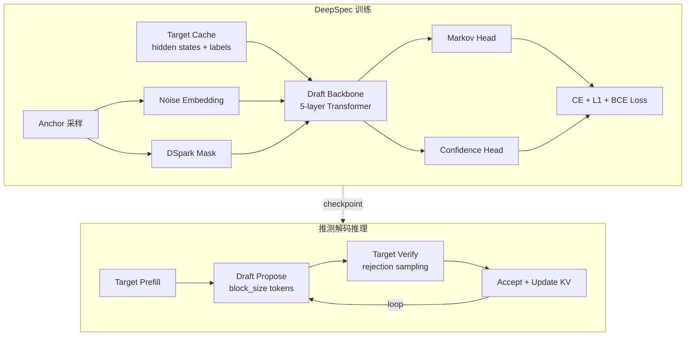
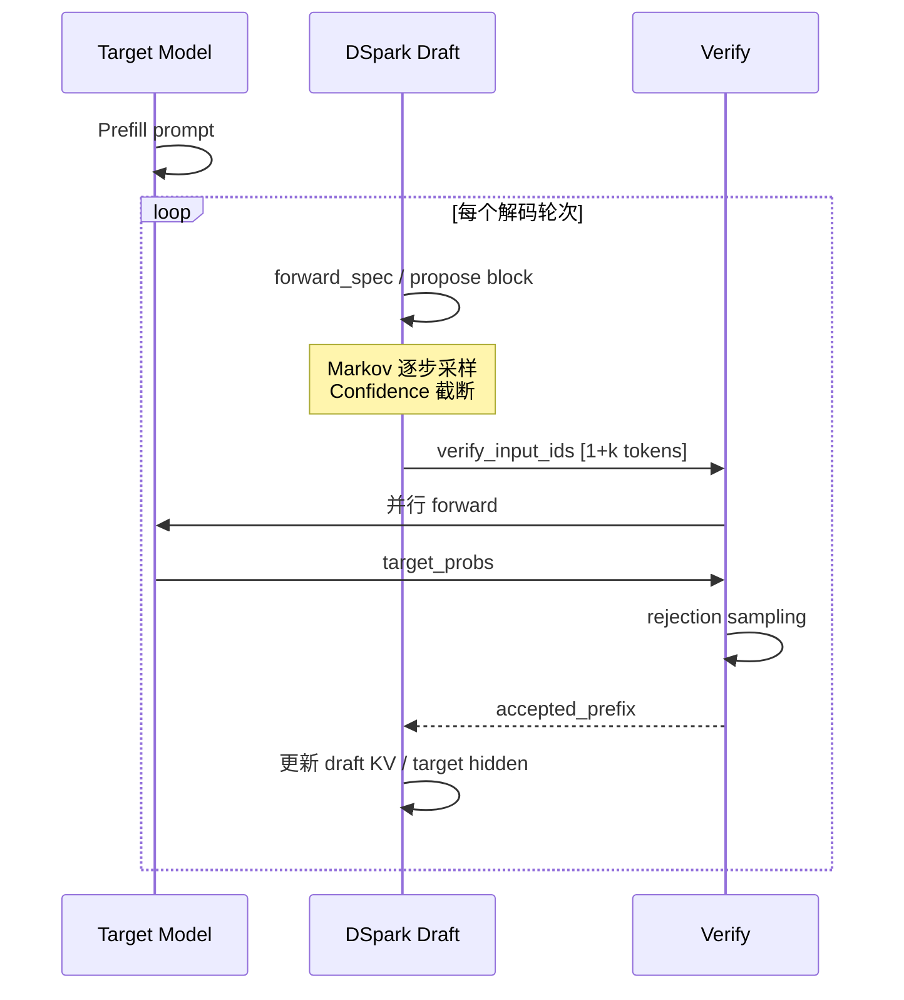

# DeepSpec DSpark 深度理解分析（面试导向）

> **代码路径：** `/home/caishengcheng/DeepSpec`  
> **权重路径：** `/data/models/DeepSeek-V4-Flash-DSpark`  
> **分析模式：** Deep（面试导向）  
> **目标：** 能讲清 DSpark 的 **WHY + 架构 + 训练/推理全链路 + 与 V4 生产的映射关系**

---

## 理解验证状态

| 核心概念 | 自我解释 | 理解"为什么" | 应用迁移 | 状态 |
|---------|---------|-------------|---------|------|
| 推测解码（Speculative Decoding） | ✅ | ✅ | ✅ | 已掌握 |
| DSpark Block-wise Draft | ✅ | ✅ | ✅ | 已掌握 |
| Anchor 采样 + Noise Embedding | ✅ | ✅ | ✅ | 已掌握 |
| DSpark 专用 Attention Mask | ✅ | ✅ | ✅ | 已掌握 |
| Target Hidden States 蒸馏 | ✅ | ✅ | ✅ | 已掌握 |
| Markov Head（vanilla/gated/rnn） | ✅ | ✅ | ✅ | 已掌握 |
| Confidence Head + 前缀截断 | ✅ | ✅ | ✅ | 已掌握 |
| CE + L1 混合 Loss | ✅ | ✅ | ✅ | 已掌握 |
| Target Cache 数据协议 | ✅ | ✅ | ⚠️ | 基本掌握 |
| 生产推理 `forward_spec` | ✅ | ✅ | ✅ | 已掌握 |
| DeepSpec vs V4 推理实现差异 | ✅ | ✅ | ✅ | 已掌握 |

---

## 项目完整地图

### DeepSpec 是什么

DeepSpec 是 DeepSeek 开源的 **推测解码全栈框架**，覆盖：

```
数据准备 → Draft 模型训练 → 推测解码评估
   ↓              ↓                ↓
target cache   DSpark/Eagle3/DFlash   accept_len / verify_rate
```

**DSpark** 是其中一种 Draft 算法（论文见仓库 `DSpark_paper.pdf`），核心思想是：**以 Block 为单位并行预测多个 token**，通过专用 Attention Mask 让 Draft 位置只能看到 anchor 之前的 context + 同 block 内已生成位置，从而在一次 forward 中产出 `block_size` 个候选 token。

**DeepSeek-V4-Flash-DSpark** 不是新模型，而是在 V4-Flash 权重上 **外挂 DSpark 模块**（checkpoint 中 `mtp.*` 命名空间），推理代码在权重目录 `inference/` 下。

### 完整目录树（DSpark 相关）

```
DeepSpec/
├── train.py                          # 训练入口，spawn 多卡
├── eval.py                           # 评估入口
├── config/dspark/                    # 各 target 模型的训练配置
│   ├── dspark_qwen3_4b.py
│   ├── dspark_qwen3_8b.py
│   └── dspark_gemma4_12b.py
├── deepspec/
│   ├── modeling/dspark/              # ★ DSpark 核心
│   │   ├── common.py                 # Anchor/Mask/Noise/采样工具
│   │   ├── loss.py                   # CE + L1 + Confidence Loss
│   │   ├── markov_head.py            # Markov/RNN Head
│   │   ├── qwen3/modeling.py         # Qwen3 版 Draft 模型
│   │   └── gemma4/modeling.py        # Gemma4 版 Draft 模型
│   ├── trainer/dspark_trainer.py     # 训练循环胶水
│   ├── eval/dspark/                  # 推测解码评估
│   │   ├── evaluator.py
│   │   ├── draft_ops.py
│   │   └── confidence_head.py
│   └── data/target_cache_dataset.py  # Target Cache 存储协议
└── scripts/
    ├── data/                         # 数据准备流水线
    └── train/train.sh

DeepSeek-V4-Flash-DSpark/
├── config.json                       # 含 dspark_* 超参
├── model*.safetensors                # 主模型 + mtp.* DSpark 权重
└── inference/
    ├── model.py                      # ★ 生产推理（含 DSparkBlock）
    ├── generate.py                   # 交互式生成
    └── kernel.py                     # FP8/FP4/sparse_attn 内核
```

### 文件清单（DSpark 核心，分类）

| 类别 | 文件路径 | 行数 | 职责摘要 |
|------|---------|------|---------|
| **核心算法** | `deepspec/modeling/dspark/common.py` | 336 | Anchor 采样、Attention Mask、Noise Embed |
| **核心模型** | `deepspec/modeling/dspark/qwen3/modeling.py` | 534 | Draft Transformer + forward 主逻辑 |
| **Markov Head** | `deepspec/modeling/dspark/markov_head.py` | 319 | 块内自回归 bias（vanilla/gated/rnn） |
| **Loss** | `deepspec/modeling/dspark/loss.py` | 334 | CE + L1 概率对齐 + Confidence 监督 |
| **训练** | `deepspec/trainer/dspark_trainer.py` | 48 | 组装 model + loss |
| **评估 propose** | `deepspec/eval/dspark/draft_ops.py` | 153 | 推理时 draft block forward + 采样 |
| **评估循环** | `deepspec/eval/base_evaluator.py` | 728 | 推测解码主循环 + rejection sampling |
| **生产推理** | `inference/model.py` (DSpark 段) | ~220 | V4 定制 DSparkBlock + forward_spec |
| **数据** | `deepspec/data/target_cache_dataset.py` | 870 | mmap 读取 target hidden states |
| **配置** | `config/dspark/dspark_qwen3_8b.py` | 67 | block_size=7, markov_rank=256 等 |

### 入口文件 + 核心调用链

**训练链路：**

```
train.sh → train.py:spawn(nprocs)
  └─ Qwen3DSparkTrainer.run_batch
       ├─ Qwen3DSparkModel.forward(input_ids, target_hidden_states, loss_mask, ...)
       │    ├─ sample_anchor_positions
       │    ├─ create_noise_embed
       │    ├─ create_dspark_attention_mask
       │    ├─ _forward_backbone (Draft Transformer)
       │    ├─ markov_head.apply_block_logits
       │    └─ confidence_head (optional)
       └─ compute_dspark_loss → backward
```

**DeepSpec 评估链路：**

```
eval.sh → eval.py
  └─ Qwen3DSparkEvaluator.generate_one_sample
       └─ generate_decoding_sample (base_evaluator)
            ├─ _propose → forward_dspark_draft_block + build_dspark_proposal
            ├─ verify_draft_tokens (target rejection sampling)
            └─ _update → 刷新 target_hidden_states
```

**V4 生产推理链路：**

```
generate.py → Transformer.forward (主模型 prefill/decode 一步)
           → Transformer.forward_spec (DSpark 块提案)
                ├─ mtp[0].forward_embed (noise + main_proj)
                ├─ mtp[0..n].forward (DSparkAttention)
                └─ mtp[-1].forward_head (markov + confidence)
```

---

## 1. 快速概览

| 维度 | 内容 |
|------|------|
| **语言/框架** | Python 3 + PyTorch 2.9 + Transformers 5.10 |
| **代码规模** | DeepSpec 约 11.5k 行 Python；DSpark 核心约 2.5k 行 |
| **算法定位** | Block-wise speculative draft model（DSpark 论文） |
| **支持 Target** | Qwen3-4B/8B/14B、Gemma4-12B；生产版对接 DeepSeek-V4-Flash |
| **Draft 规模** | 典型 5 层 Transformer（`num_draft_layers=5`），远小于 Target |
| **Block Size** | 训练配置 `block_size=7`（即每 block 预测 7 个 token）；V4 生产 `dspark_block_size=5` |
| **关键创新** | ① 并行 block draft + 定制 mask；② Markov Head 增强块内依赖；③ Confidence Head 动态截断提案长度 |
| **训练数据** | Target Cache：预计算的 hidden states + input_ids + loss_mask |
| **评估指标** | `accept_len`（每轮验证平均接受 token 数）、`verify_rate`、`accept_rate@k` |

---

## 2. 背景与动机（3 个 WHY）

### 2.1 问题本质

**要解决的问题：** 大模型自回归解码每步都要跑完整 Target Forward，GPU 利用率低、延迟高。

**WHY 需要解决：** LLM 推理的瓶颈在 **内存带宽和 serial dependency**——每生成 1 个 token 就要做一次大模型前向。推测解码用一个小 Draft 模型一次猜多个 token，再让 Target **并行验证**，接受的部分直接跳过，从而提升吞吐。

**不解决会怎样：** 7B+ 模型在在线服务场景下 TTFT/TPOT 难以满足产品要求；V4 这种 284B MoE 更严重。

### 2.2 方案选择：DSpark vs Eagle3 vs DFlash

| 方案 | 核心思路 | 优势 | 劣势 |
|------|---------|------|------|
| **Eagle3** | 多步 draft，复用 target 特征 | 接受率高、成熟 | Draft 结构复杂，训练成本高 |
| **DFlash** | Block draft（类似 DSpark 前身） | 并行度高 | 块内 token 依赖建模弱 |
| **DSpark** | Block draft + Markov Head + Confidence | 块内依赖强、可动态截断提案 | 需定制 Attention Mask；训练数据大（target cache） |

**WHY 选 DSpark（DeepSeek 视角）：**
1. **Block 并行** 比 token-by-token draft（如早期 Medusa）更能吃满 GPU 矩阵乘。
2. **Markov Head** 用极低秩参数（rank=256）补偿 block 内自回归依赖，避免 Draft 层数爆炸。
3. **Confidence Head** 在推理时按置信度截断提案，减少无效验证计算——这是 DSpark 相对 DFlash 的显著工程优化。

**替代方案对比：**
- **纯 Medusa 多头：** 每个位置独立预测，块内一致性差 → 接受率低。
- **只用 Eagle3：** 逐步 draft，并行度不如 block → 吞吐上限低。
- **不用 Confidence Head：** 每轮固定验证 `block_size` 个 token，低置信位置浪费 Target 算力。

### 2.3 应用场景

**适用场景：**
- Target 模型固定、需要高吞吐在线推理（Chat、Agent）。
- 有资源预计算 Target Cache 并训练 Draft（DeepSpec 流程）。
- V4-Flash 已集成 DSpark 权重，开箱推测解码。

**不适用场景：**
- Target 频繁微调但 Draft 未重训 → 接受率崩溃。
- 极短输出（< block_size）→ 推测开销得不偿失。
- Thinking 模式分布与训练数据不一致 → 需按 README 提示重新 fine-tune。

---

## 3. 核心概念网络

### 概念 1：Anchor（锚点）

- **是什么：** 序列中的一个位置 `p`，作为 block 的起点；block 预测 `p+1, p+2, ..., p+block_size`。
- **WHY 需要：** 训练时需要从一条长序列中 **随机采样多个 anchor**，一次 forward 监督多个 block，提高 GPU 利用率。
- **WHY 这样实现：** `sample_anchor_positions` 用随机排序 + `loss_mask` 过滤，保证 anchor 和第一个 target 都在有效监督区域。
- **WHY 不用固定间隔：** 固定间隔会系统性偏向序列特定位置，泛化差。

### 概念 2：Noise Embedding

- **是什么：** Draft 输入不是真实 token，而是 **mask token 填充 + anchor 位置放真实 token**。
- **WHY 需要：** 推理时 draft 位置尚未生成，不能用 ground truth；mask 迫使模型从 context 推断。
- **WHY 这样实现：** 与 BERT/MLM 类似，但配合 block mask 只在该 block 内自回归展开。
- **WHY 不用全零 embedding：** 丢失位置语义，且与预训练 embedding 空间不一致。

### 概念 3：DSpark Attention Mask

- **是什么：** 定制可见性规则——Query 在 draft 区，Key 来自 `[context | draft]`。
- **WHY 需要：** 标准 causal mask 无法表达「draft block i 只能看 anchor_i 之前的 context + 本 block 内位置」。
- **WHY 双路径（flex_attention / SDPA）：** GPU 用 `flex_attention` BlockMask 高效；NPU 降级 4D bool mask + SDPA。
- **WHY 不用全注意力：** 会泄露未来 anchor 的 target 信息，训练推理不一致。

### 概念 4：Target Hidden States（特征蒸馏）

- **是什么：** 从 Target 模型指定层（`target_layer_ids`）抽取 hidden，拼接到 Draft 的 cross-attn 式 K/V。
- **WHY 需要：** Draft 模型太小，无法独立建模复杂语义，需要 **借力 Target 中间表示**。
- **WHY 选多层（如 [1,9,17,25,33]）：** 浅层语法 + 深层语义组合，比单层信息更丰富。
- **WHY 不用 logits 蒸馏：** hidden 维度信息更完整，且与 Eagle3/SpecForge 生态一致。

### 概念 5：Markov Head

- **是什么：** 低秩 embedding `W1[token] → W2 → vocab_bias`，加到 draft logits 上，建模 `P(x_k | x_{k-1})`。
- **WHY 需要：** Block 内各位置共享同一个 backbone hidden，缺乏显式自回归链。
- **WHY 低秩（256）：** 参数量小（vocab×256 + 256×vocab），训练推理都快。
- **WHY 有 gated/rnn 变体：** gated 用 hidden 调制 Markov 强度；rnn 用 GRU 传递块内状态，表达力更强。

### 概念 6：Confidence Head

- **是什么：** 对每个 draft 位置预测 **接受概率**（与 target 分布的 TV 距离相关）。
- **WHY 需要：** 不是每个 draft token 都值得送去 Target 验证。
- **WHY 训练目标用 `accept_rate_3d`：** \(1 - \frac{1}{2}\|p_{draft} - p_{target}\|_1\)，与 rejection sampling 数学一致。
- **WHY 推理用前缀截断：** 第一个低置信位置之后的 token 不提案，减少验证长度。

### 概念关系矩阵

| 关系类型 | 概念 A | 概念 B | WHY 这样关联 |
|---------|--------|--------|-------------|
| 依赖 | Anchor | Noise Embed | anchor 位置填入唯一已知真实 token |
| 依赖 | Anchor | Attention Mask | mask 用 anchor 位置界定 context 可见范围 |
| 组合 | Target Hidden | Draft Attention | K/V 拼接 context 与 draft 两路 |
| 组合 | Backbone Logits | Markov Head | Markov 提供逐步 bias，合成最终 draft 分布 |
| 监督 | L1 Loss | Markov Head | L1 对齐 draft/target 概率，训练 Markov 有效性 |
| 推理 | Confidence Head | Proposal 截断 | 低置信前缀截断减少无效 verify |
| 对比 | DSpark Mask | 标准 Causal Mask | 多 block 并行训练需要非标准可见性 |

---

## 4. 算法与理论分析

### 4.1 推测解码（Speculative Decoding）

- **时间复杂度：** 无 draft 时 \(O(T)\) 次 Target forward（T=输出长度）。有 draft 时约 \(O(T / \tau)\)，\(\tau\) 为平均接受长度。
- **WHY 选择：** 保证输出分布与纯 Target 采样 **数学等价**（rejection sampling），不是启发式近似。
- **WHY 复杂度可接受：** Draft 模型远小于 Target，一次 propose `k` 个 token 的代价 \(\ll\) Target 一步。
- **退化场景：** Draft 与 Target 分布差异大 → \(\tau \to 1\)，退化为普通解码甚至更慢（多一次 draft forward）。

**参考：** [Fast Inference from Transformers via Speculative Decoding](https://arxiv.org/abs/2211.17192)

### 4.2 Rejection Sampling 验证

对每个 draft token \(x_i\)，采样 \(r \sim U(0,1)\)，接受当且仅当：

\[
r < \min\left(1, \frac{p_{target}(x_i)}{p_{draft}(x_i)}\right)
\]

- **WHY 这样：** 保证边际分布等于 \(p_{target}\)。
- **实现位置：** `base_evaluator.verify_draft_tokens`
- **退化：** draft 概率估计偏低 → 接受率下降；需 `clamp_min(1e-8)` 防除零。

### 4.3 DSpark 训练 Loss

总 loss（`compute_dspark_loss`）：

\[
\mathcal{L} = \alpha_{ce} \mathcal{L}_{CE} + \alpha_{l1} \mathcal{L}_{L1} + \alpha_{conf} \mathcal{L}_{conf}
\]

- **CE：** 对 `eval_mask` 内 token 做加权交叉熵；可选 `loss_decay_gamma` 指数衰减（越远位置权重越低）。
- **L1：** \(\|softmax(logits_{draft}) - softmax(logits_{target})\|_1\)，概率分布对齐。
- **Confidence：** BCE between `confidence_pred` and `accept_rate_3d`。

**默认配置（qwen3_8b）：** `ce_loss_alpha=0.1, l1_loss_alpha=0.9` —— **强调分布对齐而非硬标签**，因为推测解码关心的是概率比而非 argmax 正确率。

- **WHY 分布式 all_reduce 分母：** 各卡 `eval_mask` 有效 token 数不同，需全局归一化。
- **退化：** `num_anchors` 过大但有效 anchor 少 → 大量 dummy block，浪费算力（靠 `block_keep_mask` 屏蔽）。

### 4.4 Anchor 采样复杂度

- **时间：** \(O(B \cdot L \log L)\)，B=batch，L=seq_len（排序）；L 通常 4096，可接受。
- **空间：** \(O(B \cdot L)\) 候选索引。

---

## 5. 设计模式分析

### 模式 1：Strategy（算法可插拔）

**应用位置：** `config/*.py` 中 `trainer_cls`；`evaluator` 子类。

**WHY 使用：** Eagle3/DFlash/DSpark 共享数据管线、分布式训练、评估框架，仅替换 model + loss + propose。

**WHY 不用会怎样：** 三套重复训练脚本，维护成本爆炸。

### 模式 2：Template Method（评估循环）

**应用位置：** `generate_decoding_sample` 定义骨架；`init_context` / `propose` / `update` 由子类注入。

**WHY 使用：** 推测解码主循环一致，仅 propose 逻辑因算法而异。

### 模式 3：Builder（Draft Config）

**应用位置：** `build_draft_config` 从 target config 深拷贝并覆写字段。

**WHY 使用：** Draft 与 Target 共享 vocab、hidden_size、RoPE 等，避免手动同步。

### 模式 4：Teacher Forcing + 并行 Block（训练）

**应用位置：** `forward` 一次算出所有 anchor 的所有 block 位置 logits。

**WHY 使用：** 训练吞吐远高于逐步自回归。

**潜在问题：** 训练时 block 内用 ground truth prev token（通过 `prev_token_ids`），推理时用采样 token —— **train-test mismatch**，靠 Markov Head + 大量数据缓解。

---

## 6. 关键代码深度解析

### 核心片段清单

| 编号 | 片段名称 | 所在文件:行号 | 优先级 | 识别理由 |
|------|----------|--------------|--------|----------|
| #1 | `create_dspark_attention_mask` | common.py:78-133 | ★★★ | DSpark 算法核心，决定可见性 |
| #2 | `Qwen3DSparkModel.forward` | qwen3/modeling.py:389-527 | ★★★ | 训练主路径，串联所有组件 |
| #3 | `compute_dspark_loss` | loss.py:255-329 | ★★★ | 多目标 loss + 分布式归一化 |
| #4 | `VanillaMarkov.apply_block_logits` | markov_head.py:43-53 | ★★☆ | 块内自回归 bias 的关键 |
| #5 | `generate_decoding_sample` | base_evaluator.py:307-441 | ★★★ | 推测解码主循环 |
| #6 | `DSparkBlock.forward_head` | inference/model.py:860-874 | ★★★ | V4 生产推理提案逻辑 |

---

### 片段 #1：DSpark Attention Mask

> 📍 **位置：** `deepspec/modeling/dspark/common.py:78-133`  
> 🎯 **优先级：** ★★★  
> 💡 **一句话核心：** 为并行 block draft 定义「谁能看谁」的规则，是 DSpark 与标准 Decoder 的本质区别。

#### 1.1 代码整体作用

该函数根据 `anchor_positions`、`block_keep_mask`、`seq_len`、`block_size` 构建 Attention Mask。Query 长度 = `num_blocks * block_size`（所有 draft 位置），KV 长度 = `seq_len + num_blocks * block_size`（context + draft）。**它解决了什么问题？** 如果没有这个 mask，draft 位置会看到不该看的未来 context 或其他 block 的信息，训练和推理行为都会错乱。**系统层次定位：** 模型注意力层的前置约束，介于数据采样和 Transformer forward 之间。

#### 1.2 核心逻辑分析

**执行流程：**

```
anchor_positions [B, num_blocks]
        ↓
对每个 query 位置 q，计算 q_block_id = q // block_size
        ↓
anchor_pos = anchor_positions[b, q_block_id]
        ↓
分支判断 kv_idx：
  - kv_idx < seq_len  → context 区，可见当且仅当 kv_idx < anchor_pos
  - kv_idx >= seq_len → draft 区，可见当且仅当属于同一 block
        ↓
与 block_keep_mask 合取 → 最终 mask
```

**多执行路径：**
- **路径 A（flex_attention）：** 注册 `dspark_mask_mod` 回调，用 `create_block_mask` 生成 BlockMask，GPU 高效。
- **路径 B（SDPA / NPU）：** 物化 4D bool tensor `[B, 1, Q, KV]`，兼容 NPU 后端。

**核心状态变量：**

| 变量名 | 初始值 | 变化时机 | 终态 |
|--------|--------|----------|------|
| `anchor_pos` | 从 tensor 索引 | 每个 q_block_id | 标定 context 右边界 |
| `mask_context` | 全 False | kv 在 context 区 | kv < anchor_pos |
| `mask_draft` | 全 False | kv 在 draft 区 | 同 block 为 True |
| `dense_mask` | 上述 OR | SDPA 路径 | 空行 fallback 到 self-attn |

#### 1.3 逐行代码解释

> **贯穿示例：** `seq_len=10, block_size=3, num_blocks=2, anchor_positions=[[2, 7]], block_keep_mask=[[True, True]]`

```python
def create_dspark_attention_mask(
    *,
    anchor_positions: torch.Tensor,   # [B, num_blocks]
    block_keep_mask: torch.Tensor,    # [B, num_blocks]
    seq_len: int,
    block_size: int,
    device: torch.device,
    attn_implementation: str = "flex_attention",
):
    # 步骤 1: 非 flex_attention 路径（NPU/SDPA）
    if attn_implementation != "flex_attention":
        bsz, num_blocks = anchor_positions.shape
        q_len = num_blocks * block_size          # 例: 2*3=6 个 query
        kv_len = seq_len + q_len                 # 例: 10+6=16 个 kv
        q_idx = torch.arange(q_len, device=device)
        kv_idx = torch.arange(kv_len, device=device)
        q_block_ids = (q_idx // block_size).unsqueeze(0).expand(bsz, -1)
        # 例: q_block_ids = [0,0,0,1,1,1]
        anchor_pos = anchor_positions.gather(1, q_block_ids).unsqueeze(-1)
        # 例: q 0,1,2 → anchor=2; q 3,4,5 → anchor=7

        is_context = kv_idx < seq_len           # kv 0..9 是 context
        mask_context = is_context & (kv_idx < anchor_pos)
        # block0 的 query 只能看 context[0:2]; block1 看 context[0:7]

        is_draft = kv_idx >= seq_len
        kv_block_ids = (kv_idx - seq_len) // block_size
        mask_draft = is_draft & (q_block_ids == kv_block_ids)
        # draft 区内只能看同 block 的 kv

        is_valid_block = block_keep_mask.gather(1, q_block_ids.squeeze(-1)).unsqueeze(-1)
        dense_mask = (mask_context | mask_draft) & is_valid_block

        # 场景: 无效 block 的 query 行全 False → fallback 到自身位置避免 NaN
        empty_rows = ~dense_mask.any(dim=-1, keepdim=True)
        self_kv_idx = int(seq_len) + q_idx.view(1, -1, 1)
        dense_mask = dense_mask | (empty_rows & (kv_idx == self_kv_idx))
        return dense_mask.unsqueeze(1)  # [B, 1, Q, KV]

    # 步骤 2: flex_attention 路径 — 逻辑相同，用回调表达
    def dspark_mask_mod(b, h, q_idx, kv_idx):
        q_block_id = q_idx // block_size
        anchor_pos = anchor_positions[b, q_block_id]
        is_context = kv_idx < seq_len
        mask_context = is_context & (kv_idx < anchor_pos)
        is_draft = kv_idx >= seq_len
        kv_block_id = (kv_idx - seq_len) // block_size
        mask_draft = is_draft & (q_block_id == kv_block_id)
        is_valid_block = block_keep_mask[b, q_block_id]
        return (mask_context | mask_draft) & is_valid_block
    ...
```

#### 1.4 关键设计点

| 设计维度 | 分析内容 |
|----------|----------|
| **实现选择** | 双路径是为 GPU/NPU 兼容性；mask 逻辑完全一致，避免数值行为分叉。 |
| **性能优化** | flex_attention 避免物化 \(O(Q \times KV)\) mask；SDPA 路径在 block 数大时更耗内存。 |
| **安全健壮性** | `empty_rows` fallback 防止全 mask 行导致 attention softmax NaN。 |
| **可扩展性** | 修改可见性规则只需改 `dspark_mask_mod` 一处。 |
| **潜在问题** | SDPA 4D mask 在长序列 + 多 anchor 时内存可观；训练用 512 anchors 需关注。 |

#### 1.5 完整示例（三组对比）

**示例 1 — 基础：** `anchor=2, block_size=3` → block0 的 q0 可看 context[0:2] + draft_block0[0]，不可看 context[2:10]。

**示例 2 — 多 block：** `anchors=[2,7]` → block1 的 query 可看 context[0:7]，比 block0 看更多历史。

**示例 3 — 无效 block：** `block_keep_mask=False` → 该行 mask 全 False，fallback 到 self-attn，loss 被 `eval_mask` 置零。

#### 1.6 使用注意与改进建议

1. **anchor 必须 < seq_len 且第一个 target 有效**，否则采样器会 pad dummy anchor；不注意会导致有效训练信号稀薄。
2. **推理时 `attention_mask=None`**（`draft_ops.forward_dspark_draft_block`），因为单 block 增量解码，靠 KV cache 隐含可见性；与训练全 mask 形式不同但语义一致。

---

### 片段 #2：Qwen3DSparkModel.forward（训练主路径）

> 📍 **位置：** `deepspec/modeling/dspark/qwen3/modeling.py:389-527`  
> 🎯 **优先级：** ★★★  
> 💡 **一句话核心：** 一次 forward 完成 anchor 采样 → noise 输入 → backbone → logits + markov + confidence，是理解 DSpark 的训练行为入口。

#### 2.1 代码整体作用

`forward` 接收 `input_ids`、`target_hidden_states`（多层拼接）、`loss_mask`、`target_last_hidden_states`（用于 L1 对齐）。输出 `DSparkForwardOutput` 包含 `draft_logits`、`target_ids`、`eval_mask` 等，供 loss 计算。**不用它的后果：** 整个 DSpark 训练链路无法运行。**上游：** Target Cache 数据集；**下游：** `compute_dspark_loss`。

#### 2.2 核心逻辑分析

```
input_ids, target_hidden_states, loss_mask
    → sample_anchor_positions → anchor_positions, block_keep_mask
    → create_noise_embed → noise_embedding
    → create_position_ids + context_position_ids → full_position_ids
    → create_dspark_attention_mask
    → _forward_backbone (Qwen3DSparkDecoderLayer × N)
    → gather target_ids, build eval_mask
    → lm_head → draft_logits
    → markov_head.apply_block_logits (optional)
    → confidence_head (optional)
    → DSparkForwardOutput
```

**关键：** `_forward_backbone` 中 `target_hidden_states` 经 `fc`（多层 concat → linear）+ `hidden_norm` 后作为 Attention 的 K/V context 路；`noise_embedding` 作为 Q 路输入。

#### 2.3 逐行代码解释（核心段）

```python
def forward(self, input_ids, target_hidden_states, loss_mask, target_last_hidden_states=None):
    bsz, seq_len = input_ids.shape
    # 步骤 1: 采样 anchor — 随机选 num_anchors 个合法位置
    anchor_positions, block_keep_mask = sample_anchor_positions(
        seq_len=seq_len, loss_mask=loss_mask,
        num_anchors=self.num_anchors, device=device,
    )
    # 步骤 2: 构造 noise embedding — 除 block 起始放 anchor token 外全是 mask_token
    noise_embedding = create_noise_embed(
        self.embed_tokens, input_ids, anchor_positions, block_keep_mask,
        mask_token_id=self.mask_token_id, block_size=self.block_size,
    )
    # 步骤 3: 位置编码 — context 用 0..seq_len-1，draft 用 anchor+offset
    context_position_ids = torch.arange(seq_len, device=device).unsqueeze(0).expand(bsz, -1)
    draft_position_ids = create_position_ids(anchor_positions, self.block_size)
    full_position_ids = torch.cat([context_position_ids, draft_position_ids], dim=1)

    # 步骤 4: 专用 mask + backbone forward
    dspark_attn_mask = create_dspark_attention_mask(...)
    output_hidden = self._forward_backbone(
        position_ids=full_position_ids,
        noise_embedding=noise_embedding,
        target_hidden_states=target_hidden_states,
        attention_mask=dspark_attn_mask,
    )

    # 步骤 5: 收集监督标签 — label_indices = anchor + [1..block_size]
    label_offsets = torch.arange(1, self.block_size + 1, device=device).view(1, 1, -1)
    label_indices = anchor_positions.unsqueeze(-1) + label_offsets
    target_ids = torch.gather(input_ids..., safe_label_indices)

    # 步骤 6: eval_mask — 连续有效前缀 × loss_mask × block_keep
    eval_mask = build_eval_mask(...)  # int32 cumprod trick

    # 步骤 7: Markov bias — prev_token_ids = [anchor, target[:,:-1]]
    prev_token_ids = torch.cat([anchor_token_ids.unsqueeze(-1), target_ids[:, :, :-1]], dim=-1)
    draft_logits = self.compute_logits(output_hidden).reshape(bsz, num_blocks, block_size, -1)
    if self.markov_head is not None:
        draft_logits = self.markov_head.apply_block_logits(
            draft_logits, token_ids=prev_token_ids, hidden_states=output_hidden_4d,
        )
```

#### 2.4 关键设计点

| 设计维度 | 分析 |
|----------|------|
| **Qwen3DSparkAttention** | Q 来自 draft hidden；K/V = concat(context_kv, draft_kv)，实现 **非标准 cross-attention**。 |
| **fc 投影** | `len(target_layer_ids) * hidden → hidden`，融合多层 target 特征。 |
| **eval_mask cumprod** | 保证只监督 **连续有效前缀**，避免跳跃监督造成梯度噪声。 |
| **潜在问题** | `num_anchors=512` 使单次 forward 的有效序列很长，显存与 flex_attention 压力需监控。 |

#### 2.5 完整示例

**输入：** `seq_len=100, block_size=7, num_anchors=512, loss_mask` 全 1。  
**过程：** 采样约 99 个合法 anchor，随机取 512 个（含 pad）；每 anchor 预测 7 token → 最多 3584 个监督点/样本。  
**输出：** `draft_logits [1, 512, 7, vocab]`，`eval_mask` 屏蔽边界和 pad anchor。

#### 2.6 使用注意

1. `target_last_hidden_states` 为 None 时不能开 `l1_loss_alpha > 0`。
2. `mask_token_id` 必须在与 target 一致的 tokenizer 中存在（Qwen3 配置为 151669）。

---

### 片段 #3：compute_dspark_loss

> 📍 **位置：** `deepspec/modeling/dspark/loss.py:255-329`  
> 💡 **一句话核心：** 把「硬标签 CE + 软分布 L1 + 置信度 BCE」组合，并按全局有效 token 数归一化。

**面试要点：**

- `accept_rate_3d = 1 - 0.5 * |p_draft - p_target|_1` —— 与 rejection sampling 接受概率上界相关。
- `loss_decay_gamma=4.0`：位置 k 权重 \(\exp(-k/4)\)，越远的位置 draft 越难、权重越低。
- `backward_loss` 乘 `world_size`：因为 FSDP/DDP 梯度平均，需补偿。
- 分布式 `all_reduce` 仅 reduce **分母**（有效 token 数），分子保持 local sum —— 正确的 global mean 做法。

---

### 片段 #4：Markov Head（块内自回归）

> 📍 **位置：** `deepspec/modeling/dspark/markov_head.py`  
> 💡 **一句话核心：** 用 `logits += W2(Emb(prev_token))` 低成本注入块内 AR 依赖。

**三种变体：**

| 类型 | 公式 | 适用 |
|------|------|------|
| vanilla | `bias = W2(W1[x_{k-1}])` | 默认，Qwen3/V4 生产 |
| gated | `bias = W2(σ(W_g[h_k; W1[x_{k-1}]]) ⊙ W1[x_{k-1}])` | hidden 调制 Markov 强度 |
| rnn | GRU 状态递推 | 块内长依赖，计算稍贵 |

**训练 vs 推理：**
- 训练 `apply_block_logits`：teacher forcing，用 ground truth `prev_token_ids`。
- 推理 `sample_block_tokens`：逐步采样，用上一拍采样 token 作下一步输入。

---

### 片段 #5：推测解码主循环

> 📍 **位置：** `deepspec/eval/base_evaluator.py:307-441`  
> 💡 **一句话核心：** Prefill → 循环 {propose → verify → accept → update} 直到 EOS 或达到 max_new_tokens。

**面试必讲流程：**

```
1. Target prefill → 得到首个 token + hidden_states
2. init_context → 缓存 target_hidden_states（指定层）
3. while not done:
     a. propose: draft 生成 block_size 个候选 (+ confidence 截断)
     b. verify: target 并行 forward verify_input_ids
     c. rejection sampling → accepted_draft_tokens
     d. 写入 output_ids，crop KV cache
     e. update: 用已接受段的 hidden 刷新 context.target_hidden_states
4. 统计 acceptance_lengths → accept_len 指标
```

**关键公式（verify）：** `accept_prob = min(1, p_target(x) / p_draft(x))`。

---

### 片段 #6：V4 生产推理 DSparkBlock

> 📍 **位置：** `/data/models/DeepSeek-V4-Flash-DSpark/inference/model.py:818-936`  
> 💡 **一句话核心：** 权重挂在 `mtp.*` 下，与主模型共享 embed/head；`forward_spec` 在 decode 阶段提案。

**与 DeepSpec 训练代码的差异：**

| 维度 | DeepSpec 训练 | V4 生产推理 |
|------|--------------|------------|
| 框架 | HuggingFace Transformers | 自定义 Transformer + FP8/FP4 内核 |
| Target 特征 | 预计算 cache | 实时从 `main_hiddens` 抽取 `target_layer_ids` 层 |
| Attention | flex_attention BlockMask | `sparse_attn` + sliding window KV |
| 层数 | 5 层 draft | `n_mtp_layers=3` 层 DSparkBlock |
| block_size | 7（训练配置） | 5（config.json） |
| Confidence | 训练用 BCE | 推理可截断提案（生产 generate 需看是否启用） |

**`forward_spec` 流程：**

```python
def forward_spec(self, input_ids, main_hidden, start_pos=0):
    h, main_x = self.mtp[0].forward_embed(main_hidden, input_ids)  # noise + proj
    for layer in self.mtp:
        h = layer(h, start_pos, input_ids, main_x)   # DSparkAttention
    output_ids, logits, confidence = self.mtp[-1].forward_head(h, input_ids)
    # markov 逐步加 bias + 采样 + confidence
```

**权重命名：** checkpoint 中 `mtp.0.main_proj`、`mtp.2.markov_head.*`、`mtp.2.confidence_head.*` 对应 DSparkBlock 各 stage。

---

## 7. 测试用例分析

### 测试文件清单

| 测试文件 | 测试的模块 | 评估 |
|---------|-----------|------|
| DeepSpec 仓库 | 无专门 DSpark 单测 | ❌ 缺失 |
| `encoding/test_encoding_dsv4.py` | V4 编码 | 与 DSpark 无直接关系 |
| `inference/model.py __main__` |  smoke test forward + forward_spec | ⚠️ 手动脚本 |

### 功能覆盖矩阵

| 核心功能 | 主代码位置 | 测试覆盖 |
|---------|-----------|---------|
| Attention Mask | common.py | ❌ |
| Anchor 采样 | common.py | ❌ |
| Forward + Loss | modeling.py + loss.py | ❌ |
| 推测解码循环 | base_evaluator.py | ❌（靠 eval 脚本集成验证） |
| Confidence 校准 | confidence_head.py | ❌ |

**面试说法：** DeepSpec 依赖 **端到端训练 + eval 基准** 验证，而非单元测试；改动 mask/loss 需跑 smoke train + eval gsm8k 子集。

---

## 8. 应用迁移场景

### 场景 1：Qwen3-8B → DeepSeek-V4-Flash

**不变的原理：** Block draft + Markov + rejection sampling。

**需要修改：**
- Target 架构从 dense Transformer → MoE + CSA/HCA 混合注意力。
- `target_layer_ids` 改为 V4 最后几层（config: `[40,41,42]`）。
- 推理引擎从 HF 改为自定义 `inference/model.py` + 量化内核。
- 重新生成 V4 的 target cache（维度、层数、hidden size 均不同）。

### 场景 2：DSpark → 新业务域 Draft

**不变的原理：** Anchor 并行训练、target hidden 蒸馏、speculative verify 循环。

**需要修改：**
- 用业务数据重跑 `scripts/data/` 三步流水线。
- 调整 `block_size`（吞吐 vs 接受率权衡）。
- Thinking 模式需专门数据，否则 confidence 失效。

---

## 9. 依赖关系与使用示例

### 外部库

| 库 | 用途 | WHY 选择 |
|----|------|---------|
| torch 2.9 | 训练/推理 | flex_attention、FSDP |
| transformers 5.10 | Target/Draft HF 模型 | Qwen3/Gemma4 官方实现 |
| tensorboard | 训练监控 | 标准 |
| safetensors | 权重加载 | V4 生产推理 |

### Target Cache 协议（版本 2）

每条样本 mmap 存储：

- `input_ids`, `loss_mask`, `attention_mask`
- `target_hidden_states`: `[seq_len, num_layers, hidden]` flatten
- `target_last_hidden_states`: `[seq_len, hidden]` 用于 L1

**WHY mmap：** 数据集可达 TB 级，不能全进内存。

### 最小训练配置示例

```python
# config/dspark/dspark_qwen3_8b.py 核心字段
model = dict(
    target_model_name_or_path="Qwen/Qwen3-8B",
    block_size=7,
    num_draft_layers=5,
    target_layer_ids=[1, 9, 17, 25, 33],
    mask_token_id=151669,
    num_anchors=512,
    markov_rank=256,
    markov_head_type='vanilla',
    confidence_head_alpha=1.0,
    loss_decay_gamma=4.0,
    ce_loss_alpha=0.1,
    l1_loss_alpha=0.9,
)
```

### V4 推理配置（`/data/models/DeepSeek-V4-Flash-DSpark/config.json`）

```json
{
  "dspark_block_size": 5,
  "dspark_noise_token_id": 128799,
  "dspark_target_layer_ids": [40, 41, 42],
  "dspark_markov_rank": 256,
  "n_mtp_layers": 3
}
```

---

## 10. 质量验证清单

### 理解深度
- [x] 每个核心概念 3 个 WHY
- [x] 能不看代码解释 Attention Mask 规则
- [x] 概念关系矩阵覆盖训练-推理闭环

### 技术准确性
- [x] Rejection sampling 公式与代码一致
- [x] Loss 三分量及权重含义
- [x] 训练/推理 Markov 行为差异

### 实用性
- [x] DeepSpec ↔ V4 权重映射
- [x] 面试追问应答（见下节）

### 最终「四能」测试
1. ✅ 能否理解 DSpark 设计思路？—— Block 并行 + Target 特征蒸馏 + Markov 补 AR + Confidence 截断
2. ✅ 能否独立实现简化版？—— 可实现单 block、无 confidence 的 draft+verify
3. ✅ 能否迁移到新模型？—— 需重做 cache、改 target_layer_ids、对齐 mask_token
4. ✅ 能否向他人清晰解释？—— 本文档 + 下图

---

## 附录 A：架构示意图





---

## 附录 B：面试高频追问应答

### Q1：DSpark 和 Eagle3 的本质区别？

**答：** Eagle3 是 **逐步式** draft（每步依赖前一步 draft 状态），接受率高但并行度低；DSpark 是 **block 并行** draft，一次 forward 出 K 个 token，靠定制 mask 保证各位置条件独立在同一 anchor 下。DSpark 用 Markov Head 补块内 AR，用 Confidence Head 在推理时缩短提案。

### Q2：为什么训练用 L1 而不是只用 CE？

**答：** 推测解码验证阶段看的是 **概率比** \(p_t/p_d\)，不是 argmax 是否命中。L1 让 draft 的 **整个分布** 靠近 target，直接优化接受率上界。配置 `l1_loss_alpha=0.9` 说明这是主要目标。

### Q3：Attention Mask 为什么不能让 draft 看到全部 context？

**答：** 每个 block 的 anchor 不同；block1 的 query 若看到 anchor2 之后的 context，等于 **偷看未来**，推理时没有对应信息，分布偏移。

### Q4：`eval_mask` 的 cumprod 技巧是什么？

**答：** `target_valid & loss_mask` 后做 `int32 cumprod`：一旦某个位置无效，后续位置自动变 0。保证只监督 **从 block 首位置开始的连续有效前缀**，避免 anchor 靠近序列末尾时 Partial 监督混乱。

### Q5：Confidence Head 训练目标和推理怎么用？

**答：** 训练目标 `accept_rate_3d = 1 - TV(p_draft, p_target)/2`。推理时对 `sigmoid(confidence)` 与 `threshold` 比较，找第一个低于阈值的位置，截断提案长度，减少 Target verify 的序列长度。

### Q6：DeepSeek-V4-Flash-DSpark 权重结构？

**答：** 主模型 43 层 MoE 不变；额外 `mtp.0/1/2` 三个 DSparkBlock（`n_mtp_layers=3`），共享主模型 `embed` 和 `head`。`mtp.0` 含 `main_proj`；最后一层含 `markov_head` 和 `confidence_head`。不是新模型，是 **外挂模块**。

### Q7：Target Cache 为什么这么大？

**答：** 每条样本存 `seq_len × num_target_layers × hidden_size` 的 bf16 hidden，默认 Qwen3-4B 全量约 **38TB**。这是 DSpark 训练的主要成本，也是工程壁垒。

### Q8：如果接受率很低怎么 debug？

**答：** ① 查 `accept_rate@k` 是否随位置骤降 → 调 `loss_decay_gamma` 或 block_size；② 查 draft/target tokenizer 是否一致；③ 查 target_layer_ids 是否含 final layer（会踩 cache 语义坑）；④ 查 thinking 模式分布是否偏移。

### Q9：NPU 适配对 DSpark 的关键改动？

**答：** `flex_attention` → `sdpa` + 4D bool mask（`common.py` 双路径）；见同目录 `DeepSpec-NPU-support-interview.md`。

### Q10：block_size 怎么选？

**答：** 越大并行度越高，但 block 内靠 Markov 建模难度上升、接受率下降。Qwen3 训练用 7，V4 生产用 5，是吞吐与接受率的工程折中。

---

## 附录 C：关键超参速查

| 超参 | Qwen3-8B 训练 | V4-Flash 生产 | 含义 |
|------|--------------|--------------|------|
| block_size | 7 | 5 | 每 block 预测 token 数 |
| num_draft_layers | 5 | 3 (mtp) | Draft Transformer 层数 |
| markov_rank | 256 | 256 | Markov 低秩维度 |
| num_anchors | 512 | N/A（推理单 anchor） | 训练每样本并行 block 数 |
| target_layer_ids | [1,9,17,25,33] | [40,41,42] | 抽取 target 特征的层 |
| mask_token_id | 151669 | 128799 | Noise 填充 token |
| ce/l1 alpha | 0.1/0.9 | N/A | Loss 权重 |
| confidence_head_alpha | 1.0 | 有 | 是否训练 confidence |

---

*文档生成基于本地代码阅读，代码版本为 DeepSpec 仓库 `pr-9-npu-support` 分支及 `/data/models/DeepSeek-V4-Flash-DSpark` 权重目录。*
