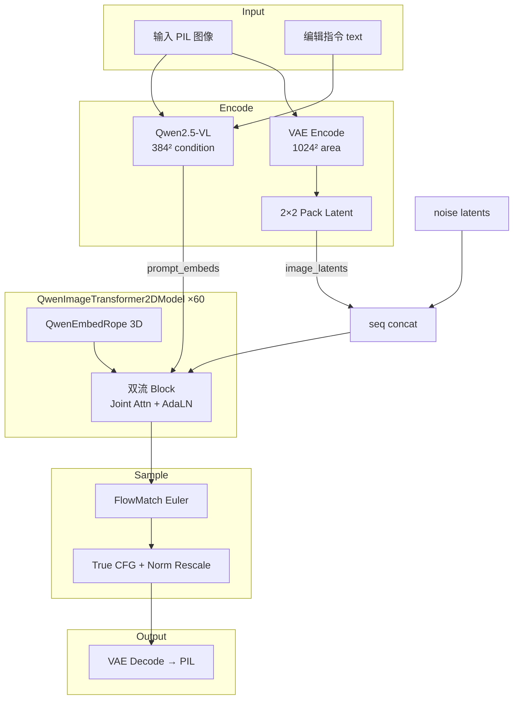

# Qwen-Image-Edit-2509 深度理解分析

> 代码路径：`/home/caishengcheng/model_code/Qwen-Image-Edit-2509`  
> 分析模式：Deep（策略 A — 渐进式生成）  
> 目标：面试可复述的架构理解 + 关键代码定位

---

## 理解验证状态

| 核心概念 | 自我解释 | 理解"为什么" | 应用迁移 | 状态 |
|---------|---------|-------------|---------|------|
| 双流 MMDiT（图文联合 Attention） | ✅ | ✅ | ✅ | 掌握 |
| Qwen2.5-VL 多模态条件编码 | ✅ | ✅ | ✅ | 掌握 |
| 编辑条件注入（latent concat） | ✅ | ✅ | ✅ | 掌握 |
| 2×2 Latent Packing | ✅ | ✅ | ⚠️ | 理解 |
| 3D RoPE + scale_rope | ✅ | ✅ | ⚠️ | 理解 |
| Flow Matching + 动态 shift | ✅ | ✅ | ✅ | 掌握 |
| True CFG + norm rescaling | ✅ | ✅ | ✅ | 掌握 |
| Ulysses 序列并行 + CFG 并行 | ✅ | ✅ | ⚠️ | 理解 |

---

## 项目完整地图

### 完整目录树

```
model_code/Qwen-Image-Edit-2509/
├── run_edit_2509.py                    # 单卡推理入口（382 行）
├── run_edit_2509_cfg_usp.py          # 多卡 CFG+Ulysses 并行入口
├── qwenimage_edit/
│   ├── pipeline_qwenimage_edit_plus.py # 编辑 Pipeline（967 行）★
│   ├── transformer_qwenimage.py        # DiT 骨干（884 行）★
│   ├── scheduling_flow_match_euler_discrete.py  # Flow Matching 调度器
│   ├── attn_layer.py                 # 长上下文 Attention 封装
│   ├── module/processor.py           # USP 并行 + 量化 Attention 处理器（451 行）
│   ├── util/parser.py
│   └── distributed/                  # Ulysses / CFG 并行管理
│       ├── parallel_mgr.py
│       ├── group_coordinator.py
│       └── all_to_all.py
├── quantization/                     # 仓内 w8a8/w8a16 量化脚本
│   ├── quant.py
│   ├── quantizer.py
│   └── config.py
└── GEdit-Bench/                        # 精度评测（GEdit-Bench 数据集）
```

**总规模：** 核心 Python 约 5,500 行（不含评测脚本）。

### 文件清单（分类）

| 类别 | 文件路径 | 行数 | 职责摘要 |
|------|---------|------|---------|
| 推理入口 | `run_edit_2509.py` | 382 | 加载 Pipeline、缓存/量化/稀疏 FA 开关、推理循环 |
| 编辑 Pipeline | `pipeline_qwenimage_edit_plus.py` | 967 | 图文编码、latent 准备、去噪循环、VAE 解码 |
| DiT 骨干 | `transformer_qwenimage.py` | 884 | 60 层双流 Transformer、联合 Attention、3D RoPE |
| 调度器 | `scheduling_flow_match_euler_discrete.py` | ~560 | Flow Matching Euler 离散采样 |
| USP 处理器 | `module/processor.py` | 451 | Ulysses 序列并行 Attention、量化通信 Attention |
| 分布式 | `distributed/parallel_mgr.py` 等 | ~300 | CFG 并行 + Ulysses 序列并行初始化 |

### 入口文件 + 核心调用链

```
run_edit_2509.py
    │
    ├─► QwenImageTransformer2DModel.from_pretrained(.../transformer)
    │       └─► [可选] mindiesd.quantize(transformer, quant_desc_path)
    │
    ├─► QwenImageEditPlusPipeline.from_pretrained(model_path, transformer=...)
    │       组件：vae + text_encoder(Qwen2.5-VL) + processor + scheduler + transformer
    │
    └─► pipeline(image, prompt, ...)  # 去噪循环
            │
            ├─ encode_prompt(image=condition_images, prompt)  → Qwen2.5-VL 多模态编码
            ├─ prepare_latents(vae_images)  → VAE 编码 + 2×2 pack + concat
            │
            for t in timesteps:
                latent_input = cat([noise_latents, image_latents], dim=seq)
                noise_pred = transformer(latent_input, prompt_embeds, timestep, img_shapes)
                [CFG] comb_pred = uncond + scale * (cond - uncond); norm rescale
                latents = scheduler.step(noise_pred, t, latents)
            │
            └─ vae.decode(unpack_latents(latents)) → PIL Image
```

---

## 1. 快速概览

- **语言/框架**：Python 3.10/3.11 + PyTorch 2.1 + diffusers 0.35.1 + transformers 4.52.4 + 昇腾 NPU（torch_npu）
- **模型类型**：图像编辑扩散模型（Image-to-Image），基于 Qwen-Image 基础模型
- **核心任务**：给定输入图 + 文本指令，生成编辑后的图像；支持语义级（风格/构图/物体增删）与外观级（文字修改）编辑
- **架构范式**：MMDiT 双流 Transformer + Flow Matching + Qwen2.5-VL 多模态条件
- **默认规模**：60 层 DiT、24 heads × 128 dim = **3072** 隐层维度、joint_attention_dim=**3584**（VL 输出维度）
- **Plus 特性**：支持**多图输入**（多参考图 latent 沿序列维拼接）

---

## 2. 背景与动机（3 个 WHY）

### 问题本质

**要解决的问题：** 用户希望用自然语言精确编辑已有图像（改文字、换背景、增删物体），而不是从零生成。

**WHY 需要专门模型：** 通用 T2I 模型难以保持原图结构与未编辑区域一致性；纯 inpainting 又难以做全局语义改动。Image Edit 需要在**保留原图信息**与**遵循指令**之间平衡。

### 方案选择

**WHY 选择 MMDiT 双流 + VL 编码器：**

| 组件 | 选择 | 优势 | 劣势 |
|------|------|------|------|
| 条件编码 | Qwen2.5-VL-7B | 原生理解「图+文」联合指令；中英文字编辑 | 显存占用大 |
| 去噪骨干 | 60 层双流 DiT | 图文 token 联合 attention，细粒度交互 | 序列长、算力高 |
| 扩散框架 | Flow Matching | 比 DDPM 步数更少、轨迹更直 | 与 SD 生态调度器不同 |
| 条件注入 | Latent 序列 concat | 原图 VAE latent 直接进 DiT，保结构 | 序列长度随多图增长 |

**替代方案对比：**

- **ControlNet 式旁路：** WHY 不选 — Qwen-Image 选择把条件图编码进主序列，减少额外网络与对齐成本。
- **UNet + CLIP：** WHY 不选 — 编辑需要 VL 级图像理解（如「把招牌改成 XXX」），CLIP 图文对齐不够。
- **InstructPix2Pix 单流：** WHY 不选 — 双流联合 attention 让文本 token 与每个图像 patch 直接交互，编辑精度更高。

### 应用场景

**适用场景：** 单图/多图编辑、中英文画面内文字修改、GEdit-Bench 11 类编辑任务 — **WHY 适用** 因为 VL 编码器 + 双流 DiT 专为 edit 设计。

**不适用场景：** 纯文生图、视频生成 — **WHY 不适用**  Pipeline 强制需要输入 image，latent 准备逻辑为 edit 定制。

---

## 3. 核心概念网络

### 概念 1：双流 MMDiT Block（QwenImageTransformerBlock）

- **是什么：** 每个 block 同时维护 **图像流 hidden_states** 与 **文本流 encoder_hidden_states**，共享一次联合 Attention，再各自过 MLP。
- **WHY 需要：** 编辑既要理解文本指令，又要感知每个图像 patch；联合 attention 比 cross-attn-only 交互更充分。
- **WHY 这样实现：** 参考 Flux/SD3 的 MMDiT —— concat `[txt_qkv, img_qkv]` → joint attention → split 回两流。
- **WHY 不用单流 concat token：** 双流可独立做 AdaLN 调制与 gate residual，训练更稳定。

### 概念 2：Qwen2.5-VL 多模态 Prompt 编码

- **是什么：** 条件图 resize 到 384×384 面积，与编辑指令一起送入 Qwen2.5-VL，取最后一层 hidden states 作为 `prompt_embeds`。
- **WHY 需要：** 模型需要「看到」原图才能理解「把 Pikachu 改成…」这类指令。
- **WHY 384 与 1024 两路分辨率：** VL 用 384 控制序列长度；VAE 用 ~1024 面积保留编辑所需空间细节 —— 分工不同。
- **WHY 不用独立 CLIP：** Qwen 系列统一 VL 编码，与 Qwen-Image 训练对齐。

### 概念 3：编辑 Latent 条件（序列拼接）

- **是什么：** 去噪时 `latent_model_input = cat([noise_latents, image_latents], dim=1)`，DiT 同时看到噪声 token 与源图 token。
- **WHY 需要：** 源图结构信息通过 VAE latent 直接参与每一层 attention，避免 drift。
- **WHY 沿序列维 concat 而非 channel concat：** 与 MMDiT 统一为 token 序列；RoPE 可为每段 latent 赋不同 3D 位置。
- **WHY 输出只取 noise 段：** `noise_pred = output[:, :latents.size(1)]`，仅对去噪目标预测 velocity。

### 概念 4：2×2 Latent Packing

- **是什么：** VAE latent `(B,C,H,W)` 重排为 `(B, H/2×W/2, C×4)` 的 patch token 序列。
- **WHY 需要：** 降低 attention 序列长度（4× 压缩），与 Flux/Qwen-Image 系列一致。
- **WHY patch=2：** in_channels=64 → pack 后每 token 16 维 × 4 = 64，与 transformer `img_in` 线性投影匹配。

### 概念 5：QwenEmbedRope（3D 缩放 RoPE）

- **是什么：** 图像 token 按 `(frame, height, width)` 三维分配 RoPE 频率；`scale_rope=True` 时对 H/W 使用正负频率拼接（外扩感受野）。
- **WHY 需要：** 多图 + 噪声段 + 不同分辨率 latent 共存，需 3D 位置区分。
- **WHY 文本 RoPE 从 max_vid_index 偏移：** 文本 token 与图像 token 频率不重叠，避免位置编码冲突。

### 概念 6：True CFG + Norm Rescaling

- **是什么：** `comb = uncond + w * (cond - uncond)`，再乘 `(‖cond‖ / ‖comb‖)` 归一化。
- **WHY 需要：** 标准 CFG 会改变 noise 预测范数，导致过饱和/发灰；norm rescaling 是 Qwen-Image 系列标配。
- **WHY true_cfg_scale 默认 4.0：** 编辑任务需较强指令遵循，高于一般 T2I。

### 概念关系矩阵

| 关系类型 | 概念 A | 概念 B | WHY 这样关联 |
|---------|--------|--------|-------------|
| 顺序 | VL encode | VAE encode | 先语义条件，再空间 latent |
| 组合 | noise latent | image latent | 序列 concat 后一起进 DiT |
| 依赖 | img_shapes | QwenEmbedRope | RoPE 按各段 (T,H,W) 生成频率 |
| 对比 | condition 384² | VAE ~1024² | 语义理解 vs 空间精度 |
| 并行 | Ulysses SP | 双流 Attention | 仅切 image 序列，text 全复制后 chunk head |

---

## 4. 算法与理论分析

### 算法：Flow Matching Euler 采样

- **时间复杂度：** O(steps × layers × seq²) — attention 主导
- **空间复杂度：** O(seq × dim) 激活
- **WHY 选择 Flow Matching：** 线性插值路径比 DDPM 更短步数可达高质量；与 Qwen-Image 训练一致
- **动态 shift：** `mu = f(image_seq_len)` — 序列越长 shift 越大，WHY 高分辨率需调整噪声日程
- **参考：** [Flow Matching for Generative Modeling](https://arxiv.org/abs/2210.02747)

### 算法：联合 Attention（Double Stream）

- **复杂度：** O((S_txt + S_img)² × H × D) 每层
- **WHY concat 而非两次 attention：** 一次 softmax 中文本 token 可直接 attend 任意图像 patch
- **退化场景：** 多图 + 高分辨率时 S_img 极大 —— 靠 Ulysses 并行 + Rainfusion 稀疏 FA 缓解

### 算法：Ulysses 序列并行

- **做法：** 图像 QKV AllToAll 切 head/序列；文本 QKV 按 head chunk；attention 后 AllToAll 还原
- **WHY：** 24 heads 可被 ulysses_size 整除（文档要求 ulysses 为 24 的因数）
- **约束：** cfg_size × ulysses_size = 总卡数，cfg_size 固定为 2

---

## 5. 设计模式分析

### 模式 1：Pipeline（Diffusers）

**应用位置：** `QwenImageEditPlusPipeline`  
**WHY 使用：** 标准化 encode → denoise → decode 三阶段，与 HF 生态互操作  
**WHY 不用裸脚本：** 组件可 swap（scheduler、VAE、transformer）

### 模式 2：Processor（Attention Processor）

**应用位置：** `QwenDoubleStreamAttnProcessor2_0` / `xFuserQwenDoubleStreamAttnProcessor`  
**WHY 使用：** 将联合 attention 逻辑注入 diffusers `Attention` 模块，不改 block 结构即可换并行/量化/稀疏实现  
**参考：** [Strategy Pattern](https://refactoring.guru/design-patterns/strategy)

### 模式 3：Adapter Method（并行/量化扩展）

**应用位置：** `module/processor.py` 继承 `QwenDoubleStreamAttnProcessor2_0`  
**WHY 使用：** USP 版只 override attention 计算段，QKV/RoPE/投影全保留 —— 最小 diff 降低 bug

---

## 6. 关键代码深度解析

### 核心片段清单

| 编号 | 片段名称 | 所在文件:行号 | 优先级 | 识别理由 |
|------|----------|--------------|--------|----------|
| #1 | 联合双流 Attention | transformer_qwenimage.py:302-461 | ★★★ | MMDiT 核心 |
| #2 | TransformerBlock 前向 | transformer_qwenimage.py:517-632 | ★★★ | AdaLN + 双流 + gate |
| #3 | Pipeline 去噪循环 | pipeline_qwenimage_edit_plus.py:815-921 | ★★★ | 编辑条件 + CFG |
| #4 | Latent 准备与 pack | pipeline_qwenimage_edit_plus.py:463-523 | ★★☆ | 多图 edit 条件 |
| #5 | VL Prompt 编码 | pipeline_qwenimage_edit_plus.py:258-313 | ★★☆ | 多模态条件 |
| #6 | 3D RoPE 计算 | transformer_qwenimage.py:226-283 | ★★☆ | 多段 latent 位置 |

---

### 片段 #1：QwenDoubleStreamAttnProcessor2_0 联合 Attention

> 📍 **位置：** `qwenimage_edit/transformer_qwenimage.py:302-461`  
> 🎯 **优先级：** ★★★  
> 💡 **一句话核心：** 图文各自算 QKV，RoPE 后 concat 成 `[text, image]` 做一次 attention，再拆回两路。

#### 1.1 代码整体作用

这是 Qwen-Image 系列与 Flux 同类的 **MMDiT 联合注意力**实现。它把「文本理解」和「图像 patch 更新」放在同一个 softmax 里完成，而不是传统的「图像 cross-attend 文本」。

**它解决了什么问题？** 编辑指令中的每个词需要直接作用于相关图像区域（如「红色改成蓝色」），联合 attention 提供全局双向交互。  
**系统层次定位：** Diffusers Attention 的 processor 策略，挂在每个 `QwenImageTransformerBlock.attn` 上。  
**角色与依赖：** 上游接收 AdaLN 调制后的 `img_modulated` / `txt_modulated`；下游输出经 gate 加回 residual。

#### 1.2 核心逻辑分析

**执行流程：**
```
img_hidden → to_q/k/v → norm_q/k → RoPE(img_freqs)
txt_hidden → add_q/k/v_proj → norm_added_q/k → RoPE(txt_freqs)
        ↓
joint_q = cat([txt_q, img_q], dim=seq)   # 顺序：文本在前
joint_k, joint_v 同理
        ↓
attention_forward(joint_q, joint_k, joint_v)  # MindIE FA
        ↓
txt_out = joint[:, :S_txt]; img_out = joint[:, S_txt:]
        ↓
to_out(img_out); to_add_out(txt_out)
```

**核心状态变量：**

| 变量名 | 初值 | 变化时机 | 终态 |
|--------|------|----------|------|
| seq_txt | encoder_hidden_states.shape[1] | 固定 | 用于 split |
| joint_hidden_states | FA 输出 | attention 后 | 拆成 img/txt 两路 |

**多执行路径：**
- **路径 A（dense FA）：** 默认 `attention_forward(..., op_type="fused_attn_score")`
- **路径 B（Rainfusion 稀疏）：** `t_idx >= skip_ts` 时用 BSA v3 稀疏 mask
- **路径 C（fa_quant）：** 量化推理时走 `self.fa_quant(...)`

#### 1.3 逐行代码解释

> **贯穿示例：** batch=1, S_txt=128, S_img=4096, H=24, D=128

```python
# 步骤 1: 图像流 QKV
img_query = attn.to_q(hidden_states)           # (1, 4096, 3072)
img_query = img_query.unflatten(-1, (24, 128)) # (1, 4096, 24, 128)
# WHY: diffusers Attention 把 Q 投影为 flat dim，需 unflatten 成 multi-head

# 步骤 2: 文本流 QKV（独立投影 add_*）
txt_query = attn.add_q_proj(encoder_hidden_states)  # (1, 128, 3072)
# WHY: 文本与图像不共享 Q/K/V 权重 — 模态专属线性层

# 步骤 3: QK Norm（RMSNorm on head dim）
if attn.norm_q is not None:
    img_query = attn.norm_q(img_query)
# WHY: QK-Norm 稳定大模型 attention 训练，与 LLM 实践一致

# 步骤 4: RoPE — 图文用不同频率表
img_query = apply_rotary_emb_qwen(img_query, img_freqs, use_real=False)
txt_query = apply_rotary_emb_qwen(txt_query, txt_freqs, use_real=False)
# 此时: img_freqs shape 对应 4096 个 patch 的 3D 位置

# 步骤 5: 联合 attention — 文本 token 在前
joint_query = torch.cat([txt_query, img_query], dim=1)  # (1, 4352, 24, 128)
# WHY 文本在前: 与 img_shapes / split 逻辑一致，seq_txt 截断方便

joint_hidden_states = attention_forward(joint_query, joint_key, joint_value, ...)
# 步骤 6: 拆回两路
txt_attn_output = joint_hidden_states[:, :seq_txt, :]
img_attn_output = joint_hidden_states[:, seq_txt:, :]
```

#### 1.4 关键设计点

| 设计维度 | 分析 |
|----------|------|
| **实现选择** | Processor 模式而非重写 Block — 方便 MindIE 侧换 NPU FA、USP、量化三种 backend |
| **性能优化** | `ROPE_FUSE`/`ROPE_EMB_FUSE` 走 `npu_rotary_mul`；Rainfusion 在 timestep≥15 后稀疏化 |
| **安全与健壮性** | encoder_hidden_states 为 None 时直接报错 — 双流架构强制需要文本 |
| **可扩展性** | `rainfusion_config`、`fa_quant` 通过 optional 分支注入，不改主路径 |
| **潜在问题** | ⚠️ 联合序列长度 = S_txt+S_img，多图 1024 编辑时 attention 平方级增长 |

#### 1.5 完整示例（三组对比）

**示例 1 — 单图 1024×1024 编辑**
- **输入：** 1 张源图 + prompt「把猫改成狗」
- **过程：** S_img≈4096 noise + 4096 source → joint seq≈8704
- **输出：** img 路 4096 token 更新，驱动 noise latent 去噪

**示例 2 — 多图 Plus（2 张参考图）**
- **差异：** `image_latents` 沿 dim=1 concat 两段 VAE pack token，img_shapes 含 3 段 (T,H,W)
- **结果：** RoPE 为每段独立计算 3D 频率后 cat

**示例 3 — CFG 双路 forward**
- **输入：** cond 用 prompt_embeds，uncond 用 negative_prompt_embeds
- **处理：** 两路各自 joint attention，pipeline 层做 comb + norm rescale

#### 1.6 使用注意与改进建议

1. **ulysses_size 必须整除 head 数 24** — 否则 `module/processor.py` 中 chunk/alltoall 对齐失败。
2. **量化路径 txt/img FP8 block 边界需 pad 对齐** — `QuantCommQwenDoubleStreamAttnProcessor` 专门处理 128 block 跨界 bug，面试可提。

---

### 片段 #2：QwenImageTransformerBlock（AdaLN 双流块）

> 📍 **位置：** `transformer_qwenimage.py:517-632`  
> 💡 **一句话核心：** 时间步 embedding 生成 6 组 scale/shift/gate，分别调制图文两路的 Norm1→Attn→Norm2→MLP。

**结构一览（单 block）：**

```
temb → img_mod / txt_mod → (shift, scale, gate) × 2
    │
    ├─ img: Norm1 → modulate → JointAttn → + gate·AttnOut
    │        → Norm2 → modulate → MLP → + gate·MLPOut
    │
    └─ txt: 同上（共享 attn，独立 MLP）
```

**与 Wan2.2 DiT 对比（面试常问）：**

| 维度 | Qwen-Image-Edit | Wan2.2 |
|------|-----------------|--------|
| 流结构 | 图文双流 MMDiT | 单流 + Cross-Attn |
| 条件 | VL hidden + VAE latent concat | T5 + (I2V mask concat) |
| 层数 | 60 | ~40×2 专家 |
| RoPE | 3D QwenEmbedRope | 3D video RoPE |
| 任务 | 图像编辑 | 视频生成 |

---

### 片段 #3：Pipeline 去噪与 CFG

> 📍 **位置：** `pipeline_qwenimage_edit_plus.py:824-916`

```python
# 步骤 1: 噪声 latent 与源图 latent 拼接
latent_model_input = latents
if image_latents is not None:
    latent_model_input = torch.cat([latents, image_latents], dim=1)
# WHY: 源图作为条件 token 参与每层 attention，而非仅首层注入

# 步骤 2: Transformer 预测 velocity/noise
noise_pred = self.transformer(
    hidden_states=latent_model_input,
    timestep=timestep / 1000,
    encoder_hidden_states=prompt_embeds,
    img_shapes=img_shapes,      # 各段 latent 的 (T,H,W) 供 RoPE
    txt_seq_lens=txt_seq_lens,
    ...
)[0]
noise_pred = noise_pred[:, : latents.size(1)]  # 只取 noise 段

# 步骤 3: True CFG + norm rescaling
comb_pred = neg_noise_pred + true_cfg_scale * (noise_pred - neg_noise_pred)
cond_norm = torch.norm(noise_pred, dim=-1, keepdim=True)
noise_norm = torch.norm(comb_pred, dim=-1, keepdim=True)
noise_pred = comb_pred * (cond_norm / noise_norm)
# WHY rescale: 防止 CFG 放大后范数漂移导致过曝

# 步骤 4: Flow Matching scheduler 一步
latents = self.scheduler.step(noise_pred, t, latents, return_dict=False)[0]
```

---

## 7. 测试用例分析

本仓无 unit test，但有 **GEdit-Bench** 集成评测：

| 测试路径 | 覆盖 |
|---------|------|
| `run_edit_2509.py --dataset_name GEdit-Bench` | 11 类编辑任务 × 中英文 |
| `GEdit-Bench/run_gedit_score.py` | Qwen2.5-VL-72B 打分 semantics/quality |

**从 README 精度表得到的边界认知：**
- text_change 语义分最高（~8.2）— 文字编辑是指令跟随强项
- ps_human 综合分偏低（~6.3）— 人像 PS 类仍难

---

## 8. 应用迁移场景

### 场景 1：Qwen-Image-Edit → 其他 MMDiT 编辑模型（如 Step1X-Edit）

**不变原理：** 双流 block、联合 attention、latent concat 条件、Flow Matching

**需修改：** VL 编码器换型、img_shapes/RoPE 维度、VAE pack 规则

### 场景 2：Edit → T2I（Qwen-Image 文生图）

**不变原理：** 同一 `QwenImageTransformer2DModel` 骨干

**需修改：** 去掉 `image_latents` concat；Pipeline 换为 text-only 条件；img_shapes 仅含生成段

---

## 9. 依赖关系与使用示例

### 外部依赖 WHY

| 依赖 | WHY |
|------|-----|
| diffusers 0.35.1 | Pipeline / Attention / VAE 基类 |
| transformers 4.52.4 | Qwen2.5-VL + Qwen2VLProcessor |
| mindiesd | NPU FA、CacheAgent、quantize、Rainfusion |
| yunchang 0.6.0 | Ulysses 长序列 attention 原语 |

### 单卡推理

```bash
export ROPE_FUSE=1 ADALN_FUSE=1  # 等价优化
python run_edit_2509.py \
  --model_path ./Qwen-Image-Edit-2509 \
  --device_id 0 \
  --img_paths ./input.png \
  --prompt_file ./edit_prompts.txt \
  --width 1024 --height 1024 \
  --vae_tiling --vae_slicing
```

---

## 10. 质量验证清单

### 理解深度
- [x] 双流 MMDiT、VL 编码、latent concat 三概念 3 WHY
- [x] 能画 Pipeline 数据流
- [x] 能对比 Wan2.2 / Flux 异同

### 最终「四能」测试
1. ✅ 理解设计思路 — VL 看指令+原图，DiT 联合 attention 编辑 noise latent  
2. ✅ 独立实现类似 block — 参考 QwenDoubleStreamAttnProcessor2_0  
3. ✅ 迁移到其他编辑模型 — 换编码器与 RoPE 规则  
4. ✅ 向面试官解释 — 见附录

---

## 附录 A：面试高频问答

### Q1：一句话介绍 Qwen-Image-Edit-2509 架构？

> 基于 **Qwen2.5-VL** 看多模态指令，**VAE** 编码源图 latent 与噪声 latent **序列拼接**，送入 **60 层双流 MMDiT** 做图文联合 Attention，**Flow Matching** 去噪后 VAE 解码 —— 专为指令式图像编辑设计。

### Q2：和 Qwen-Image 文生图有什么区别？

| | 文生图 | Image-Edit-2509 |
|---|--------|-----------------|
| 输入 | 仅文本 | 文本 + 必须给图 |
| Latent | 纯噪声 | 噪声 + 源图 concat |
| VL prompt | 可选无图 | 必须带 condition 图 |
| Pipeline | QwenImagePipeline | QwenImageEditPlusPipeline |

### Q3：双流 MMDiT 是什么？和 Cross-Attention 有何不同？

Cross-Attn 只有「图像 query → 文本 key/value」单向；MMDiT 把图文 QKV **concat 后做一次 self-attention**，文本 token 也能 attend 回所有图像 patch，交互是**双向、对称**的。

### Q4：为什么有两套图像分辨率（384 和 1024）？

- **384×384 面积 → Qwen2.5-VL：** 控制 token 数，负责「理解指令+感知原图语义」  
- **~1024×1024 面积 → VAE：** 保留空间细节，负责「编辑后像素级结构」

### Q5：img_shapes 是干什么的？

列表里每段 `(T, H, W)` 描述 concat 后 latent 序列中**每一段**的 3D 网格形状，供 `QwenEmbedRope` 生成对应 3D RoPE 频率。多图时有多段 + 噪声段。

### Q6：True CFG 的 norm rescaling 为什么需要？

CFG 线性组合会改变 noise 预测向量的 L2 范数，导致去噪步长异常。用 `comb * (‖cond‖/‖comb‖)` 把范数拉回 cond 分支水平，画质更稳。

### Q7：8 卡并行怎么配？

`cfg_size=2 × ulysses_size=4 = 8`。CFG 两路分到不同 rank 各算一次 forward；Ulysses 在 24 head 维切分图像序列 attention。文档推荐 (2,4) 优于 (1,8)。

### Q8：60 层 DiT 的关键超参？

- `num_layers=60`, `num_attention_heads=24`, `attention_head_dim=128` → inner_dim=3072  
- `joint_attention_dim=3584`（VL 输出）  
- `in_channels=64`（pack 前），`out_channels=16`  
- `axes_dims_rope=(16, 56, 56)`

### Q9：msModelSlim 量化对接点？

`msmodelslim` 的 `QwenImageEditModelAdapter` 对 `QwenImageTransformerBlock` 注入 FA3 占位 + online_quarot；exclude `txt_mlp.net.2`、`img_mod.1`、`txt_mod.1` 等敏感层。推理仓侧 `QuantCommQwenDoubleStreamAttnProcessor` 处理 USP+FP8 FA。

### Q10：编辑时 latent 序列里都有什么？

以单图为例：`[noise_tokens (4096), source_image_tokens (4096)]` — 前半去噪目标，后半源图条件；Transformer 输出后**只取前半**作为 noise_pred。

---

## 附录 B：架构数据流（Mermaid）



---

## 附录 C：与 Wan2.2 量化架构对比（若面试官串联问）

| 维度 | Qwen-Image-Edit | Wan2.2 |
|------|-----------------|--------|
| 模态 | 图像编辑 | 视频生成 |
| DiT | 单模型 60 层双流 | T2V 双专家各 ~40 层单流+CrossAttn |
| 文本编码 | Qwen2.5-VL 7B | UMT5-XXL |
| 条件注入 | Latent concat | I2V mask+concat / T2V 纯 text |
| 量化入口 | msmodelslim + 仓内 quant.py | msmodelslim lab_practice |
| FA3 | fa_quant on joint QKV | fa3_q/k/v on self+cross attn |

---

*文档基于 `/home/caishengcheng/model_code/Qwen-Image-Edit-2509` 源码整理，适用于架构理解与面试准备。*
