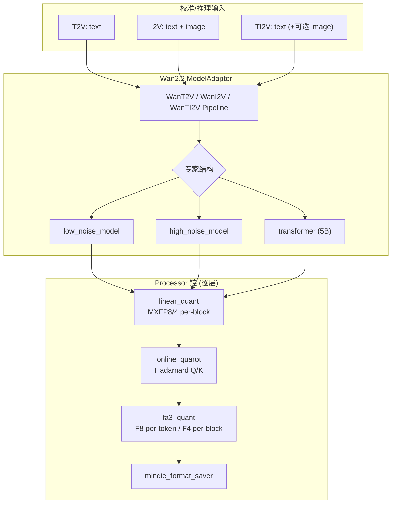

# Wan2.2 量化深度理解分析

## 理解验证状态

| 核心概念 | 自我解释 | 理解"为什么" | 应用迁移 | 状态 |
|---------|---------|-------------|---------|------|
| 双专家 MoE DiT | ✅ | ✅ | ✅ | 掌握 |
| T2V / I2V / TI2V 三场景 | ✅ | ✅ | ✅ | 掌握 |
| W8A8 MXFP8 per-block | ✅ | ✅ | ✅ | 掌握 |
| online_quarot (Hadamard) | ✅ | ✅ | ⚠️ | 理解 |
| FA3 F8 (fp8_e4m3 per-token) | ✅ | ✅ | ✅ | 掌握 |
| FA3 F4 (mxfp4 per-block) | ✅ | ✅ | ✅ | 掌握 |
| 逐层量化 + 专家子适配器 | ✅ | ✅ | ✅ | 掌握 |

---

## 项目完整地图

### 完整目录树（Wan2.2 量化相关）

```
msmodelslim/
├── lab_practice/wan2_2/          # 官方最佳实践 YAML（5 套）
│   ├── wan2_2_w8a8f8_mxfp_t2v.yaml
│   ├── wan2_2_w8a8f8_mxfp_i2v.yaml
│   ├── wan2_2_w8a8f8_mxfp_ti2v.yaml
│   ├── wan2_2_w4a4f8_mxfp_t2v.yaml
│   └── wan2_2_w4a4f4_mxfp_t2v.yaml
├── msmodelslim/model/wan2_2/     # 模型适配器（核心）
│   ├── base_model_adapter.py     # 公共流水线 + FA3/QuaRot 注入
│   ├── expert_sub_adapter.py     # 逐层量化子适配器
│   ├── constants.py
│   ├── t2v/model_adapter.py      # T2V 双专家
│   ├── i2v/model_adapter.py      # I2V 双专家
│   └── ti2v/model_adapter.py     # TI2V 单 DiT
├── msmodelslim/processor/
│   ├── quant/linear.py           # linear_quant 处理器
│   ├── quant/fa3/processor.py    # fa3_quant 处理器
│   └── quarot/online_quarot/     # online_quarot 处理器
├── msmodelslim/core/quant_service/multimodal_sd_v1/
│   └── quant_service.py          # 多模态 SD 量化编排
├── msmodelslim/ir/
│   ├── w8a8_mx_dynamic.py        # MXFP8 动态线性层 IR
│   ├── w4a4_mx_dynamic*.py       # MXFP4 动态线性层 IR
│   └── activation_dynamic.py     # FA3 激活伪量化 IR
└── example/multimodal_sd/Wan2_2/README.md
```

### 文件清单（分类）

| 类别 | 文件路径 | 职责摘要 |
|------|---------|---------|
| 最佳实践配置 | `lab_practice/wan2_2/*.yaml` | 定义 process 链、dataset、推理参数 |
| 场景适配器 | `model/wan2_2/{t2v,i2v,ti2v}/model_adapter.py` | 加载 Wan pipeline、校验校准数据、绑定专家 |
| 公共基类 | `model/wan2_2/base_model_adapter.py` | FA3 占位注入、QuaRot 配置、逐层 forward |
| 专家子适配 | `model/wan2_2/expert_sub_adapter.py` | LayerWiseRunner 按专家调度 |
| 线性量化 | `processor/quant/linear.py` | 遍历 nn.Linear，安装 LinearQuantizer |
| FA3 量化 | `processor/quant/fa3/processor.py` | Q/K/V 激活量化，支持 per-token/per-block |
| 在线旋转 | `processor/quarot/online_quarot/` | Hadamard 旋转 Q/K，配合低比特 attention |
| 量化服务 | `core/quant_service/multimodal_sd_v1/quant_service.py` | 双专家循环 + LayerWiseRunner |
| MXFP IR | `ir/w8a8_mx_dynamic.py` 等 | 部署态 fake-quant / dequant 算子 |

### 入口与核心调用链

```
msmodelslim quant --model_type Wan2.2-T2V-A14B --quant_type w8a8f8
    │
    ├─► NaiveQuantApp.get_best_practice()  → lab_practice/wan2_2/wan2_2_w8a8f8_mxfp_t2v.yaml
    │
    ├─► Wan2_2T2VModelAdapter.init_model()  → WanT2V pipeline → low/high_noise_model
    │
    └─► MultimodalSDModelslimV1QuantService._quant_process()
            │
            for expert in [low_noise_model, high_noise_model]:
                LayerWiseRunner(expert_adapter).run(process=[
                    linear_quant → online_quarot → fa3_quant → mindie_format_saver
                ])
```

---

## 1. 快速概览

- **语言/框架**：Python 3 + PyTorch + 昇腾 NPU（torch.npu）
- **代码规模**：Wan2.2 适配模块约 29 个文件；核心逻辑集中在 `base_model_adapter.py`（~1134 行）
- **模型类型**：视频扩散 DiT（Diffusion Transformer），Wan2.2 在 Wan2.1 基础上引入 **MoE 双专家**（低噪声/高噪声）
- **支持的 quant_type**：
  - `w8a8f8`：全层 W8A8(MXFP8) + FA3 F8 动态 — **T2V/I2V/TI2V 均已官方验证**
  - `w4a4f4`：首 5 层 W8A8 + 其余 W4A4 + FA3 F4 — **仅 T2V 官方验证**
  - `w4a4f8`：首 5 层 W8A8 + 其余 W4A4 + FA3 F8 — **仅 T2V**
- **核心依赖**：Wan2.2 推理仓（`wan`、`generate.py`）、MindIE-SD（`mindiesd`）、msModelSlim 处理器链

---

## 2. 背景与动机（3 个 WHY）

### 问题本质

**要解决的问题：** Wan2.2 A14B 级视频 DiT 参数量大、attention 计算占主导，全精度推理无法在单卡 Atlas 800I A2 64G 上高效部署。

**WHY 需要解决：** 不量化则显存/算力无法满足影视级 T2V/I2V 实时或近实时生成；attention 的 Q/K/V 中间激活动态范围大，仅线性层 W8A8 不足以覆盖 attention 内核（FA3）的精度损失。

### 方案选择

**WHY 选择 MXFP + FA3 混合方案：**

| 组件 | 方案 | 优势 | 劣势 |
|------|------|------|------|
| 线性层 | MXFP8/MXFP4 per-block | 与昇腾 MX 格式硬件对齐；block 级共享指数，精度优于朴素 INT8 | 需 block 对齐（通常 32 元素） |
| Attention | FA3 + FP8/MXFP4 动态激活量化 | 在 FlashAttention-3 路径上对 Q/K/V 做在线伪量化，无需离线校准（per-token/per-block） | 需模型适配器 hook forward |
| 前置 | online_quarot Hadamard | 旋转 Q/K 使激活分布更均匀，降低 outlier 对低比特 FA 的影响 | 增加少量旋转开销 |

**替代方案对比：**

- **纯 W8A8 不做 FA3**：WHY 不选 — attention matmul 仍是 FP16/BF16，加速有限，显存瓶颈仍在 KV 路径。
- **静态 PTQ 校准 attention**：WHY 不选 — 视频扩散每步 timestep、每帧 token 分布变化大，per-token 动态更鲁棒；Wan2.2 默认 `enable_dump: False` 即纯动态路径。
- **INT8 per-head FA3**：WHY 不选 — msModelSlim 默认 FA3 为 INT8 per-head 需校准数据；Wan2.2 选用 FP8/MXFP4 动态 scope 实现 data-free。

### 应用场景

**适用场景：** Atlas 350/800 上 MindIE-SD 部署 Wan2.2 视频生成 — **WHY 适用** 因为官方 verified_tags 覆盖 MindIE-SD + Atlas_350。

**不适用场景：** 需要 W4A4 的 I2V/TI2V — **WHY 不适用** README 表格中 I2V/TI2V 的 W4A4 列为空，仅 T2V 提供 w4a4f4/w4a4f8 最佳实践。

---

## 3. 核心概念网络

### 概念 1：双专家 MoE DiT（T2V / I2V）

- **是什么：** A14B 模型拆成 `low_noise_model` 与 `high_noise_model` 两个独立 DiT，扩散过程按 timestep 切换专家。
- **WHY 需要：** 视频扩散在不同噪声阶段对模型能力需求不同；MoE 在不倍增单次推理 FLOPs 的前提下扩大总参数量。
- **WHY 这样实现：** msModelSlim 对两个专家 **分别逐层量化、分别保存** 到 `save_path/low_noise_model/` 与 `high_noise_model/`。
- **WHY 不用单模型量化：** 两个专家权重独立，混合量化策略（如首层 W8A8）也按各自 block 索引生效。

### 概念 2：TI2V 单 DiT（5B）

- **是什么：** `Wan2.2-TI2V-5B` 只有一个 `transformer`，无 low/high 拆分；同一模型内按是否有 `image` 走 t2v/i2v 分支。
- **WHY 需要：** 5B 统一模型覆盖文本生视频 + 图文生视频，部署更简单。
- **WHY 这样实现：** `init_model()` 返回 `{"": self.transformer}`，专家名为空字符串；量化输出直接写 `save_path/` 根目录。
- **WHY 不用双专家：** 5B 参数量小，不需要 MoE 分工。

### 概念 3：quant_type 命名规则

```
w{W}a{A}[f{4|8}|c8][s]
  W/A = 线性层 weight/activation 比特
  f8  = FA3 使用 FP8 (fp8_e4m3 per-token)
  f4  = FA3 使用 MXFP4 (per-block)
  c8  = KV Cache 8bit（Wan2.2 未启用）
  s   = 稀疏（Wan2.2 未启用）
```

- **WHY f8 默认 8bit：** `check_config` 中若 label 有 `fa_quant: True` 但无 `fa_bit`，默认 FA 为 8bit。

### 概念 4：MXFP（Microscaling FP）

- **是什么：** 每 32 元素为一个 block，block 内共享一个 E8M0 指数，元素用 E4M3（MXFP8）或 E2M1（MXFP4）存储。
- **WHY 需要：** 比 per-tensor 量化更细、比 per-channel 更省 scale 存储；与 OCP MX 标准及昇腾算子对齐。
- **WHY per-block scope：** 线性层权重/激活的最后一维（head_dim 或 out_features）按 block 切分；见 `reshape_to_blocks(..., block_size=32)`。
- **WHY 不用 INT8 per-channel：** MXFP 在极低比特（4bit）下仍保留浮点指数结构，更适合扩散模型权重分布。

### 概念 5：FA3 量化

- **是什么：** 在 `WanSelfAttention` / `WanCrossAttention` 的 forward 中，Q/K/V 计算后、进入 `attention()` 前，插入 `fa3_q/k/v` 伪量化模块。
- **WHY 需要：** FlashAttention-3 融合内核消费低比特 Q/K/V，是 attention 加速的关键路径。
- **WHY 注入占位而非改源码：** 解耦 msModelSlim 与 Wan 推理仓；适配器 `inject_fa3_placeholders` 包裹 forward。
- **WHY Q/K ratio=0.9999, V ratio=1.0：** RecallWindowObserver 对 Q/K 略缩范围（抗 outlier），V 全保留。

### 概念 6：online_quarot

- **是什么：** 对 `q_rot`、`k_rot` 模块做 Hadamard 旋转（seed=1234 共享，保证 Q/K 一致）。
- **WHY 在 FA3 之前：** 先旋转再量化，使各 channel 能量更均匀，FA 低比特误差更小。
- **WHY T2V 排除 blocks.0：** 首层 attention 对最终画质最敏感，保留 FP 路径 + 不做 quarot/FA3（见 YAML exclude）。

### 概念关系矩阵

| 关系类型 | 概念 A | 概念 B | WHY 这样关联 |
|---------|--------|--------|-------------|
| 顺序 | online_quarot | fa3_quant | 旋转后的 Q/K 再量化，误差更小 |
| 顺序 | linear_quant | online_quarot | 线性层权重先定稿，attention 路径单独处理 |
| 组合 | W4A4 linear | W8A8 首 5 层 | 浅层对重建误差更敏感，混合精度保底 |
| 对比 | FA3 F8 per-token | FA3 F4 per-block | F8 精度高、全动态；F4 更省带宽、需 block 对齐 |
| 依赖 | LayerWiseRunner | expert_sub_adapter | 逐层遍历 blocks，每专家独立 context |

---

## 4. 算法与理论分析

### 算法：MXFP8 per-block 动态线性量化

- **时间复杂度：** 前向 O(n) 遍历元素；每 block O(32) 求 min/max — 总体 O(n)
- **空间复杂度：** 额外存储 per-block scale（E8M0），O(n/32)
- **WHY 选择：** block 级共享指数在 8bit 下精度/开销平衡最优
- **WHY 复杂度可接受：** 相比 attention O(n²) 可忽略
- **退化场景：** head_dim 非 32 倍数时需 padding（`reshape_to_blocks` 处理）
- **参考：** [OCP Microscaling Formats (MX)](https://www.opencompute.org/documents/ocp-microscaling-formats-mx-v1-0-spec-final-pdf)

### 算法：FA3 FP8 per-token 动态量化

- **时间复杂度：** O(B×H×S×D) — 每个 token 独立 min/max
- **空间复杂度：** O(1) 额外参数（scale 运行时计算，不持久化）
- **WHY 选择：** 扩散每步激活分布漂移大，per-token 跟踪局部动态范围
- **WHY 不选 per-head 静态：** `is_data_free()` 在 per-token 时为 True，无需 calib pth
- **退化场景：** 极长序列时 per-token scale 计算开销上升 — 视频 DiT 的 S 为时空 token 数，可接受

### 算法：FA3 MXFP4 per-block

- **时间复杂度：** 同 MXFP8 block 统计
- **WHY 用于 w4a4f4 的非首层：** 线性层已 W4A4，attention 对齐到 4bit 最大化 FA3 加速比
- **退化场景：** outlier 多的 timestep — 配合 quarot 缓解

### 算法：W4A4 权重 `ceil_x` + `enable_search`

- **WHY：** 4bit 权重量化误差大，在候选 scale 中搜索最优（见 `w4a4_qconfig.ext.enable_search: True`）
- **WHY 首 5 层仍 W8A8：** 经验上浅层特征提取对量化噪声最敏感（lab 最佳实践）

---

## 5. 设计模式分析

### 模式 1：Adapter（模型适配器）

**应用位置：** `Wan2_2BaseModelAdapter` 及 t2v/i2v/ti2v 子类  
**WHY 使用：** Wan 推理仓接口（generate.py CLI、WanT2V pipeline）与 msModelSlim 量化框架解耦  
**WHY 不用直接改 Wan 源码：** 用户 checkout 固定 commit 即可，量化逻辑全在 msmodelslim  
**参考：** [Adapter Pattern](https://refactoring.guru/design-patterns/adapter)

### 模式 2：Template Method（专家子适配器）

**应用位置：** `Wan2_2ExpertSubAdapter` 委托 `_parent` 实现 forward/visit/FA3 注入  
**WHY 使用：** T2V/I2V 双专家共享 95% 逻辑，仅 `quantization_context` 绑定的 module 不同  
**WHY 不用三个完全独立适配器：** 避免 FA3 forward 包裹代码三份拷贝

### 模式 3：Chain of Responsibility（process 链）

**应用位置：** YAML `spec.process: [linear_quant, online_quarot, fa3_quant]`  
**WHY 使用：** 各处理器独立注册（`QABCRegistry`），可任意组合/排除 include  
**WHY 不用单体量化函数：** 支持 w4a4f4 双 linear_quant + 双 fa3_quant 灵活叠加

### 模式 4：Placeholder → Observer → Deploy（FA3 三阶段）

**应用位置：** `FA3QuantPlaceHolder` → `_FA3PerHeadObserver` → `AutoFakeQuantActivation`  
**WHY 使用：** preprocess 注入占位；逐层 forward 时 observer 可选收集；postprocess 部署 IR  
**WHY 不用一步量化：** per-head 需要校准统计；per-token/per-block 跳过 observer 直接部署

---

## 6. 关键代码深度解析

### 核心片段清单

| 编号 | 片段名称 | 所在文件:行号 | 优先级 | 识别理由 |
|------|----------|--------------|--------|----------|
| #1 | FA3 forward 注入链 | base_model_adapter.py:844-1074 | ★★★ | attention 量化核心路径 |
| #2 | 量化 process YAML | wan2_2_w8a8f8_mxfp_t2v.yaml:16-45 | ★★★ | 一键量化配置真相源 |
| #3 | 混合 W4A4+W8A8+FA F4/F8 | wan2_2_w4a4f4_mxfp_t2v.yaml:71-92 | ★★★ | 最低比特官方方案 |
| #4 | 双专家量化编排 | quant_service.py:208-246 | ★★☆ | 理解输出目录结构 |
| #5 | MXFP8 动态 linear forward | w8a8_mx_dynamic.py:77-109 | ★★☆ | W8A8 数学实现 |
| #6 | FA3 per-token IR | activation_dynamic.py:42-77 | ★★☆ | F8 动态量化实现 |

**跳过说明：**
- `t2v/i2v/ti2v/model_adapter.py`：除 `init_model`、校准校验外，量化逻辑全在基类，差异仅在 pipeline 类型与 inference 默认值。

---

### 片段 #1：FA3 Attention Forward 注入链

> 📍 **位置：** `msmodelslim/model/wan2_2/base_model_adapter.py:899-964`  
> 🎯 **优先级：** ★★★  
> 💡 **一句话核心：** 在 Q/K/V 算出后、RoPE+Attention 前，依次做 QuaRot 旋转和 FA3 伪量化。

#### 1.1 代码整体作用

这段代码通过 **monkey-patch** `WanSelfAttention.forward`，在不修改 Wan 源码的前提下插入量化点。它是整个 FA3 方案能在 MindIE 推理链路上生效的「卡口」——没有这里，`fa3_quant` 处理器安装的 IR 模块永远不会被调用。

**它解决了什么问题？** Attention 的 Q/K/V 张量形状为 `(B, S, H, D)`，必须在进入融合 attention 内核之前完成低比特化。  
**系统层次定位：** 模型适配层（Adapter），介于 Wan 模型代码与 msModelSlim Processor 之间。  
**角色与依赖：** 上游依赖 `FA3QuantProcessor.preprocess` 注入 `fa3_q/k/v` 子模块；下游消费 MindIE FA3 算子。

#### 1.2 核心逻辑分析

**执行流程：**
```
x → Linear(q/k/v) → norm → view(B,S,H,D)
        ↓
    q_rot(q), k_rot(k)     [online_quarot]
        ↓
    fa3_q(q), fa3_k(k), fa3_v(v)   [fa3_quant]
        ↓
    rope_apply → attention() → flatten → Linear(o)
```

**核心状态变量：**

| 变量名 | 初始值 | 变化时机 | 终态 |
|--------|--------|----------|------|
| q, k, v | FP tensor | qkv_fn 计算 | FA3 伪量化后仍为 FP 容器 |
| fa3_* 模块 | Placeholder | preprocess | postprocess 变为 AutoFakeQuantActivation |

**多执行路径：**
- **路径 A（Self-Attn 新版）：** `self.attention()` 实例方法 + rope_apply — commit 38fb8eb 后
- **路径 B（Cross-Attn）：** 无 rope，直接 `self.attention(q,k,v, k_lens=context_lens)`

#### 1.3 逐行代码解释

> **贯穿示例输入：** `x.shape = (1, 7560, 5120)`（batch=1, 时空 token, hidden）

```python
def qkv_fn(x):
    q = self.norm_q(self.q(x)).view(b, s, n, d)
    k = self.norm_k(self.k(x)).view(b, s, n, d)
    v = self.v(x).view(b, s, n, d)
    return q, k, v

q, k, v = qkv_fn(x)
# 步骤 1: 线性层输出已含 W8A8 伪量化（linear_quant 已 deploy）
# WHY: Q/K 有 norm，V 无 norm — 与 Wan 架构一致

if hasattr(self, 'q_rot'):
    q = self.q_rot(q)
if hasattr(self, 'k_rot'):
    k = self.k_rot(k)
# 步骤 2: Hadamard 旋转，使各 head_dim 分量能量均匀
# WHY: 降低 FA 量化时 outlier channel 的 clipping 损失

if hasattr(self, 'fa3_q'):
    q = self.fa3_q(q)
if hasattr(self, 'fa3_k'):
    k = self.fa3_k(k)
if hasattr(self, 'fa3_v'):
    v = self.fa3_v(v)
# 步骤 3: FA3 动态伪量化 — w8a8f8 下为 fp8_e4m3 per-token
# 此时: q.shape = (1, 7560, 40, 128)  (示例 H=40, D=128)

x = self.attention(
    q=rope_apply(q, grid_sizes, freqs),
    k=rope_apply(k, grid_sizes, freqs),
    v=v, ...
)
# 步骤 4: RoPE 在 FA3 之后 — 位置编码作用于已量化 Q/K
# WHY: 与 MindIE 推理仓算子顺序对齐，保证量化模型可部署
```

#### 1.4 关键设计点

| 设计维度 | 分析内容 |
|----------|----------|
| **实现选择** | Monkey-patch forward 而非 subclass WanAttention — 用户无需 fork Wan 仓库，只需 PYTHONPATH 指向官方仓 |
| **性能优化** | fa3 模块在 NPU 上可融合进 FA3 kernel；量化阶段 blocks 在 CPU、其余在 NPU（`_quantization_context_with_no_sync`） |
| **安全与健壮性** | 检测 `self.attention` 方法 vs 独立函数两种 Wan 版本，避免 commit 不一致崩溃 |
| **可扩展性** | `should_inject(name)` 回调支持 YAML include/exclude 精确到层 |
| **潜在问题** | ⚠️ 若用户 Wan 仓版本不是 38fb8eb，README 要求 git checkout，否则 attention 解析失败 |

#### 1.5 完整示例（三组对比）

**示例 1 — w8a8f8 T2V blocks.5.self_attn**
- **输入：** Q tensor, fp8_e4m3 per-token 配置  
- **过程：** quarot → fa3 动态 min/max 每个 token → attention  
- **输出：** 与 FP 接近的 attention 输出，FA3 内核走 FP8 路径

**示例 2 — w4a4f4 T2V blocks.0.self_attn**
- **输入：** 仅 `fa3_fp8_qconfig`，include=`blocks.0.self_attn`  
- **差异：** 首层 FA 用 F8 而非 F4，且 exclude 了 quarot  
- **输出：** 首层最高精度保底

**示例 3 — w8a8f8 T2V blocks.0.self_attn**
- **输入：** YAML exclude `*blocks.0.self_attn*`  
- **处理：** 不注入 fa3 占位，首层 attention 全精度  
- **原因：** 首层误差会逐级放大到 81 帧视频

#### 1.6 使用注意与改进建议

1. **必须 checkout Wan2.2 指定 commit** — 否则 `inject_fa3_placeholders` 可能 ImportError；面试常考「量化前环境准备」。
2. **TI2V/I2V 未 exclude blocks.0** — 与 T2V 不同，5B/ I2V 的 w8a8f8 YAML 对首层也做 FA3；需注意场景差异。

**改进方向：** 可考虑将 exclude blocks.0 策略参数化到 YAML，而非 T2V 硬编码，方便 I2V 画质调优。

---

### 片段 #2：W8A8F8 标准配置

> 📍 **位置：** `lab_practice/wan2_2/wan2_2_w8a8f8_mxfp_t2v.yaml`  
> 🎯 **优先级：** ★★★

#### 1.1 代码整体作用

这是 `--quant_type w8a8f8` 一键量化时自动匹配的最佳实践，定义了三处理器链 + 数据集 + MindIE 保存格式。理解 YAML 等于理解「Wan2.2 官方推荐的完整量化配方」。

#### 1.2 核心逻辑 — process 链解读

```yaml
process:
  # 处理器 1: 所有 Linear 层 W8A8 MXFP8
  - type: "linear_quant"
    qconfig:
      act:  { scope: per_block, dtype: mxfp8, method: minmax }
      weight: { scope: per_block, dtype: mxfp8, method: mse_round }  # T2V 用 mse_round
    include: ["*"]

  # 处理器 2: Self-Attn Q/K 在线 Hadamard 旋转
  - type: "online_quarot"
    include: ["*.self_attn.*"]
    exclude: ["*blocks.0.self_attn*"]

  # 处理器 3: Attention Q/K/V FA3 动态 FP8
  - type: "fa3_quant"
    qconfig:
      dtype: fp8_e4m3
      scope: per_token
      method: minmax
    include: ["*self_attn"]
    exclude: ["*blocks.0.self_attn*"]
```

**T2V vs I2V vs TI2V 差异表：**

| 配置项 | T2V | I2V | TI2V |
|--------|-----|-----|------|
| weight method | mse_round | minmax | minmax |
| quarot exclude blocks.0 | ✅ | ❌ | ❌ |
| fa3 exclude blocks.0 | ✅ | ❌ | ❌ |
| dataset | wan2_2_t2v | wan2_2_i2v | wan2_2_ti2v |
| size 默认 | 1280*720 | 1280*720 | 1280*704 |
| sample_steps | 40 | 40 | 50 |
| sample_shift | 12.0 | 5.0 | 5.0 |
| 专家结构 | 双专家 | 双专家 | 单 DiT |
| 输出目录 | low/ + high/ | low/ + high/ | 根目录 |

---

### 片段 #3：W4A4F4 混合精度（T2V 极致压缩）

> 📍 **位置：** `lab_practice/wan2_2/wan2_2_w4a4f4_mxfp_t2v.yaml:71-92`

```yaml
# 主体: blocks 5+ 用 W4A4 MXFP4
- type: "linear_quant"
  qconfig: *w4a4_qconfig      # ceil_x + enable_search
  include: ["*"]
  exclude: ["*blocks.0.*", ..., "*blocks.4.*"]

# 保底: blocks 0-4 用 W8A8
- type: "linear_quant"
  qconfig: *w8a8_qconfig
  include: ["*blocks.0.*", ..., "*blocks.4.*"]

# FA3: 非首层 MXFP4 per-block
- type: "fa3_quant"
  qconfig: *fa3_mxfp4_qconfig  # dtype: mxfp4, scope: per_block
  include: ["*self_attn"]
  exclude: ["blocks.0*"]

# FA3: 首层仍 FP8 per-token
- type: "fa3_quant"
  qconfig: *fa3_fp8_qconfig
  include: ["blocks.0.self_attn"]
```

**面试要点：** 「F4」指 FA3 路径上 Q/K/V 用 MXFP4（`fa_bit: 4`），不是线性层单独 F4；线性层是 W4A4 + 首 5 层 W8A8 混合。

---

## 7. 测试用例分析

### 测试文件清单

| 测试文件 | 测试模块 | 价值 |
|---------|-----------|------|
| `test/cases/model/wan2_2/test_scene_model_adapters.py` | 三场景 adapter | 验证 T2V/I2V/TI2V 专家绑定 |
| `test/cases/processor/quant/test_fa3_processor.py` | FA3QuantProcessor | per-token/per-head/per-block 分支 |
| `test/cases/processor/quant/test_w8a8_mx_linear_quant_processor.py` | LinearQuantProcessor | MXFP8 全层替换 |
| `test/cases/app/naive_quantization/test_naive_quantization_app.py` | quant_type 匹配 | w8a8f8 ↔ fa_quant label |

### 从测试中发现的边界条件

1. **FA3 qconfig 与 details 互斥** — 不能同时配置统一 qconfig 和 per-branch details。
2. **T2V 样本禁止带 image** — `validate_calib_samples` 硬校验。
3. **enable_dump=False 需用户确认** — 纯动态量化跳过 pth，但 calib_data key 仍需占位。
4. **双专家缺一不可** — calib_data 必须含 `low_noise_model` 和 `high_noise_model`。

---

## 8. 应用迁移场景

### 场景 1：Wan2.2 → HunyuanVideo / Flux1

**不变的原理：** `linear_quant + online_quarot + fa3_quant` 三处理器链；MXFP per-block；FA3 adapter 注入 Q/K/V。

**需要修改的部分：** 实现各自 `FA3QuantAdapterInterface.inject_fa3_placeholders`，匹配目标模型的 Attention 类名与 forward 签名。

### 场景 2：W8A8F8 → 自定义 W4A8 + FA3 F8

**不变的原理：** FA3 F8 per-token 配置不变。

**需要修改的部分：** 线性层改为 W4A8 qconfig；参考 w4a4f8 YAML 的首 5 层 W8A8 exclude 模式做 sensitivity 分层。

---

## 9. 依赖关系与使用示例

### 一键量化命令

```bash
# T2V — W8A8 + FA3 F8（推荐入门）
msmodelslim quant \
    --model_path /path/to/Wan2.2-T2V-A14B \
    --save_path /path/to/quant_out \
    --device npu \
    --model_type Wan2.2-T2V-A14B \
    --quant_type w8a8f8 \
    --trust_remote_code True

# T2V — W4A4 + FA3 F4 混合（极致压缩）
msmodelslim quant \
    --model_type Wan2.2-T2V-A14B \
    --quant_type w4a4f4 \
    ...

# I2V / TI2V — 仅官方验证 w8a8f8
msmodelslim quant \
    --model_type Wan2.2-I2V-A14B \
    --quant_type w8a8f8 \
    ...
```

### 环境依赖 WHY

| 依赖 | WHY |
|------|-----|
| Wan2.2 @ commit 38fb8eb | attention 抽取为实例方法，与 FA3 注入兼容 |
| PYTHONPATH 含 Wan 仓 | `import generate`、`import wan` |
| mindiesd | attention_cache agent；量化时固定关闭 cache/rainfusion |

---

## 10. 质量验证清单

### 理解深度
- [x] 每个核心概念 3 WHY
- [x] 能解释 T2V/I2V/TI2V 专家结构差异
- [x] 能画 attention 量化插入点数据流

### 技术准确性
- [x] MXFP block_size=32、per-block vs per-token 区别
- [x] F8=fp8_e4m3, F4=mxfp4 per-block
- [x] w4a4f4 首 5 层 W8A8 原因

### 最终「四能」测试
1. ✅ 能否理解设计思路？— 线性 MXFP + QuaRot + FA3 分层压缩
2. ✅ 能否独立实现类似 FA3 注入？— 参考 inject_fa3_placeholders
3. ✅ 能否应用到其他 DiT？— 换 Attention 类名 + forward hook
4. ✅ 能否向面试官清晰解释？— 见下方速查

---

## 附录 A：面试高频问答速查

### Q1：Wan2.2 量化整体架构用一句话怎么说？

> Wan2.2 是视频扩散 DiT，A14B 的 T2V/I2V 采用 **低噪声/高噪声双专家 MoE**；msModelSlim 用 **逐层量化** 分别处理两个专家，每条 Linear 做 **MXFP8/4 W8A8/W4A4**，每条 Attention 的 Q/K/V 在 FA3 内核前做 **online QuaRot + 动态 FA 量化（F8 fp8_e4m3 或 F4 mxfp4）**。

### Q2：T2V、I2V、TI2V 量化有何不同？

| | T2V A14B | I2V A14B | TI2V 5B |
|---|---------|---------|---------|
| 专家 | 双专家 | 双专家 | 单 DiT |
| 校准数据 | 仅 text | text + image | text，image 可选 |
| 官方 quant | w8a8f8, w4a4f4, w4a4f8 | w8a8f8 | w8a8f8 |
| 首层 FA3 排除 | 是 | 否 | 否 |

### Q3：W8A8 MXFP8 是什么？和 INT8 区别？

MXFP8 是 **OCP 微缩放格式**：每 32 元素 block 共享 E8M0 指数，元素为 E4M3。**WHY 不用 INT8**：MX 格式与昇腾 MX 算子原生对齐，动态范围优于对称 INT8；激活 **per-block 动态 minmax**，权重 **data-free（mse_round/minmax）**。

### Q4：FA3 F8 和 F4 分别指什么？

- **F8（w8a8f8 / w4a4f8）**：`fa3_quant` 的 `dtype: fp8_e4m3, scope: per_token` — 每个 token 独立算 scale，**无需校准数据**。
- **F4（w4a4f4）**：`dtype: mxfp4, scope: per_block` — Q/K/V 按 32 元素 block 做 MXFP4 动态量化，与 W4A4 线性层比特一致，最大化 FA3 加速。

### Q5：为什么需要 online_quarot？

Hadamard 旋转 Q/K 使 hidden 各维度幅度更均匀，**减少 FA 低比特量化时的 outlier clipping**。必须在 FA3 之前执行。T2V 对 blocks.0 排除 quarot 和 FA3 以保画质。

### Q6：w4a4f4 为什么首 5 层用 W8A8？

浅层 transformer block 对重建误差更敏感；官方最佳实践 **blocks 0-4 线性层 W8A8、FA3 首层 F8，其余 W4A4 + FA F4**，是精度与压缩率的工程折中。

### Q7：逐层量化如何省显存？

`LayerWiseRunner` 每次只把一个 `AttentionBlock` 加载到 NPU forward；`_quantization_context_with_no_sync` 把 **blocks 放 CPU、非 blocks 放 NPU**，单卡 64G 可量化 A14B 双专家。

### Q8：量化输出目录长什么样？

```
save_path/
├── low_noise_model/    # T2V/I2V
│   └── (MindIE 格式权重)
└── high_noise_model/
    └── ...

# TI2V 5B 直接 save_path/ 根目录
```

### Q9：enable_dump False 意味着什么？

**纯动态量化**不需要浮点 forward 采集 calib pth；linear 权重 data-free 直接算 scale，FA3 per-token/per-block 运行时动态算。启动时会提示用户确认。

### Q10：quant_type 如何映射到 YAML？

`NaiveQuantApp` 按 `model_pedigree=wan2_2` + `quant_type` + `model_type` 在 `lab_practice/wan2_2/` 搜索 `metadata.label` 匹配的配置（w_bit/a_bit/fa_bit/fa_quant）。

---

## 附录 B：量化数据流总图（Mermaid）



---

*文档基于 msmodelslim 仓库源码与 lab_practice 最佳实践整理，适用于 Wan2.2 量化方案理解与面试准备。*
