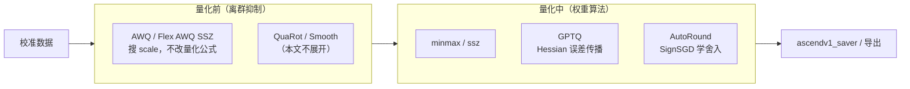

# msModelSlim：AWQ / GPTQ / AutoRound

> 基于 `/home/caishengcheng/msmodelslim` 源码与官方文档整理。
> 分析模式：**Quick** | 目标：面试被问到时能 **30 秒讲清定位 + 1 分钟讲清原理 + 知道在流水线里放哪**
>
> 配套文档：[QuaRot](./msmodelslim-quarot-algorithm-interview.md) · [DeepSeek 量化](./msmodelslim-deepseek-quant-interview.md) · [Qwen 量化](./msmodelslim-qwen-quant-interview.md) · [MXFP](./msmodelslim-mxfp-quant-interview.md)

---

## 一句话定位（背这三句就够）

| 算法                | 一句话                                                                                                 |
| ------------------- | ------------------------------------------------------------------------------------------------------ |
| **AWQ**       | 量化**之前**的平滑步骤——用激活统计找「重要通道」，给权重加 scale，让后续低比特量化少踩离群值。 |
| **GPTQ**      | 量化**之中**的权重算法——逐列量化，用 Hessian 把当前列误差「摊」到后面未量化列上。              |
| **AutoRound** | 量化**之中**的权重算法——不学权重本身，学「往上舍还是往下舍」以及 scale，用 SignSGD 逐层优化。  |

**流水线顺序（典型 W4A8）：**

```
校准数据 → [AWQ / Flex AWQ SSZ] → [linear_quant: minmax/ssz/gptq] → 保存
                ↑ 离群抑制              ↑ 真正量化

W4A4 典型：Adapt Rotation → AutoRound → 保存
```

---

## 三者对比（面试高频表）

| 维度                       | AWQ                              | GPTQ                                | AutoRound                  |
| -------------------------- | -------------------------------- | ----------------------------------- | -------------------------- |
| **解决什么问题**     | 激活离群导致 W4 精度崩           | MinMax 等粗量化误差大               | 简单四舍五入在低比特下太差 |
| **优化对象**         | 子图 scale（α / ratio）         | 量化后的权重 + 误差补偿             | 舍入偏移 V、scale 的 α/β |
| **是否改权重数值**   | 间接（scale 融合进子图）         | 直接（逐列 GPTQ 量化）              | 直接（优化后量化）         |
| **是否需要校准集**   | 要（统计激活 + 块级 MSE）        | 要（建 Hessian）                    | 要（逐层重构损失）         |
| **计算成本**         | 中（网格搜索 n_grid 次）         | 高（Hessian + Cholesky + 逐列）     | 高（逐层迭代 SignSGD）     |
| **msModelSlim 入口** | `type: awq` / `flex_awq_ssz` | `linear_quant` + `method: gptq` | `type: autoround_quant`  |
| **典型场景**         | W4A8、W8A8 离群抑制              | 高精度 int8 权重量化                | W4A4、LAOS 超低比特        |

---

## 1. AWQ（Activation-aware Weight Quantization）

### 核心直觉

大模型里并非所有权重通道同等重要。**激活大的通道**对输出影响更大，量化时应多保护。AWQ 不直接搜权重，而是搜一组 **per-channel scale**：量化前把权重放大、量化后再缩回去，等价于给重要通道更高有效精度。

### 核心公式

```python
scales = act_mean.pow(ratio).clamp(min=1e-4)
scales = scales / sqrt(scales.max() * scales.min())
```

- `act_mean`：逐通道 `mean(abs(act))`，衡量通道重要性
- `ratio`：在 `[0, 1)` 上网格搜索（步长 `1/n_grid`，默认 `n_grid=20`）
- 选使 **块级输出 MSE** 最小的 `ratio` 对应的 scales

### 执行流程（5 步）

1. 模型适配器提供子图映射（`AWQInterface.get_adapter_config_for_subgraph()`）
2. Hook 收集激活均值 + 祖先模块输入（块级评估）
3. 浮点基准前向 → 得到 golden output
4. 遍历 ratio：缩放权重 → 真实量化器量化 → 反缩放 → 前向算 MSE
5. 最优 scales 通过 `SubgraphFusionFactory` 融合进子图（Norm 反向缩放、Linear 正向缩放）

### 支持的子图（知道名字即可）

| 子图          | 结构                     | 缩放方向                        |
| ------------- | ------------------------ | ------------------------------- |
| Norm-Linear   | `norm → cat(linears)` | norm 除 scale，linears 乘 scale |
| Linear-Linear | `linear2(linear1(x))`  | linear2 乘，linear1 除          |
| OV            | `o_proj` + `v_proj`  | o 乘，v 除                      |
| Up-Down       | `down(gate/up)`        | down 乘，up/gate 除             |

### msModelSlim 中的变体

- **`awq`**：`processor/anti_outlier/awq/`，经典 AWQ，`ratio` 网格搜索
- **`flex_awq_ssz`**：AWQ + SSZ 思想，`scales = Act_Mean^α / Weight_Max^β`（β 固定 0），用真实 `LinearQuantizer` 评估；DeepSeek V4 等配置里常见

### 关键代码路径

```
msmodelslim/processor/anti_outlier/awq/
├── processor.py          # AWQProcessor
├── best_scales_search.py # AWQBestScalesSearcher（网格搜索 + MSE）
├── awq_stats_collector.py
└── interface.py          # AWQInterface（模型适配器实现）

msmodelslim/model/qwen3/model_adapter.py  # 示例：实现 AWQInterface
lab_practice/deepseek_v4/*.yaml           # flex_awq_ssz 配置示例
```

### 面试可答

> AWQ 是**激活感知的平滑算法**，在真正量化之前运行。它用激活均值估计通道重要性，网格搜索 scale，使块级量化输出最接近浮点输出。和 QuaRot 正交旋转不同，AWQ 走的是 **scale 重分配** 路线，常与后续 `linear_quant` 联用。

---

## 2. GPTQ（Generative Pre-trained Transformer Quantization）

### 核心直觉

按列（或按块内逐列）量化权重时，当前列会产生误差。GPTQ 的关键是：**用激活的二阶信息（Hessian）估计「哪一列误差对输出伤害大」**，量化完一列后，立刻调整后面未量化列来抵消误差——类似高斯消元里的误差传播。

### 核心步骤

1. **收集 Hessian**：前向时用校准激活累加 `H += X^T X`（实现见 `add_batch`）
2. **求逆**：`Hinv = cholesky_inv(H + damp)`，`percdamp` 防止奇异
3. **分块逐列量化**：
   - 量化第 `i` 列 → 算误差 `err_i`
   - 用 `Hinv` 把 `err_i` 传播到同块及后续列：`W[:, i:] -= err_i @ Hinv[i, i:]`
4. 输出最终量化权重

### 关键超参（被问到能说用途）

| 参数           | 默认 | 作用                               |
| -------------- | ---- | ---------------------------------- |
| `percdamp`   | 0.01 | Hessian 对角阻尼，防求逆数值爆炸   |
| `block_size` | 128  | 每次处理的列块大小，权衡精度与速度 |
| `group_size` | 128  | per_group 时共享 scale 的组大小    |

### msModelSlim 中的两种角色

**角色 A — 量化算法（主路径）**

```yaml
- type: linear_quant
  qconfig:
    weight:
      method: "gptq"
      scope: "per_channel"   # 或 per_group
      dtype: "int8"
      ext:
        percdamp: 0.01
        block_size: 128
```

实现：`msmodelslim/core/quantizer/impl/gptq.py` → `WeightPerChannelGPTQ` / `WeightPerGroupGPTQ`

**角色 B — 格式转换（次要）**

外部 GPTQ 格式（`gptq_int4`）→ BF16 浮点：`processor/convert/gptq_to_float.py`，用于导入社区量化权重。

### 限制（面试加分项）

- 依赖校准激活建 Hessian → **MoE 需覆盖所有 expert**，否则不推荐
- 逐列 + 矩阵分解 → **速度慢、显存/CPU 压力大**（NPU 上 Cholesky 会搬到 CPU）
- 当前文档写明 int8 per_channel/per_group 为主力场景

### 面试可答

> GPTQ 是**基于 Hessian 的逐列权重量化**。每量化一列，就用激活协方差矩阵指导后续列做误差补偿，比 MinMax 更精细。代价是校准和计算都贵，适合对 int8 权重量化精度要求高的场景，不太适合 MoE 或追求速度的场景。

---

## 3. AutoRound

### 核心直觉

传统量化用 `round(W/s)`，但向上还是向下舍入对低比特影响很大。AutoRound（Intel）把 **舍入方向变成可学习参数 V**，再配合可调的 scale（α、β），用 **SignSGD** 逐层最小化「量化输出 vs 浮点输出」的重构损失。

### 核心公式

传统：`Ŵ = s × clip(round(W/s + zp), n, m)`

AutoRound：`Ŵ = s × clip(round(W/s + zp + V), n, m)`，`s = (max(W)×α - min(W)×β) / (2^bit - 1)`

- **V**：可学习舍入偏移（控制往上/往下）
- **α、β**：可选的 scale 范围调节

### 执行流程（逐 decoder layer）

1. 浮点前向 → 记录 golden output
2. 包装 `Linear` 为 `WrapperLinear`，注入可训练 V / scale
3. SignSGD 迭代：量化-反量化前向 → MSE 损失 → 更新 V 和 scale
4. 收敛后应用最优参数，unwrap，量化输出作为下一层输入

### msModelSlim 入口

```yaml
- type: autoround_quant
  qconfig: ...
  iters: 200
  lr: ...
```

实现：

```
msmodelslim/processor/quant/autoround.py           # AutoroundQuantProcessor
msmodelslim/processor/quant/autoround_utils/
├── trainer.py    # BlockQuantTrainer（SignSGD 训练循环）
├── wrapper.py    # WrapperLinear（可学习量化参数）
└── sign_sgd.py   # SignSGD 优化器
```

### 典型组合：LAOS

文档中的 **LAOS** 流水线：`Adapt Rotation`（旋转矩阵优化）→ `AutoRound`（低比特量化），面向 **W4A4** 等超低比特场景。

### 面试可答

> AutoRound 不直接优化浮点权重，而是优化 **怎么舍入** 和 **scale 怎么取**。逐层用 SignSGD 让量化输出逼近浮点输出，在低比特（尤其 W4A4）下比 GPTQ/MinMax 更稳。代价是逐层迭代训练，耗时长，常与 Adapt Rotation 等离群抑制前置步骤搭配。

---

## 4. 三者关系一张图



**记忆口诀：**

- AWQ → **先**调 scale，为量化铺路
- GPTQ / AutoRound → **量化时**的两个高精度路线（二阶补偿 vs 学习舍入）
- 它们**不互斥**：常见 `flex_awq_ssz` + `linear_quant(minmax)`；W4A4 常见 `adapt_rotation` + `autoround_quant`

---

## 5. 面试快问快答

**Q：AWQ 和 GPTQ 有什么区别？**

A：阶段不同。AWQ 是量化前的 **平滑/离群抑制**，优化 scale，不直接产出 int4/int8 权重；GPTQ 是量化时的 **权重算法**，直接产出量化权重并用 Hessian 做误差补偿。一个管「量化前怎么保护重要通道」，一个管「量化时怎么减小误差」。

**Q：GPTQ 和 AutoRound 怎么选？**

A：都要校准、都偏慢。GPTQ 经典、社区生态大（GPTQ 格式），适合 int8 权重高精度；AutoRound 专攻 **超低比特**（W4A4），用学习舍入换精度，在 msModelSlim 里常和 Adapt Rotation 组成 LAOS。追求部署生态选 GPTQ 转换链；追求 W4A4 精度选 AutoRound。

**Q：AWQ 里的 ratio / Flex AWQ 里的 alpha 是一回事吗？**

A：思想类似，都是网格搜索的缩放指数，但公式和评估方式略有差异。经典 AWQ 用 `act_mean^ratio`；Flex AWQ SSZ 用 `Act_Mean^α / Weight_Max^β`（β=0），且强制用真实量化器评估，和后续 `linear_quant` 配置更对齐。

**Q：为什么 MoE 不推荐 GPTQ？**

A：GPTQ 的 Hessian 来自校准激活。MoE 若校准集没覆盖全部 expert，部分专家的 Hessian 不准，误差补偿会偏，精度掉得厉害。

**Q：在 msModelSlim YAML 里怎么配？**

A：AWQ 类 → `process` 里 `type: awq` 或 `flex_awq_ssz`；GPTQ → `linear_quant` 的 `weight.method: gptq`；AutoRound → `type: autoround_quant`。顺序上平滑类一般在 `linear_quant` 之前。

---

## 6. 源码速查表

| 算法         | 核心文件                                    | 模型适配                    |
| ------------ | ------------------------------------------- | --------------------------- |
| AWQ          | `processor/anti_outlier/awq/processor.py` | 实现`AWQInterface`        |
| Flex AWQ SSZ | `processor/anti_outlier/flex_smooth/`     | 基类`BaseSmoothProcessor` |
| GPTQ 量化    | `core/quantizer/impl/gptq.py`             | 无需专用接口                |
| GPTQ 转换    | `processor/convert/gptq_to_float.py`      | 检测`IRKind.GPTQ_INT4`    |
| AutoRound    | `processor/quant/autoround.py`            | 无需专用接口                |

官方文档：

- AWQ：`docs/zh/.../awq_smooth.md`
- Flex AWQ SSZ：`docs/zh/.../flex_awq_ssz.md`
- GPTQ：`docs/zh/.../gptq.md`
- AutoRound：`docs/zh/.../autoround.md`

---

## 7. 质量自检（面试前 2 分钟）

- [ ] 能说出 AWQ / GPTQ / AutoRound 各自在流水线的**阶段**
- [ ] 能各用一句话解释**优化对象**（scale / Hessian 补偿 / 舍入方向）
- [ ] 知道 AWQ 为什么要**块级 MSE** 而不是单层权重 MSE
- [ ] 知道 GPTQ 的 **percdamp** 是干什么的
- [ ] 知道 AutoRound 和 **SignSGD、LAOS** 的关系
- [ ] 知道 msModelSlim 里对应的 **YAML type / method** 字段

---

*文档生成时间：2026-07-08 | 模式：Quick 面试速览*
