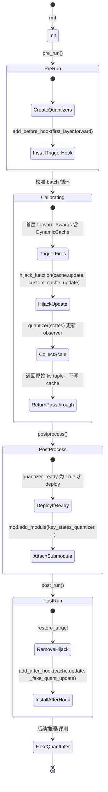
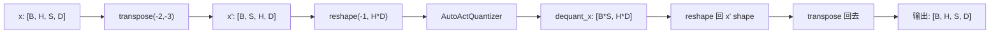
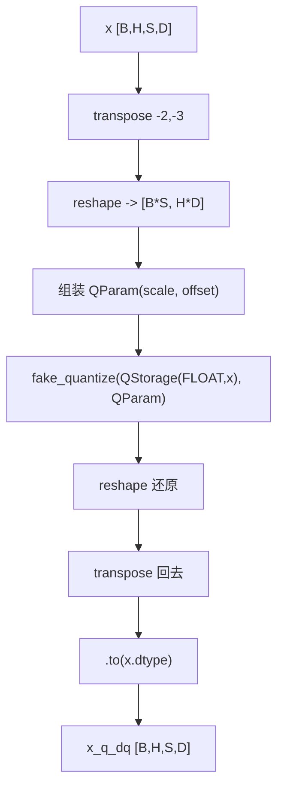
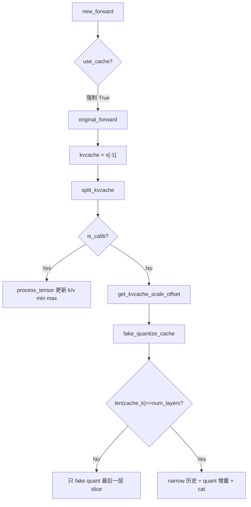

# msModelSlim：KV Cache 量化 + FA3 量化深度理解分析

> 基于 `/home/caishengcheng/msmodelslim` 源码、官方文档与 `lab_practice/` 配置。
> 分析模式：**Deep** | 目标：面试可讲清 **WHY + C8 产品命名 + 两条路径选型 + 代码对应关系**
>
> 配套文档：[DeepSeek 量化](./msmodelslim-deepseek-quant-interview.md) · [Qwen 量化](./msmodelslim-qwen-quant-interview.md) · [AWQ/GPTQ/AutoRound](./msmodelslim-awq-gptq-autoround-interview.md) · [MXFP](./msmodelslim-mxfp-quant-interview.md)

---

## 一句话定位（背这三句就够）

| 能力 | 一句话 |
|------|--------|
| **C8** | MindIE 产品位：把「K/V 相关 INT8/FP8 量化」统称 c8；**KVCache 量化与 FA3 量化都纳入 c8**。 |
| **dynamic_cache** | 标准 MHA（如 Qwen）路径：劫持 `DynamicCache.update`，对写入 cache 的 K/V 做 **per_channel INT8**。 |
| **fa3_quant** | MLA/FlashAttention 路径（如 DeepSeek、多模态）：在 Q/K/V **激活入口**插桩，做 **per-head / per-token** 量化（常 FP8）。 |

**选型口诀：** 有标准 `DynamicCache` → `dynamic_cache`；MLA/自定义 Attention 或要量化 Q 激活 → `fa3_quant`。二者都可能出现在 `w8a8c8` / `w4a8c8` 配置名里。

```
Qwen 典型：  iter_smooth → linear_quant → dynamic_cache → ascendv1_saver
DeepSeek：   [quarot/smooth] → linear_quant → fa3_quant → ascendv1_saver
```

---

## 理解验证状态

| 概念/机制 | 源码锚点 | 理解状态 | 一句话验证 |
|-----------|----------|----------|------------|
| **C8 产品命名** | `ascendv1.py` 写 `kv_cache_scale` 标签 `C8`；官方矩阵脚注 | ✅ 已验证 | KVCache 与 FA3 两条路径的 K/V 量化参数在 MindIE 侧统一归入 **C8** 产品位，YAML 里 `kv_cache: True` 即 w*a*c8 方案 |
| **DynamicCache 劫持** | `processor/quant/attention.py` `_custom_cache_update` | ✅ 已验证 | 校准阶段 `hijack_function(DynamicCache.update)`，只喂 observer、**原样返回** key/value，cache 始终为空 |
| **per_channel KV reshape** | `core/quantizer/attention.py` + `ir/attention.py` | ✅ 已验证 | `(B,H,S,D)` → transpose → `(B,S,H,D)` → reshape `(N, H*D)`，按最后一维 per_channel 统计/量化 |
| **FA3 PlaceHolder** | `fa3/interface.py` + DeepSeek `inject_fa3_placeholders` | ✅ 已验证 | 适配器在 MLA 路径插入 `fa_q/fa_k/fa_v`，Processor 再替换为 Observer → IR |
| **Recall Window（ratio）** | `core/observer/recall_window.py` | ✅ 已验证 | 排序后滑动窗口找覆盖 `ratio×N` 个元素的最窄 `[min,max]` 区间 |
| **per_head / per_token** | `fa3/processor.py` `is_data_free` | ✅ 已验证 | per_head 需校准数据；per_token/per_block 标记 `data_free`，forward 动态算 scale |
| **v0/v1 双路径** | v0: `pytorch/llm_ptq/...`；v1: `processor/quant/` | ✅ 已验证 | v1 走 Processor+IR+Saver 流水线；v0 走 monkeypatch + `ForwardFactory` |
| **KV Smooth** | `processor/kv_smooth/processor.py` L229-233 | ✅ 已验证 | key absmax 按 RoPE 半维配对取 max，再 fold 到 k_proj / 放大 q_proj |
| **MLA latent 注入** | `deepseek_v3/model_adapter.py` L409-415 | ✅ 已验证 | 在 `q_nope` 与 `compressed_kv` 计算完成后、matmul 注意力前插入 FA3 占位 |

---

## 项目完整地图

msModelSlim 在 KV/FA3 量化上存在 **v0（传统 PTQ）** 与 **v1（modelslim_v1 快速量化）** 两条并行实现，面试里要能说清「同一产品能力、不同工程代际」。

**v1 分层（当前主推）**

```
YAML spec.process[]
    │
    ├─ type: dynamic_cache  ──► DynamicCacheQuantProcessor
    │       pre_run → hijack update（校准）
    │       postprocess → deploy FakeQuantDynamicCache
    │       post_run → after_hook fake quant（推理）
    │
    ├─ type: fa3_quant  ──► FA3QuantProcessor + FA3QuantAdapterInterface
    │       preprocess → inject PlaceHolder → 换 Observer
    │       校准 forward → postprocess → FakeQuantActivation IR
    │
    └─ type: kv_smooth（可选，C8 前置）──► 抑制 Key 离群，配合 per_channel KV

ascendv1_saver
    ├─ FakeQuantDynamicCache → k/v_proj.kv_cache_scale（标签 C8）
    └─ FakeQuantActivation(fa_*) → fa_quant_type（FAKQuant 等）
```

**v0 分层（存量模型）**

- `pytorch/llm_ptq/llm_ptq_tools/kv_cache_utils.py`：monkeypatch attention forward，直接在 cache 写入路径插量化。
- `fa_quant.py` + `fa_quant_adapter/ForwardFactory`：按 `(model_type, attn_name)` 注册不同 forward 包装，实现 FA 激活量化。

**典型配置对照**

| 模型族 | YAML 处理器 | 产品标签 |
|--------|-------------|----------|
| Qwen3 w8a8c8 | `dynamic_cache` + `linear_quant` | w8a8**c8** |
| DeepSeek-V3.1 w8a8c8 | `fa3_quant` + `linear_quant` | w8a8**c8**（FA3 分支） |

官方文档明确：**「kvcache 量化和 fa3 量化都纳入 c8」**——两者都量化 LLM 中的 K/V 相关缓存/激活，MindIE 侧以 C8/FAQuant 字段落盘，而非两套互斥产品。

更完整的目录树见同目录 `../项目地图.md`。

---

## 1. 快速概览

**语言与规模**：Python 3.x，PyTorch + HuggingFace Transformers（`DynamicCache` 需 transformers≥4.36）。KV/FA3 相关核心源码约 15 个文件、2000 行量级，测试覆盖 `test_attention_processor.py`、`test_fa3_processor.py`、`test_recall_window.py`。

**核心依赖链**

- **Transformers**：`DynamicCache.update` 作为 v1 KV 劫持锚点。
- **自研 IR 层**（`msmodelslim.ir`）：`FakeQuantDynamicCache`、`AutoFakeQuantActivation`，校准与部署分离。
- **Observer 层**：MinMax（KV per_channel）、RecallWindow（FA3 per_head）。
- **模型适配器**：FA3/KVSmooth 必须模型感知（MLA 路径、RoPE 融合子图）。

**两类算法定位对比**

| 维度 | KVCache 量化（dynamic_cache） | FA3 量化（fa3_quant） |
|------|------------------------------|------------------------|
| **量化对象** | 写入 KV Cache 的 `key_states` / `value_states` | Attention 内 Q/K/V（或 MLA  latent）**激活** |
| **插入点** | 通用 `DynamicCache.update` 钩子 | 模型适配器指定的 forward 内节点 |
| **粒度** | 仅 **per_channel INT8**（v1 硬约束） | per_head / per_token / per_block，INT8/FP8 |
| **校准** | 必须跑校准集（`is_data_free=False`） | per_head 需校准；per_token/block 可 data-free |
| **典型模型** | Qwen 系列 w8a8c8 | DeepSeek MLA 系列 w*a*c8 |
| **导出标签** | `k_proj/v_proj.kv_cache_scale` → **C8** | `fa_q/fa_k/fa_v` scale → **FAQuant**（同属 c8 产品矩阵） |
| **内存收益** | Cache 从 FP16→INT8，约 50% KV 显存 | 降低 Attention 中间激活峰值 + 配合 FA 算子 |

---

## 2. 背景与动机（3 个 WHY）

### WHY-1：问题本质——KV 显存是长序列推理的一等公民瓶颈

大模型自回归解码时，每生成一个 token 就要把当前层的 Key/Value 追加进 Cache。Cache 大小随 **层数 × 头数 × 序列长度 × head_dim × dtype 字节数** 线性增长，往往超过权重本身。FP16/BF16 下，32B 模型在 32K context 上 KV 占用可达数十 GB。

**WHY 这 matters**：权重是固定的，KV 是「随用户输入变长」的；不做 Cache 量化，batch size 和 context 上限会被显存直接卡死。C8 产品位的存在，就是把「最后一英里」的 Cache 从 16bit 压到 8bit，在 MindIE 推理引擎里用 INT8 KV 算子真正省显存、提吞吐。

### WHY-2：方案选择——dynamic_cache vs fa3_quant vs 不做

**不做量化**：实现最简单，但长上下文场景 OOM 风险最高，也无法享受 Ascend/MindIE 侧 C8 专用 kernel 的带宽优势。

**dynamic_cache（标准 MHA/GQA）**：劫持 HuggingFace 统一的 `DynamicCache.update`，与模型结构解耦，只要走标准 cache API 就能量化。Qwen 等 dense/MoE 模型 attention 路径规整，reshape 成 `(N, H*D)` 做 per_channel MinMax 足够。代价是 **只支持 per_channel INT8**，对 MLA 等「K/V 不在标准 shape 里」的架构不友好。

**fa3_quant（MLA / 定制 Attention）**：DeepSeek-V3 把 K/V 压到 **latent 空间**（`compressed_kv`），标准 DynamicCache 路径量化不到 FA 算子真正消费的激活。必须在 `q_nope`、`compressed_kv` 等节点注入 PlaceHolder，配合 Recall Window 做 per-head 鲁棒范围估计。代价是 **每个模型要写 Adapter**，但精度与算子融合空间更好。

官方矩阵脚注写得很直白：**kvcache 量化和 fa3 量化都纳入 c8**——产品层面都是「把 K/V 相关存储/激活压到 8bit」，工程上按架构选型，不是二选一的产品线。

### WHY-3：应用场景——w8a8c8 / w4a8c8 全量化方案的「C」位

线性量化（W/A）解决权重和 GEMM 激活；C8 解决 **Attention 状态持久化与中间激活**。典型落地：

- **Qwen3-32B w8a8c8**：`iter_smooth` → `linear_quant` → `dynamic_cache`，MindIE 部署 INT8 权重 + INT8 KV Cache。
- **DeepSeek-V3.1 w8a8c8**：`fa3_quant`（fa_q per_token FP8，fa_k/fa_v per_head FP8）+ 分组 `linear_quant`，MLA 路径全链路 8bit 化。
- **可选 KV Smooth**：在 C8 之前对 Key 离群做 SmoothQuant 式 scale 迁移，RoPE 维度成对处理，避免 per_channel 量化被单个 spike 拉宽 scale。

**WHY 组合使用**：单独 W8A8 只省权重和 MLP 激活；不加 C8，长对话仍可能在 KV 上爆显存。Smooth + C8 是「先抑离群、再量化」的经典 PTQ 组合拳。

---

## 3. 核心概念网络

### 3.1 C8

**WHY-1（命名）**：AscendV1 导出格式用单字母类型码描述算子精度组合；`C8` 专指 **KV Cache 8bit 量化参数**（scale/offset），与 W8A8 等并列，方便 MindIE 读 json 描述文件一键选型。

**WHY-2（范围）**：官方把 **DynamicCache KV 量化** 和 **FA3 对 K/V 分支的量化** 都算作 c8 产品能力——因为最终都服务于「K/V 相关 8bit 存储/计算」。导出时 KV 路径写 `kv_cache_type: C8`，FA3 路径写 `fa_quant_type: FAKQuant` 等，但支持矩阵里统一标注 w8a8c8。

**WHY-3（约束）**：仅 MindIE 推理栈完整支持 C8 模式（含 w8a8c8、w4a8c8）。PTQ 工具负责产参，真 INT8 KV 读写发生在推理引擎内核，msModelSlim 侧主要是 FakeQuant 对齐数值。

### 3.2 DynamicCache.update 劫持

**WHY-1（锚点）**：Transformers 4.36+ 统一了 `DynamicCache`，所有层的 K/V 追加都走 `update()`。劫持这一个函数，比 per-model patch forward 成本低一个数量级。

**WHY-2（校准语义）**：`_custom_cache_update` **故意不写 cache**——直接 `return tuple(key_states, value_states)`。这样校准 forward 时 cache 始终为空，每层看到的都是「当前步的完整 K/V」，observer 统计不被历史 INT8 误差污染。

**WHY-3（部署语义）**：`post_run` 换成 `add_after_hook(update, _fake_quant_update)`，在**真正写入 cache 之后**对返回值做 FakeQuant，模拟部署时「量化后再存/再算」的数值路径。

### 3.3 per_channel KV reshape `(B,H,S,D) → (N, H*D)`

**WHY-1（对齐 linear 量化习惯）**：per_channel 在这里指 **最后一维** 每个 channel 独立 scale。K/V 原始 layout 是 head-major，直接 per head_dim 量化会忽略 head 间差异；transpose 后把 `(H, D)` 展平成 `H*D` 个 channel，与 `k_proj/v_proj` 输出维度一致。

**WHY-2（与 proj 权重对齐）**：导出 scale 挂在 `k_proj.kv_cache_scale` / `v_proj.kv_cache_scale`，推理引擎按 proj 输出 channel 反量化 Cache。reshape 保证 **校准统计维度 = 部署反量化维度**。

**WHY-3（v1 硬约束）**：`DynamicCacheQuantProcessor` 初始化时检查 `qconfig.scope == PER_CHANNEL`，其他 scope 直接抛错——KV Cache 路径不做 per_token 动态，避免 cache 条目随 token 变 scale 的实现复杂度。

### 3.4 FA3QuantPlaceHolder / Adapter

**WHY-1（解耦）**：FA3 插入点因架构而异（MLA 的 `q_nope`、GQA 的完整 Q/K/V 等）。`FA3QuantAdapterInterface.inject_fa3_placeholders` 把「插在哪」交给模型适配器，Processor 只关心「占位 → 观测 → IR」状态机。

**WHY-2（DeepSeek ratio 差异）**：`fa_q/fa_k` 用 `ratio=0.9999`，`fa_v=1.0`。Q/K 分布长尾明显，Recall Window 裁掉 0.01% 极端值换更紧 scale；V 进入 softmax 加权后对误差更敏感，用全量 MinMax（ratio=1.0）保精度。

**WHY-3（forward 包裹）**：DeepSeek 适配器 `_wrap_attention_forward` 在 latent matmul 前调用占位，保证 Observer 看到的 tensor shape 与推理一致 `(B,H,S,D)` 或可 squeeze 的 latent shape。

### 3.5 Recall Window（ratio）

**WHY-1（抗离群）**：per-head 激活常有 heavy tail，纯 MinMax 被一个 outlier 拉大 scale，有效量化比特利用率低。Recall Window 在排序序列上找 **覆盖 ratio 比例样本的最窄区间**，等价于「允许裁掉两侧极端值」。

**WHY-2（与 FA3 耦合）**：`_FA3PerHeadObserver` 先把 `(B,H,S,D)` view 成 `(H, N)`，再对最后一维跑 `recall_window`。每个 head 独立窗口，适配 multi-head 分布异质性。

**WHY-3（跨 batch 累积）**：`RecallWindowObserver.update` 对 min 取更小、对 max 取更大，多轮校准覆盖不同 prompt 长度与语义域，避免单 batch 过拟合。

### 3.6 per_head vs per_token vs per_block

**WHY-1（per_head）**：静态 scale，每个 head 一组参数，校准一次、推理零开销。适合 K/V 分布稳定、算子支持 per-head dequant 的场景。`is_data_free()` 为 **False**。

**WHY-2（per_token / per_block）**：forward 时按 token 或 block 动态算 scale，适应输入分布漂移。`FA3QuantProcessor.is_data_free()` 在 scope 为 PER_TOKEN 或 PER_BLOCK 时返回 **True**，可不跑校准集。postprocess 创建「空 QParam」IR，scale 在运行时填充。

**WHY-3（DeepSeek 混合策略）**：w8a8c8 配置里 fa_q 用 per_token（查询随输入变），fa_k/fa_v 用 per_head（KV latent 相对稳定），是精度与性能的工程折中。

### 3.7 MLA latent 空间注入（q_nope / compressed_kv）

**WHY-1（架构事实）**：DeepSeek MLA 不 materialize 完整 K/V head，而在低秩 **compressed_kv** 上与 absorbed Q（`q_nope`）做注意力。对标准 `key_states/value_states` 做 Cache 量化抓不到主计算路径。

**WHY-2（注入位置）**：在 `q_nope = matmul(q_nope, q_absorb)` 之后、`attn_weights = matmul(q_pe,k_pe)+matmul(q_nope, compressed_kv)` 之前插入 FA3。这正好是 FA kernel 消费的 Q/K/V 语义点。

**WHY-3（与 Cache 关系）**：`compressed_kv` 仍会进 `past_key_value.update` 做 latent cache；FA3 量化激活与 C8 产品目标一致——压缩 **存+算** 两条线上的 K/V 相关张量。

### 3.8 KV Smooth（RoPE 配对 scale）

**WHY-1（离群来源）**：Key 在 RoPE 旋转后，相邻维度是 **频率配对** 的复平面分量。单独对每维取 absmax 会破坏配对结构，Smooth 时把 `head_dim` reshape 成 `(num_kv_heads, 2, head_dim//2)`，在 dim=1 上取 max，得到 RoPE-safe 的 scale。

**WHY-2（scale 迁移）**：对 `k_proj`（或 fused norm）weight **除以** scale，对 `q_proj` **乘以** 扩展后的 scale（含 GQA repeat），保持 `Q·K` 数学不变，降低后续 INT8 量化难度。

**WHY-3（与 C8 配合）**：Smooth 是 **量化前处理**，不单独导出 C8 参数；它让 per_channel KV 的 MinMax 范围更紧，是 w8a8c8 recipe 里可选但常见的前置步。

### 3.9 FakeQuant vs 真 INT8 算子

**WHY-1（职责分离）**：msModelSlim 在校准/导出阶段用 `fake_quantize`（浮点域 quant→dequant）对齐误差，便于与 PyTorch 浮点模型对比 loss。`FakeQuantDynamicCache` 是部署前数值契约，不是 NPU 内核。

**WHY-2（参数落盘）**：`kv_cache_scale/offset` 作为 `nn.Parameter` 写入 checkpoint，Saver 打 C8 标签。MindIE 加载后用 **真 INT8 KV 读写** 替换 FakeQuant 路径。

**WHY-3（双阶段钩子）**：校准 hijack 不写 cache + 只 observer；部署 after_hook FakeQuant 写 cache——两阶段分离，避免把「统计」和「模拟部署误差」混在一次 forward 里。

### 3.10 概念关系矩阵

|  | C8 | DynamicCache 劫持 | per_channel reshape | FA3 PlaceHolder | Recall Window | KV Smooth | FakeQuant |
|--|:---:|:---:|:---:|:---:|:---:|:---:|:---:|
| **C8** | — | 导出目标 | 参数维度依据 | 产品同级 | FA3 分支共用 c8 矩阵 | 前置可选 | 参数来源 |
| **DynamicCache 劫持** | 提供 KV scale | — | 调用 quantizer 前 reshape | 互斥路径* | 不用 | 可串行前置 | 校准/部署钩子 |
| **per_channel reshape** | scale 形状 | KV 专属 | — | FA3 用 view(H,-1) | RW 在 H 维后 | Smooth 在 proj 前 | IR 同构 |
| **FA3 PlaceHolder** | fa_* 导出 | 不走 update | 不同插入点 | — | ratio 配置 | 独立 | → Observer→IR |
| **Recall Window** | 间接 | — | — | per_head 必需 | — | — | 算 qparam |
| **KV Smooth** | 提升 C8 质量 | 独立 Processor | 影响 K 统计 | 独立 | — | — | 不改 IR 类型 |
| **FakeQuant** | 写盘前验证 | 部署钩子 | 同 reshape | FA3 Activation IR | — | — | — |

\* Qwen 走 DynamicCache；DeepSeek MLA 走 FA3；同一模型通常不混用两种 KV 量化处理器。

---

## 4. 算法与理论

### 4.1 MinMax per_channel KV

**算法步骤**

1. 输入 `x`，shape `(B, H, S, D)`。
2. `x' = transpose(-2,-3)` → `(B, S, H, D)`。
3. `x'' = reshape(-1, H*D)` → `(N, H*D)`，其中 `N = B×S`。
4. 对每个 channel `c ∈ [0, H*D)`：`scale_c = max(|min_c|, |max_c|) / 127`（对称 INT8）。
5. FakeQuant：`round(x/scale)*scale`，再 reshape/transpose 还原。

**复杂度**：统计阶段 O(N·H·D)；scale 向量长度 O(H·D)，与序列长度无关（**静态 per_channel**）。空间 O(H·D) 存 scale。

**WHY 用 MinMax**：KV PTQ 工业界默认方案，实现简单、与 Ascend C8 算子接口一致；配合 KV Smooth 后精度足够支撑 w8a8c8 benchmark。

**退化场景**

- **极长 tail 离群**：未做 Smooth 时，单个 spike 拉大 scale，大部分 channel 量化分辨率下降。
- **分布漂移**：per_channel 静态 scale 对 OOD 长文/代码域可能 MSE 上升；需加校准集多样性或 Smooth。
- **极短序列校准**：N 过小导致 MinMax 不稳定，scale 方差大。

**参考**

- Jacob et al., *Quantization and Training of Neural Networks for Efficient Integer-Arithmetic-Only Inference*（对称量化基础）：https://arxiv.org/abs/1712.05877
- msModelSlim KVCache 文档：`docs/zh/user_guide/quantization_algorithms/quantization_algorithms/kvcache_quant.md`

### 4.2 Recall Window 滑动窗口最小区间

**算法步骤**（单 head，样本数 N，ratio ρ）

1. `sorted = sort(head_data)`。
2. `target = floor(ρ × N)`（实现为 `int(ratio * total_elements)`）。
3. 枚举窗口起点 `i ∈ [0, N-target]`：
   - 窗口值域 `[sorted[i], sorted[i+target-1]]`，长度 `L_i = sorted[i+target-1] - sorted[i]`。
4. 取 `L_i` 最小的窗口，输出 `(min_val, max_val) = (sorted[i*], sorted[i*+target-1])`。
5. 多 batch：全局 min/max 累积更新。

**复杂度**：单 head 排序 O(N log N)，滑动 O(N·(N-target))；源码实现对 `sorted_tensor` 逐 head 循环，H 个头线性放大。Recall Window 是 **校准期离线成本**，推理期只用静态 scale。

**WHY 不用纯 MinMax**：FA3 面向 Attention 激活，head 内常有 >99% 样本集中在窄区间，MinMax 被 0.01% outlier 支配；ρ=0.9999 是经验 sweet spot（DeepSeek PlaceHolder 默认值）。

**退化场景**

- **ρ=1.0**：退化为 MinMax（fa_v 路径）。
- **N 很小**：target 过小，窗口选择不稳定。
- **多峰分布**：单窗口 MinMax 本身就不最优，Recall Window 只能缓解尾部，不能解决 multimodal。

**参考**

- Dao et al., *FlashAttention-2*（FA 内存层次与激活布局）：https://arxiv.org/abs/2307.08691
- FA3 算法说明：`docs/zh/user_guide/quantization_algorithms/quantization_algorithms/fa3_quant.md`

### 4.3 对称量化 scale = absmax / 127

**公式**

\[
s = \frac{\max(|x_{\min}|, |x_{\max}|)}{127}, \quad q = \mathrm{clip}(\mathrm{round}(x/s), -128, 127), \quad \hat{x} = q \cdot s
\]

FA3 per_head：`abs_max[h] = max(|min_h|, |max_h|)`，每 head 一个 scale。

**WHY 127 而非 128**：对称 INT8 通常用 [-127,127] 避免 -128 与 +128 不对称带来的溢出细节；与 Ascend/MindIE INT8 算子约定一致。

**WHY absmax**：比 asymmetric 少存一个 zero_point，硬件 dequant 更快；Attention 激活近似零均值但对称 MinMax 足够简单。

**退化场景**：明显非零均值或严重偏态时，对称量化效率低于 asymmetric；KV 路径配置可支持 `int8_per_channel_asym`，但 w8a8c8 recipe 默认 symmetric。

**参考**

- NVIDIA ModelOpt / 工业 INT8 PTQ 实践（对称 per-channel）：https://github.com/NVIDIA/TensorRT-Model-Optimizer
- FlashAttention 官方：https://github.com/Dao-AILab/flash-attention

---

## 5. 设计模式

### 5.1 Processor 流水线（AutoSessionProcessor）

**WHY 使用**：KV/FA3 都实现 `pre_run / preprocess / postprocess / post_run` 生命周期，与 `linear_quant`、`kv_smooth` 并列写进 YAML `spec.process` 列表，**顺序组合**即完整 recipe。量化逻辑不侵入 `main()`，新增算法只注册 Processor。

**不用会怎样**：每种算法 copy 一套校准脚本，模型入口膨胀；Qwen/DeepSeek 无法共用同一套 v1 CLI。

**参考**：[Pipeline](https://refactoring.guru/design-patterns/pipeline) / 责任链思想（Refactoring Guru 对 Processing Pipeline 的变体描述）

### 5.2 Adapter 接口（FA3QuantAdapterInterface / KVSmoothFusedInterface）

**WHY 使用**：「插桩位置」是模型知识，「怎么量化」是算法知识。接口隔离后，新增 Kimi/GLM 只写 Adapter，不改 `FA3QuantProcessor` 核心循环。

**不用会怎样**：Processor 里堆 `if deepseek elif qwen`，每上新模型改核心库，违反开闭原则。

**参考**：[Adapter Pattern](https://refactoring.guru/design-patterns/adapter)

### 5.3 Hijack / Hook（function_hijacker + hook_utils）

**WHY 使用**：`DynamicCache.update` 是第三方库方法，不能改 Transformers 源码。`hijack_function` 在校准期替换实现，`add_after_hook` 在部署期挂后置处理，**零侵入**原模型类定义。

**不用会怎样**：每个模型 subclass Attention 并重写 `forward`，维护成本随模型数爆炸；还易漏 `layer_idx` 等 cache 协议细节。

**参考**：[Decorator](https://refactoring.guru/design-patterns/decorator) / Hook 是 Decorator 的运行时变体

### 5.4 Placeholder → Observer → IR 状态机

**WHY 使用**：FA3 三阶段语义清晰——(1) PlaceHolder 仅占位透传 forward；(2) 校准期换 `_FA3PerHeadObserver` 收集统计；(3) postprocess 换 `AutoFakeQuantActivation` IR 固定 qparam。模块 **同名替换**，forward 图结构不变，下游 matmul 无感知。

**不用会怎样**：校准模块直接留在线上，误把 observer 当 deploy；或 deploy 后仍动态改 graph，导出 checkpoint 不可复现。

**参考**：编译器 Pass 管线（IR lowering）；概念上接近 Refactoring Guru [State](https://refactoring.guru/design-patterns/state)（对象行为随阶段变）

### 5.5 Factory（v0 ForwardFactory）

**WHY 使用**：v0 路径 `ForwardFactory.register(model_type, attn_name)` 返回对应 forward 包装器，HyVideo/Flux/DeepSeek 各自注册，**运行时按模型元数据查表**，避免 import 全部适配器。

**不用会怎样**：v0 `fa_quant.py` 顶层 import 所有模型 forward patch，循环依赖和启动延迟；新模型无法插件式接入。

**参考**：[Factory Method](https://refactoring.guru/design-patterns/factory-method)（注册表是 Simple Factory 扩展）

---

**本章小结（面试速记）**

1. **C8** 是产品位，KVCache（dynamic_cache）与 FA3 都服务 K/V 8bit 化，导出字段不同（C8 vs FAQuant）。
2. **KV v1** 核心 trick：校准 hijack update **不写 cache**，部署 after_hook **FakeQuant**；reshape `(B,H,S,D)→(N,H*D)` per_channel。
3. **FA3 v1** 核心 trick：Adapter 注入 PlaceHolder → Recall Window per_head → IR；DeepSeek 在 MLA latent 点注入，fa_q/k ratio=0.9999，fa_v=1.0。
4. **KV Smooth** 在 RoPE 半维配对取 max 做 scale 迁移，是 C8 前置可选步。
5. 设计模式支撑 **v0/v1 双路径共存**：v1 用 Processor+IR，v0 用 ForwardFactory+monkeypatch。

---

## 6. 关键代码深度解析

本章聚焦 msModelSlim **KV Cache 量化**在 v1（DynamicCache 路径）与 v0（Attention forward 劫持路径）上的核心实现。读代码前先记住两条「坑位红线」：

1. **校准期 cache 恒为空**：`_custom_cache_update` 的 NOTICE 写得很直白——劫持的是 `DynamicCache.update`，校准跑 forward 时 KV 还没真正写入 cache，量化器吃的是**当前 step 的 key/value states**，不是历史 cache 张量。
2. **Fake Quant 在 post_run 才挂 after_hook**：校准结束后 `post_run` 拆掉 hijack，改挂 `_fake_quant_update` 的 **after_hook**，模拟部署后的量化误差。

---

### 核心片段清单（6A）

| # | 片段名称 | 文件:行号 | 优先级 | 选择理由 |
|---|---------|----------|--------|---------|
| 1 | DynamicCacheQuantProcessor 校准劫持 | `processor/quant/attention.py:157-308` | ★★★ | 整条 v1 KV 量化生命周期的调度中枢：pre_run 挂 trigger hook → hijack `DynamicCache.update` 收集 scale → postprocess deploy → post_run 切 fake quant after_hook |
| 2 | DynamicCacheQuantizer reshape + deploy | `core/quantizer/attention.py:31-56` | ★★★ | per-channel 量化的张量维度变换核心：head×dim 展平成 channel，校准与 deploy 共用同一套 reshape 逻辑 |
| 3 | FakeQuantDynamicCache forward | `ir/attention.py:41-69` | ★★☆ | 部署态 IR：固化 scale/offset，走 `fake_quantize` 做 Q→DQ，推理仿真与 Ascend 导出对齐 |
| 4 | v0 `new_forward` / `process_tensor` | `pytorch/llm_ptq/llm_ptq_tools/kv_cache_utils.py:91-247` | ★★☆ | 旧版 PTQ 路径：在 Attention forward 出口直接扫 KV，校准累 min/max、推理 fake quant；与 v1 的 cache.update 劫持形成对照 |
| 5 | KVSmooth RoPE scale 融合 | `processor/kv_smooth/processor.py:209-253` | ★★☆ | KV 量化前置平滑：按 RoPE 维度折叠取 max，再 `div_/mul_` 到 k_proj/q_proj，降低 per-channel 量化动态范围 |
| 6 | ascendv1 `on_dynamic_cache` 导出 | `core/quant_service/modelslim_v1/save/ascendv1.py:530-542` | ★☆☆ | 把 `FakeQuantDynamicCache` 的 scale/offset 写到 `k_proj`/`v_proj.kv_cache_*`，并标记 `kv_cache_type=C8` |

---

### 片段 #1：DynamicCacheQuantProcessor 校准劫持

> **位置**：`msmodelslim/processor/quant/attention.py:106-308`  
> **优先级**：★★★  
> **一句话核心**：用「首层 trigger + DynamicCache.update 函数劫持」在校准期收集 KV scale，校准结束后切换为 after_hook 做 fake quant。

#### 1.1 代码整体作用

`DynamicCacheQuantProcessor` 是 v1 KV Cache 量化的 **Session 级编排器**，继承 `AutoSessionProcessor`，在量化流水线里负责三件事：创建每层 K/V 各自的 `DynamicCacheQuantizer`、在校准 forward 过程中**透明替换** HuggingFace `DynamicCache.update` 以收集 observer 统计、校准结束后把 quantizer deploy 成 `FakeQuantDynamicCache` 子模块并挂推理 hook。

它和权重 PTQ 最大的不同是 **不能 data-free**（`is_data_free() -> False`），且显式声明 `need_kv_cache() -> True`，意味着校准数据必须走带 cache 的 generate 路径。处理器通过 `_detect_attention_layers` 扫描模型里所有 attention 模块，按 layer_idx 维护两套字典：`cache_quantizers`（校准用）和 `fake_kvcache_quantizers`（推理仿真用）。include/exclude 用 `ConfigSet` 做模块名模式匹配，粒度是 attention prefix 字符串。

整个设计绕开了「直接改模型源码」——靠 `hijack_function` 和 hook 在运行时注入行为，对上层 YAML 配置透明。理解这个类，等于理解 v1 KV 量化从校准到 fake quant 的完整状态机。

#### 1.2 核心逻辑分析

**生命周期状态机**（四阶段）：



**关键状态变量表**

| 变量 | 类型 | 含义 | 何时变化 |
|------|------|------|---------|
| `cache_quantizers[layer_idx][name]` | `DynamicCacheQuantizer` | 校准期 observer 容器 | `pre_run` 创建；`_custom_cache_update` 里 forward 更新 |
| `quantizer_ready[layer_idx][name]` | `bool` | 该层该路是否已收到过 states | `_custom_cache_update` 里 quantizer 跑完置 True |
| `fake_kvcache_quantizers[...]` | `FakeQuantDynamicCache` | deploy 后的仿真模块 | `postprocess` → `_deploy_quantizer` |
| `_installed_cache_ids` | `set` | 已挂 hook 的 cache 对象 id | 防止同一 DynamicCache 实例重复 hijack |
| `_use_global_hook` | `bool` | 是否降级为全局 hijack | kwargs 里找不到 DynamicCache 时置 True |
| `_trigger_hook_installed` | `bool` | 首层 trigger hook 是否存在 | pre_run 安装；post_run 先拆再装 fake quant 版 |

**路径 A：正常校准路径（kwargs 里有 DynamicCache）**

1. `pre_run` 给 `first_layer.forward` 装 `before_hook` → `_add_quantizer_hook`。
2. 首个带 cache 的 forward 触发：从 kwargs 找到 `DynamicCache` 实例，对其 `update` 做 `hijack_function`。
3. 每层 attention 调 `cache.update(key_states=..., value_states=..., layer_idx=...)` 时，实际跑 `_custom_cache_update`：
   - 从 kwargs 取 `layer_idx`、`key_states`/`value_states`；
   - include/exclude 过滤；
   - `quantizer(states)` 更新 per-channel min/max；
   - **直接 return 原始 tuple**，不写入 cache（NOTICE：cache 恒为空）。
4. `postprocess` 对 ready 的 quantizer 执行 `deploy()`，挂到 attention 模块上。
5. `post_run` 拆掉 hijack，改挂 `_add_fake_quant_hook` → `after_hook` → `_fake_quant_update`，对 update 返回值做 fake quant。

**路径 B：降级全局 hijack（kwargs 无 DynamicCache）**

- `_add_quantizer_hook` 找不到实例时打 warning，对 `(DynamicCache, 'update')` **类级别** hijack。
- 风险：可能影响同进程其他模型的 cache 行为（warning 里写了）。
- `_use_global_hook=True`，post_run 时 `restore_target(self.cache_target)` 恢复。

**路径 C：Fake Quant 推理路径（post_run 之后）**

- trigger hook 换成 `_add_fake_quant_hook`，对 `cache.update` 挂 **after_hook**。
- `_fake_quant_update(self, _, kwargs, result)` 在原始 update 完成后，用 `fake_kvcache_quantizers` 对返回的 states 做 Q→DQ。
- 此时 cache 正常写入，fake quant 只污染「返回值」供后续 attention 使用，模拟量化误差。

#### 1.3 逐行代码解释

下面贴出校准劫持 + 阶段切换的**真实源码**（连续 30+ 行），按执行顺序解读。

```python
# processor/quant/attention.py — 阶段入口
def pre_run(self) -> None:
    attention_layers = _detect_attention_layers(self.model)
    for layer_idx, _ in attention_layers.items():
        self._create_quantizer(layer_idx)          # 步骤1: 每层 K/V 各建一个 DynamicCacheQuantizer

    add_before_hook(self.trigger_hook_target, self._add_quantizer_hook)  # 步骤2: 首层 forward 前触发
    self._trigger_hook_installed = True

def post_run(self) -> None:
    if self._trigger_hook_installed:
        if self._use_global_hook:
            restore_target(self.cache_target)      # 步骤3a: 若用了全局 hijack，先恢复类方法
            self._use_global_hook = False
        restore_target(self.trigger_hook_target)   # 步骤3b: 拆掉首层 trigger hook
        self._trigger_hook_installed = False

    self._installed_cache_ids.clear()              # 步骤4: 清 cache id 注册表，允许新 hook

    add_before_hook(self.trigger_hook_target, self._add_fake_quant_hook)  # 步骤5: 换 fake quant 触发器
    self._trigger_hook_installed = True

def _add_quantizer_hook(self, _, kwargs):
    get_logger().debug(
        "dynamic cache quant processor hijack kvcache update, the cache is always empty when calibrating!"
    )
    for _, value in kwargs.items():
        if isinstance(value, self.cache_target[0]):   # 场景: forward 签名里带了 DynamicCache
            cache_id = id(value)
            if cache_id in self._installed_cache_ids:
                return                                    # WHY: 同一 cache 对象只 hijack 一次
            target = (value, self.cache_target[1])        # (cache实例, 'update')
            hijack_function(target, self._custom_cache_update)
            self._installed_cache_ids.add(cache_id)
            return
    if not self._use_global_hook:                         # 边界: 找不到 cache 实例
        get_logger().warning("No DynamicCache found ... try to hook on DynamicCache.update ...")
        hijack_function(self.cache_target, self._custom_cache_update)
        self._use_global_hook = True

def _custom_cache_update(self, **kwargs):
    """
    NOTICE: this function hijack the cache update function,
            the cache is always empty when calibrating!
    """
    layer_idx = kwargs.get(self.input_layer_idx_name)     # 此时变量: layer_idx，如 0..31
    if layer_idx is None:
        raise UnsupportedError("Can't find layer index ...")

    for _, target_name in self.input_name_map.items():    # 遍历 key_states, value_states
        states = kwargs.get(target_name)                  # 场景: 当前 step 新生成的 K 或 V
        if self._attention_layers_map[layer_idx] not in self.include:
            return tuple(kwargs.get(name) for name in CACHE_INPUT_NAME)  # 跳过：原样返回
        if self._attention_layers_map[layer_idx] in self.exclude:
            return tuple(kwargs.get(name) for name in CACHE_INPUT_NAME)

        quantizer = self.cache_quantizers[layer_idx][target_name]
        if quantizer is not None:
            quantizer(states)                             # WHY: 用当前 states 更新 observer（不是 cache 历史）
            self.quantizer_ready[layer_idx][target_name] = True

    return tuple(kwargs.get(name) for name in CACHE_INPUT_NAME)  # 不写 cache，直接透传
```

**逐步场景说明**：

- **步骤 1-2（pre_run）**：假设 32 层 Llama，会创建 32×2=64 个 quantizer。trigger 挂在第 0 层 attention 的父 block 上，因为 generate 时每层都会过一遍，但只需在**第一次**遇到 cache 对象时 hijack。
- **_add_quantizer_hook 执行时**：`kwargs` 里通常有 `past_key_values=DynamicCache()`。第一次为空 cache，NOTICE 说的「恒为空」指的是 **cache 内部还没有历史 KV**，不是 kwargs 里没有 cache 对象。
- **_custom_cache_update 执行时**：`states` shape 一般是 `[bs, num_kv_heads, seq_len, head_dim]`。quantizer 内部会 transpose+reshape 成 per-channel 2D（见片段 #2）。`quantizer_ready` 置 True 后，`postprocess` 才会 deploy。
- **post_run 切换**：校准 hook 必须拆掉，否则真实推理仍走「只收集不写入」逻辑。换成 `_add_fake_quant_hook` 后，对 `update` 挂的是 **after_hook**，先让原生 update 写入 cache，再对返回值 fake quant——这才符合部署后「cache 存 INT8、读出来 dequant」的仿真。

#### 1.4 关键设计点表

| 设计点 | 做法 | WHY | 不用会怎样 |
|--------|------|-----|-----------|
| 首层 trigger 而非全局 pre-hook | 只在 `first_layer.forward` 前检查 kwargs | 延迟到 cache 对象创建后再 hijack，避免过早绑定 | 可能在 cache 未实例化时 hijack 失败 |
| 校准用 function hijack，推理用 after_hook | 两阶段不同注入点 | 校准要拦截「写入前」的 states；推理要在「写入后」仿真读回误差 | 混用会导致校准期 cache 行为错误或 fake quant 不生效 |
| cache id 去重 | `_installed_cache_ids` | generate 多 step 复用同一 DynamicCache 实例 | 重复 hijack 可能栈式包裹 update |
| 透传 return 原始 kv | 不调用原生 update | 校准只关心当前 step 统计；且 NOTICE 表明不依赖历史 cache | 若写入 cache，prefill+decode 混合统计会污染 scale |
| include/exclude 在劫持函数内检查 | 按 attention prefix 字符串 | 与权重量化配置风格一致 | 粗粒度 skip 整层 KV 量化 |
| 全局 hijack 降级 | 找不到实例时 hijack 类方法 | 兼容 cache 不在 kwargs 的模型 | 有污染其他模型风险 |

#### 1.5 三组对比示例

**基础场景：标准 Llama + DynamicCache，32 层全量化**

| 阶段 | 输入 | 行为 | 输出 |
|------|------|------|------|
| pre_run | YAML `include: ["*"]` | 创建 64 个 quantizer，挂 trigger hook | 模型结构不变 |
| 校准 step（prefill, seq=512） | `key_states[1,8,512,128]` | `_custom_cache_update` 收集 512×8 个 head 的 channel min/max | cache 仍空；`quantizer_ready[0][key]=True` |
| post_run 后 decode | `key_states[1,8,1,128]` | 原生 update 写入 → after_hook fake quant | 返回 DQ 后的 states 供 attention |

**复杂场景：部分层 exclude + 多 batch 校准**

| 配置 | 现象 | 原因 |
|------|------|------|
| `exclude: ["model.layers.31.self_attn"]` | 第 31 层 quantizer 不 ready | exclude 命中直接 return 原始 tuple |
| 2 个校准 batch，同一 DynamicCache | 第二次 batch 不再 hijack | `cache_id in _installed_cache_ids` |
| prefill + decode 混合 | scale 仅反映「单 step 见到的 states」 | 不读历史 cache，decode 每步独立喂 observer |

**边界场景：坑位与降级**

| 边界 | 表现 | 应对 |
|------|------|------|
| `layer_idx` 不在 kwargs | `UnsupportedError` | 检查模型 cache.update 签名，adapter 需兼容 |
| forward 无 DynamicCache | warning + 全局 hijack | 确认 `use_cache=True`；隔离其他模型 |
| 校准数据 `use_cache=False` | hook 不触发 / 无统计 | 必须 `need_kv_cache=True` 的数据管线 |
| post_run 前跑推理 | 仍走 hijack 透传路径 | 确保 Session 顺序：calib → postprocess → post_run |

#### 1.6 使用注意与改进

1. **校准数据必须开 KV cache**，且最好覆盖目标 seq_len 分布；否则 per-channel scale 只见过短 seq 的 states。
2. **NOTICE 不是废话**：别指望校准期能从 cache 里读历史 KV 做统计——设计如此，decode 长序列要嘛多 step 校准，要嘛接受「逐步 observer 更新」的近似。
3. **post_run 顺序不能乱**：`postprocess`（deploy）必须在 `post_run`（切 fake quant hook）之前，否则 fake quantizer 还没挂上。
4. **全局 hijack 慎用**：多模型同进程评测时，优先改模型 forward 把 DynamicCache 放进 kwargs。
5. **改进方向**：可在 `_custom_cache_update` 里加 seq_len 加权合并策略；或对 prefill/decode 分离统计两套 scale（当前未实现）。

---

### 片段 #2：DynamicCacheQuantizer reshape + deploy

> **位置**：`msmodelslim/core/quantizer/attention.py:31-56`  
> **优先级**：★★★  
> **一句话核心**：把 KV 的 head 维与 head_dim 展平成 per-channel 二维张量，走 `AutoActQuantizer` 收集/应用 scale，deploy 时导出为 `FakeQuantDynamicCache`。

#### 2.1 代码整体作用

`DynamicCacheQuantizer` 是 KV Cache 量化的**数值内核**，体量很小但承载维度语义。KV states 原始 layout 是 `[batch, num_kv_heads, seq_len, head_dim]`（HF 默认），而 per-channel 量化要求 **最后一维是 channel**，且每个 channel 独立 scale。该类在 `forward` 里用 `transpose(-2,-3)` 把 head 与 seq 互换，再 `reshape(-1, head_dim * seq_len)` 把「head×seq」合并成 batch 维，使 `head_dim` 成为 channel 维——注意这里 channel 实际是 **head_dim 维**，每个 head 的每个位置共享同一套 per-channel scale（observer 在 dim 上聚合）。

`deploy()` 不做额外计算，只是把校准完成的 `input_quantizer.get_q_param()` 交给 `AutoFakeQuantDynamicCache.create`，生成轻量 IR 模块挂到 attention 上。校准期 `DynamicCacheQuantProcessor._custom_cache_update` 调的是 quantizer 的 forward（继承 `nn.Module`），observer 在 `AutoActQuantizer` 内部更新；deploy 后同一套 q_param 进入 `FakeQuantDynamicCache`，保证 **校准与仿真数学一致**。

#### 2.2 核心逻辑分析

**数据流（forward）**



**路径 A：校准模式（quantizer 作为 observer）**

- `input_quantizer(x)` 内部根据 `QConfig`（要求 `QScope.PER_CHANNEL`）更新 min/max 或 histogram。
- 返回 `dequant_x` 在校准期**不被写回 cache**（外层 hijack 直接透传 kwargs 里的原始 states）；quantizer forward 的返回值主要用于 observer 内部流程。
- `QStorage.set_value_float_type(x.dtype)` 确保 bf16/fp16 下演算 dtype 一致。

**路径 B：deploy 模式**

- `deploy()` 返回 `FakeQuantDynamicCache`，不再更新 observer。
- 权重形式：`kv_cache_scale`、`kv_cache_offset` 为 `nn.Parameter(requires_grad=False)`。
- 挂到 `mod.key_states_quantizer` / `value_states_quantizer` 后，由 `_fake_quant_update` 调用。

**状态变量**

| 字段 | 含义 |
|------|------|
| `config: QConfig` | 量化 scheme，必须 per_channel |
| `input_quantizer` | `AutoActQuantizer` 实例，校准核心 |
| `x_shape` | reshape 前中间 shape，用于还原 |

#### 2.3 逐行代码解释

```python
# core/quantizer/attention.py — 完整 forward + deploy
class DynamicCacheQuantizer(nn.Module):

    @validate_call(config=dict(arbitrary_types_allowed=True))
    def __init__(self, config: QConfig, *args, **kwargs):
        super().__init__(*args, **kwargs)
        self.config = config
        self.input_quantizer = AutoActQuantizer.from_config(config)  # 步骤1: 按 QConfig 选 observer+scheme

    def forward(self, x: torch.Tensor) -> torch.Tensor:
        with QStorage.set_value_float_type(x.dtype):   # 步骤2: 锁浮点 dtype，防 bf16 scale 漂移
            x = x.transpose(-2, -3)                    # 步骤3: [B,H,S,D] -> [B,S,H,D]
            x_shape = x.shape                          # 此时变量 x_shape，如 (1, 512, 8, 128)
            x = x.reshape(-1, x.shape[-1] * x.shape[-2])  # 步骤4: [B*S, H*D] — 把 head 摊平进 channel 维
            dequant_x = self.input_quantizer(x)        # 步骤5: per-channel 校准/假量化；channel 数 = H*D
            dequant_x = dequant_x.reshape(x_shape)       # 步骤6: 还原 [B,S,H,D]
            dequant_x = dequant_x.transpose(-2, -3)    # 步骤7: 回到 [B,H,S,D]
        return dequant_x

    def deploy(self):
        return AutoFakeQuantDynamicCache.create(
            self.input_quantizer.get_q_param(),        # 步骤8: 导出 scale/offset 到 IR
        )
```

**WHY 逐步解释**：

- **步骤 3 transpose**：HF KV layout 把 head 放在 dim=1；per-channel 量化通常对最后一维做。transpose 后 head 与 seq 位置交换，便于把「多 head」拼进 channel。
- **步骤 4 reshape**：`-1` 合并 B×S 个 token 位置，形成大 batch，让每个 (head, dim) 通道在同一 seq 位置上统计。注意 `x.shape[-1] * x.shape[-2]` = `H * D`，即 **每个 channel 对应某个 head 的整个 head_dim**——这与严格「每个 dim 独立 scale」的 per-channel 语义一致（H×D 个 channel）。
- **步骤 5**：校准第一次调用时 observer 初始化 min/max；后续 batch 累积。`Processor` 侧看到 quantizer 跑过就 mark ready。
- **步骤 8 deploy**：不再保留 observer，只固化 `QParam`；工厂 `AutoFakeQuantDynamicCache.create` 按 scheme 分发到 `FakeQuantDynamicCache`（INT8 对称/非对称）。

**场景数值例**：`x.shape = [1, 8, 512, 128]` → transpose → `[1, 512, 8, 128]` → reshape → `[512, 1024]`（1024=8×128 channels）。`AutoActQuantizer` 输出 1024 个 scale。

#### 2.4 关键设计点表

| 设计点 | 做法 | WHY |
|--------|------|-----|
| transpose + reshape 对称 | forward 与 FakeQuantDynamicCache 相同 | deploy 后仿真与校准维度一致，否则 scale 对不上 |
| 复用 AutoActQuantizer | 与激活量化同一套 observer | 降低维护成本，YAML QConfig 可复用 |
| deploy 零拷贝 q_param | `get_q_param()` 一次导出 | 避免重复校准 |
| validate_call on init | pydantic 校验 QConfig | 错误 scheme 早失败 |
| 类内不区分 K/V | 同一 DynamicCacheQuantizer | K/V 各实例化一个，config 可独立（若 YAML 支持） |

#### 2.5 三组对比示例

**基础：对称 INT8 per-channel，Llama-7B 单层**

| 步骤 | 张量 shape | 说明 |
|------|-----------|------|
| 输入 K | `[1, 32, 128, 128]` | GQA: 32 kv heads |
| reshape 后 | `[128, 4096]` | 4096=32×128 channels |
| scale 向量长 | 4096 | 每 channel 一个 scale |
| deploy 后模块名 | `key_states_quantizer` | 挂在 attention 子模块 |

**复杂：bf16 模型 + 非对称量化**

| 项 | 行为 |
|----|------|
| dtype | `QStorage.set_value_float_type(torch.bfloat16)` 保持演算一致 |
| offset | deploy 后 `kv_cache_offset` 非零 |
| FakeQuant | `fake_quantize` 对称/非对称分支由 scheme 决定 |

**边界：seq_len=1（decode 单步）**

| 项 | 影响 |
|----|------|
| reshape 行数 | `B*1 = B`，observer 仅 1 个 token 更新 |
| 风险 | 若只用单步 decode 校准，scale 方差大 |
| 建议 | prefill 阶段用长 seq 驱动校准 |

#### 2.6 使用注意与改进

1. **Processor 强制 `QScope.PER_CHANNEL`**，配 per-tensor 会直接 ValueError。
2. **reshape 语义要心里有数**：channel 数是 `num_kv_heads * head_dim`，不是单纯 head_dim；导出 Ascend 时按 proj 命名写入。
3. **校准与 FakeQuant IR 的 transpose 必须一字不差**——改了一处另一处也要改。
4. **改进**：可支持「仅对 head_dim per-channel、head 间共享」的变体，减小 scale 存储；或按 head 分组量化降低误差。

---

### 片段 #3：FakeQuantDynamicCache forward

> **位置**：`msmodelslim/ir/attention.py:41-69`  
> **优先级**：★★☆  
> **一句话核心**：部署态 KV 伪量化 IR，用固化 scale/offset 对 states 做 Q→DQ，layout 变换与 DynamicCacheQuantizer 镜像。

#### 3.1 代码整体作用

`FakeQuantDynamicCache` 是量化 IR 层对 KV Cache 的**推理仿真算子**，注册在 `QABCRegistry` 下，支持 INT8 per-channel 对称与非对称两种 scheme。它不参与校准，只持有 deploy 后的 `kv_cache_scale` 与 `kv_cache_offset` 两个 Parameter buffer。forward 接收与 HF 一致的 KV states，做与 `DynamicCacheQuantizer` 相同的 transpose/reshape，调用底层 `fake_quantize(QStorage, QParam)` 完成量化再反量化，最后 cast 回输入 dtype。

这个模块出现在两条路径：**post_run 后的 `_fake_quant_update`**（运行时 hook）和 **Ascend 导出**（`on_dynamic_cache` 读 scale/offset 写盘）。它是连接「PyTorch 仿真」与「NPU INT8 KV Cache」的桥梁——NPU 上 cache 存 C8，读出来 dequant 进 attention，PyTorch 侧用同一套公式验证精度。

#### 3.2 核心逻辑分析



**路径 A：对称量化（int8_per_channel_sym）**

- `kv_cache_offset` 可能全零或忽略。
- `fake_quantize` 内部：`round(x/scale)` → clamp int8 → `* scale`。

**路径 B：非对称量化（int8_per_channel_asym）**

- offset 参与 zero-point 计算。
- 导出时 offset dtype 为 int32。

**与 DynamicCacheQuantizer 差异**

| 对比项 | DynamicCacheQuantizer | FakeQuantDynamicCache |
|--------|----------------------|----------------------|
| 参数来源 | observer 在线更新 | deploy 固化 |
| 调用时机 | 校准 hijack | after_hook / 直接 forward |
| 返回值用途 | 外层可能丢弃 | 替换 update 返回值 |

#### 3.3 逐行代码解释

```python
# ir/attention.py — FakeQuantDynamicCache
@QABCRegistry.multi_register(
    dispatch_key=[int8_per_channel_sym, int8_per_channel_asym],
    abc_type=AutoFakeQuantDynamicCache
)
class FakeQuantDynamicCache(AutoFakeQuantDynamicCache):
    def __init__(self, x_q_param: QParam):
        super().__init__()
        self.x_q_scheme = x_q_param.scheme
        self.kv_cache_scale = nn.Parameter(x_q_param.ext.get("scale"), requires_grad=False)
        self.kv_cache_offset = nn.Parameter(x_q_param.ext.get("offset"), requires_grad=False)

    def forward(self, x: torch.Tensor) -> torch.Tensor:
        x = x.transpose(-2, -3)                    # 步骤1: 与 quantizer 对齐 layout
        x_shape = x.shape
        x = x.reshape(-1, x.shape[-1] * x.shape[-2])   # 步骤2: [B*S, H*D]
        x_q_param = QParam(
            scheme=self.x_q_scheme,
            ext={"scale": self.kv_cache_scale, "offset": self.kv_cache_offset}
        )                                            # 步骤3: 运行时组装 QParam
        x_q_dq = fake_quantize(QStorage(QDType.FLOAT, x), x_q_param).value  # 步骤4: Q->DQ
        x_q_dq = x_q_dq.reshape(x_shape)             # 步骤5: 还原形状
        x_q_dq = x_q_dq.transpose(-2, -3).to(x.dtype)  # 步骤6: 还原 layout + dtype
        return x_q_dq
```

**场景：post_run 后 decode 一步**

- 此时变量 `x` 是 `cache.update` 返回的新 key slice，shape `[1,8,1,128]`。
- `fake_kvcache_quantizers[layer_idx]["key_states"]` 即本模块实例。
- after_hook 把返回值换成 `x_q_dq`，attention 后续 matmul 用的是带量化噪声的 K。
- **WHY `.to(x.dtype)`**：fake_quantize 可能在 fp32 算，需回到 bf16 与模型一致。

#### 3.4 关键设计点表

| 设计点 | 说明 |
|--------|------|
| Parameter 包装 scale | 便于 `named_modules` 遍历导出，且自动到 device |
| registry 多 scheme | sym/asym 同一类，靠 dispatch_key 区分 |
| 无状态 forward | 纯函数式，可安全多 step 调用 |
| ext 字典传 scale | 与 QAL 层其他 IR 一致 |

#### 3.5 三组对比示例

**基础**

```text
输入 x: bf16 [1, 8, 1, 128]
scale: fp32 [1024]
输出: bf16 [1, 8, 1, 128]，数值 ≈ DQ(Q(x))
```

**复杂：多层 + K/V 分离**

| 模块 | prefix 示例 |
|------|------------|
| K | `...self_attn.key_states_quantizer` |
| V | `...self_attn.value_states_quantizer` |
| 导出 | `k_proj.kv_cache_scale` / `v_proj.kv_cache_scale` |

**边界：scale 未 deploy**

- `quantizer is None` 时 `_fake_quant_update` 跳过，返回原生 result。
- 表现：推理无量化噪声，精度虚高。

#### 3.6 使用注意与改进

1. deploy 前不要手动 call `FakeQuantDynamicCache`——scale 随机/init 无意义。
2. 导出路径依赖模块名含 `key_states` / `value_states`，见片段 #6。
3. 若 attention 不用 DynamicCache 而用手写 cache，需另写 hook 调此 IR。
4. 改进：融合 `fake_quantize` 到 CUDA/Ascend 自定义 op 降低 Python 开销。

---

### 片段 #4：v0 `new_forward` / `process_tensor`

> **位置**：`msmodelslim/pytorch/llm_ptq/llm_ptq_tools/kv_cache_utils.py:91-247`  
> **优先级**：★★☆  
> **一句话核心**：旧版在 Attention forward 出口截获 KV，校准累 channel min/max，推理时对 cache 做 fake quant（含增量 decode 拼接逻辑）。

#### 4.1 代码整体作用

`kv_cache_utils.py` 是 **v0 LLM PTQ** 的 KV 量化工具包，不依赖 `DynamicCache.update` 劫持，而是给 Attention 模块替换 `forward` 为 `new_forward`。`set_kvcache_vari_func` 注入 `is_calib`、`k_min/max`、`k_scale/offset` 等状态和工具方法。校准期 `is_calib=True`，在 forward 返回后从 output 最后一项取 kvcache，解析 K/V 张量，用 `process_tensor` 按 channel 累 min/max；推理期 `is_calib=False`，先 `get_kvcache_scale_offset()` 算 scale，再 `fake_quantize_cache` 对 cache 张量做 DQ 仿真。

与 v1 最大差异：**v0 直接摸 cache 容器里的张量**，且 decode 时长 seq 场景用 `narrow + cat` 只 quant 最后增量 token（`incre_k/incre_v`），避免重复量化整个 history。理解 v0 有助于迁移老模型配置、对比 scale 统计差异。

#### 4.2 核心逻辑分析



**路径 A：校准（is_calib=True）**

- 遍历 `cache_k`/`cache_v` 列表（多层 cache 结构）。
- `process_tensor(batch, seq, ch_max, ch_min, tensor)`：reshape 为 `[B*S, C]`，对 dim=0 取 max/min，与历史 extrema 合并。

**路径 B：推理全层 cache（len(cache_k) != num_hidden_layers）**

- 只对 `cache_k[-1]` / `cache_v[-1]` fake quant。
- 适用于逐层填充 cache 的结构。

**路径 C：推理单层增量（len(cache_k) == num_hidden_layers）**

- 当前层 `layer_idx` 的 cache 切分为 `pre_*`（历史）和 `incre_*`（新 token）。
- 仅对增量做 fake quant，再 cat 回去——**降低开销且模拟「新写入 cache 的 INT8 块」**。

#### 4.3 逐行代码解释

```python
# kv_cache_utils.py — process_tensor + new_forward 核心
def process_tensor(batch_size, seq_len, channel_max, channel_min, tensor):
    tensor = tensor.reshape(batch_size, seq_len, -1)
    tensor = tensor.view(tensor.shape[0] * tensor.shape[1], -1)
    coming_max = torch.max(tensor, dim=0)[0]    # 步骤1: 当前 batch 每 channel max
    coming_min = torch.min(tensor, dim=0)[0]    # 步骤2: 当前 batch 每 channel min
    channel_max = update_extremum(channel_max, torch.max, coming_max)  # 步骤3: 与历史合并
    channel_min = update_extremum(channel_min, torch.min, coming_min)
    return channel_max, channel_min

def new_forward(self, *args, **kwargs):
    use_cache = kwargs['use_cache']
    if 'use_cache' in kwargs.keys() and not use_cache:
        kwargs['use_cache'] = True              # 步骤4: 强制开 cache，否则拿不到 kvcache
    x = self.original_forward(*args, **kwargs)
    kvcache = x[-1]
    if kvcache is not None:
        cache_k, cache_v = split_kvcache(kvcache)
        if self.cache_seq_index is None or self.cache_bz_index is None:
            self.cache_seq_index, self.cache_bz_index = get_var_index(x, cache_k)  # 步骤5: 推断 B/S 维

        if self.is_calib:
            for tensor_k in cache_k:
                batch_size, seq_len = update_bz_seq(tensor_k, self.cache_bz_index, self.cache_seq_index)
                self.k_max, self.k_min = process_tensor(batch_size, seq_len,
                                                        self.k_max, self.k_min, tensor_k)
            for tensor_v in cache_v:
                batch_size, seq_len = update_bz_seq(tensor_v, self.cache_bz_index, self.cache_seq_index)
                self.v_max, self.v_min = process_tensor(batch_size, seq_len,
                                                        self.v_max, self.v_min, tensor_v)
        else:
            if self.any_none():
                self.get_kvcache_scale_offset()  # 步骤6: min/max -> scale/offset
            kv_scale_offset = [[self.k_scale, self.k_offset], [self.v_scale, self.v_offset]]
            if len(cache_k) != self.num_hidden_layers:
                batch_size, seq_len = update_bz_seq(cache_k[-1], self.cache_bz_index, self.cache_seq_index)
                fake_cache_k, fake_cache_v = fake_quantize_cache(batch_size, seq_len, kv_scale_offset,
                                                                cache_k[-1], cache_v[-1])
                cache_k[-1], cache_v[-1] = fake_cache_k, fake_cache_v
            else:
                batch_size, seq_len = update_bz_seq(cache_k[self.layer_idx], ...)
                pre_k = cache_k[self.layer_idx].narrow(self.cache_seq_index.item(), 0, seq_len-1)
                incre_k = cache_k[self.layer_idx].narrow(self.cache_seq_index.item(), -1, 1)
                incre_k, incre_v = fake_quantize_cache(batch_size, 1, kv_scale_offset, incre_k, incre_v)
                cache_k[self.layer_idx] = torch.cat((pre_k, incre_k), dim=self.cache_seq_index.item())
    return x
```

**WHY 强制 use_cache**：注释写明 attention 输入必须有 cache；关 cache 时 output 无 kvcache，校准无法进行。

**WHY decode 增量 quant**：历史 `pre_k` 已是上一轮 fake quant 结果，再 quant 会双重误差；只对新增 token 切片符合真实部署「写入 INT8 cache」行为。

#### 4.4 关键设计点表

| 设计点 | v0 | v1 DynamicCache |
|--------|----|-----------------|
| 注入点 | Attention forward | DynamicCache.update |
| 校准对象 | cache 内张量 | 当前 step states |
| 增量 decode | explicit narrow/cat | 依赖逐步 update |
| 模型适配 | split_kvcache 多格式 | 需 HF DynamicCache |

#### 4.5 三组对比示例

**基础：校准一轮 prefill**

- `is_calib=True`，seq=512 → `k_min/k_max` 长度 = hidden per channel。
- 结束后 `disable_calib` + `get_kvcache_scale_offset()`。

**复杂：GLM tensor 型 cache**

- `split_kvcache` 分支：`torch.Tensor` 型拆 `[0][0]` / `[0][1]`。

**边界：scale 未初始化推理**

- `any_none()` 为 True 时自动 `get_kvcache_scale_offset()`；若 min/max 仍 None 会出错——需先校准。

#### 4.6 使用注意与改进

1. v0 与 v1 **不要混用**同一模型，hook 点不同会互相干扰。
2. `get_var_index` 靠 shape 猜 batch/seq 维， exotic layout 可能猜错。
3. 迁移到 v1 时，注意 v0 统计的是 cache 内累积张量，v1 是 step-wise states，scale 可能有系统性偏差。
4. 改进：统一 split_kvcache 与 DynamicCache 语义，减少双路径维护。

---

### 片段 #5（可选速览）：KVSmooth RoPE scale 融合

> **位置**：`processor/kv_smooth/processor.py:229-251`  
> **优先级**：★★☆  
> **核心**：`key_abs_max.view(n_heads, 2, head_dim//2).max(dim=1)` 把 RoPE 偶/奇维配对取 max，再 `pow(smooth_factor)`，K 权重 `div_`、Q 权重 `mul_`，把 KV 动态范围压进量化器舒适区。与片段 #1 配合时，通常 **KVSmooth 跑在 KV Quant 之前**（preprocess/postprocess 在 layer 级循环里先于 quant processor）。

---

### 片段 #6（可选速览）：ascendv1 `on_dynamic_cache` 导出

> **位置**：`ascendv1.py:530-542`  
> **优先级**：★★☆  
> **核心**：遍历 IR 时见到 `FakeQuantDynamicCache`，按名字 `key_states`/`value_states` 映射到 `k_proj.kv_cache_scale` 等 tensor 名，并写 `json_append['kv_cache_type']='C8'`，供 Ascend 推理加载 INT8 KV。

---

### KV Cache 侧小结（片段 #1–#6）

| 维度 | 要点 |
|------|------|
| v1 校准 | hijack `DynamicCache.update`，cache 空，只吃当前 states |
| v1 仿真 | post_run 后 after_hook + `FakeQuantDynamicCache` |
| 张量布局 | transpose+reshape，channel = num_kv_heads × head_dim |
| v0 对照 | forward 尾部分离 kvcache，decode 增量 quant |
| 前置 | KVSmooth 可先做 RoPE-aware 平滑 |

建议动手 trace：`pre_run` → 单 batch 校准 → `postprocess` → `post_run` → 确认 attention 子模块出现 `key_states_quantizer`，且第二次 forward 走 `_fake_quant_update`。

---

### 核心片段清单（6A 续）— FA3 侧

| 编号 | 片段名称 | 所在文件:行号 | 优先级 | 识别理由 |
|------|----------|--------------|--------|----------|
| #7 | FA3QuantProcessor preprocess/postprocess 状态机 | `processor/quant/fa3/processor.py:147-237` | ★★★ | 整条 FA3 量化流水线的调度中枢：占位注入→Observer 校准→IR 部署 |
| #8 | `_FA3PerHeadObserver` + `recall_window` | `processor.py:79-107` + `core/observer/recall_window.py:38-118` | ★★★ | per-head 统计的核心算法；ratio 裁剪离群值直接影响 scale |
| #9 | DeepSeek `inject_fa3_placeholders`（latent 注入） | `model/deepseek_v3/model_adapter.py:341-450` | ★★★ | MLA 注意力在 latent 空间插桩，与标准 MHA 的 FA3 路径完全不同 |
| #10 | Wan/Hunyuan `fa3_q/k/v` 注入差异 | `wan2_2/base_model_adapter.py:828-1058` / `hunyuan_video/model_adapter.py:649-951` | ★★☆ | 多模态标准 QKV 路径；子模块命名 `fa3_*` vs DeepSeek 的 `fa_*` |
| #11 | AscendV1 `update_fa_quant_type` | `core/quant_service/.../save/ascendv1.py:576-625` | ★★☆ | C8 导出时 `quant_type` 复合字符串拼装规则 |

**跳过说明：**
- `interface.py` 中 `FA3QuantPlaceHolder`：纯透传 + ratio 校验，逻辑简单，并入 #7 讲解。
- `FA3QuantProcessorConfig` 校验：测试章节 #7 已反向覆盖，此处不单独开片段。

---

### 片段 #7：FA3QuantProcessor preprocess/postprocess 状态机

> 📍 **位置：** `msmodelslim/processor/quant/fa3/processor.py:147-237`
> 🎯 **优先级：** ★★★
> 💡 **一句话核心：** 先把适配器插好的占位换成 Observer 吃校准数据，校准跑完再按 scope 换成 FakeQuant IR。

#### 7.1 代码整体作用

`FA3QuantProcessor` 是 modelslim v1 会话里 `type: fa3_quant` 的执行体。它和 `DynamicCacheQuantProcessor` 是并列关系：前者量化 **进入 FlashAttention 算子前的 Q/K/V 激活**，后者量化 **写进 KV Cache 的张量**。`preprocess` 负责「结构改造」——调用适配器补占位、把 `FA3QuantPlaceHolder` 换成 `_FA3PerHeadObserver`、在分布式场景挂上 `DistHelper`。`postprocess` 负责「参数固化」——遍历 Observer，按 `qconfig` 或 `details.fa_q/k/v` 选路，调用 `calculate_qparam` 或创建空 `QParam`，最终 `set_submodule` 为 `AutoFakeQuantActivation` 系列 IR。

不用这套状态机，FA3 量化就没法嵌入现有 `AutoSessionProcessor` 的 pre_run → 校准 forward → post_run 节奏；适配器插的占位也不会自动变成可导出的 scale。

**系统层次定位：** 量化会话中间层（Processor），夹在 YAML 配置与模型 IR 之间。

**角色与依赖：** 上游依赖 `FA3QuantAdapterInterface.inject_fa3_placeholders`；下游被 `ascendv1_saver` 遍历 IR 写 `fa_*.scale` 和 `quant_type`。

#### 7.2 核心逻辑分析

**执行流程：**

```
BatchProcessRequest
    ↓ preprocess
[adapter.inject_fa3_placeholders] → [PlaceHolder → _FA3PerHeadObserver] → [可选 DistHelper]
    ↓ 用户校准 forward（多轮）
[Observer.update 累积 min/max]
    ↓ postprocess
[按 fa_q/k/v 名匹配 QConfig] → [_process_per_head|token|block] → [FakeQuant IR]
    ↓
dist_helper = None
```

**关键算法/数据结构：** `ConfigSet(include/exclude)` 控制注入范围；`FA3_BRANCHES = ("fa_q","fa_k","fa_v")` 与 YAML `details` 字段对齐。DeepSeek 子模块叫 `fa_q`，Wan/Hunyuan 叫 `fa3_q`——若用 `details` 模式，`getattr(details, "fa3_q")` 会得到 `None` 被跳过，这是集成时要注意的命名契约。

**核心状态变量：**

| 变量名 | 初始值 | 变化时机 | 终态 |
|--------|--------|----------|------|
| `self.dist_helper` | `None` | preprocess 且 `dist.is_initialized()` | postprocess 末尾清 `None` |
| 子模块类型 | `FA3QuantPlaceHolder` | preprocess 替换 | `FakeQuantActivation*` IR |
| `observer._min/_max` | `None` | 校准 forward | postprocess 读取后丢弃 Observer |

**多执行路径：**
- **路径 A（per_head，需校准）：** `is_data_free()==False` → 必须跑校准 → `calculate_qparam` → 静态 scale。
- **路径 B（per_token/per_block）：** `is_data_free()==True` → postprocess 直接建空 `QParam` → forward 动态算 scale，无需 Observer 数据（但 preprocess 仍会换 Observer，直到 postprocess 替换）。

#### 7.3 逐行代码解释

> **贯穿示例输入：** `request.name="model.layers.0.self_attn"`，子模块 `fa_q` 为 `FA3QuantPlaceHolder(ratio=0.9999)`，配置 `details.fa_q: INT8 per_head`。

```python
# processor.py — FA3QuantProcessor 状态机核心

def preprocess(self, request: BatchProcessRequest) -> None:
    # 步骤 1: 适配器注入占位 + 包裹 forward（若尚未注入）
    try:
        self.adapter.inject_fa3_placeholders(
            request.name,
            request.module,
            lambda module_name: (module_name in self.include and module_name not in self.exclude),
        )
    except Exception as e:
        # WHY: 注入失败不应中断整条量化会话——可能该层本就没有 Attention
        # WHY: 打 WARNING 留痕，方便排查 include 范围或模型结构不匹配
        get_logger().warning("install fa3 placeholders at %s failed: %s", request.name, e)

    # 步骤 2: PlaceHolder → Observer（无论注入是否成功，遍历已有占位）
    for name, submodule in request.module.named_modules(prefix=request.name):
        if not isinstance(submodule, FA3QuantPlaceHolder):
            continue
        # 此时: submodule.ratio = 0.9999（来自适配器）
        observer = _FA3PerHeadObserver(ratio=submodule.get_ratio(), name=name)
        self.model.set_submodule(name, observer)
        # 此时: name 处模块类型 = _FA3PerHeadObserver

    # 步骤 3: 分布式 shared 模块跨卡同步 min/max
    if dist.is_initialized():
        self.dist_helper = DistHelper(request.module, prefix=request.name)
        for _, submodule in request.module.named_modules(prefix=request.name):
            if not isinstance(submodule, _FA3PerHeadObserver):
                continue
            submodule.set_dist_helper(self.dist_helper)

def postprocess(self, request: BatchProcessRequest) -> None:
    for name, submodule in request.module.named_modules(prefix=request.name):
        if not isinstance(submodule, _FA3PerHeadObserver):
            continue

        fa_prefix = name.rsplit('.', 1)[-1]  # 此时: fa_prefix = "fa_q"
        if self.config.details:
            qconfig = getattr(self.config.details, fa_prefix, None)
        elif self.config.qconfig is not None:
            qconfig = self.config.qconfig
        else:
            qconfig = None

        # 场景 1: details 里没配 fa_k，只有 fa_q
        if qconfig is None:
            get_logger().debug("No config for %s, skipping", name)
            continue

        # 场景 2: per_head 静态 — 必须有校准数据
        if qconfig.scope == QScope.PER_HEAD:
            self._process_per_head(qconfig, name, submodule)
        elif qconfig.scope == QScope.PER_TOKEN:
            self._process_per_token(qconfig, name)
        elif qconfig.scope == QScope.PER_BLOCK:
            self._process_per_block(qconfig, name)
        else:
            raise UnsupportedError(...)

    self.dist_helper = None  # 此时: 会话级 dist 状态已释放

def _process_per_head(self, fa_config, name, submodule):
    if submodule.min_val is None:
        # WHY: per_head 静态量化没有 min/max 就无法算 scale，必须 fail-fast
        raise UnsupportedError("... collected no calibration data ...")
    min_v = submodule.min_val.squeeze()  # (1,H,1,1) → (H,)
    max_v = submodule.max_val.squeeze()
    q_param = calculate_qparam(min_val=min_v, max_val=max_v, ...)
    fa_quantizer = qir.AutoFakeQuantActivation.create(q_param)
    self.model.set_submodule(name, fa_quantizer)
```

#### 7.4 关键设计点

| 设计维度 | 分析内容 |
|----------|----------|
| **实现选择** | 采用「占位→Observer→IR」三态而非一步到位 FakeQuant，是因为校准阶段需要旁路统计、不能提前量化噪声反馈到后续层。备选方案是在 forward 里用 hook；不选 hook 是因为 FA3 注入点深藏在适配器重写的 attention forward 内部，子模块调用更直观。 |
| **性能优化** | Observer `forward` 用 `@torch.no_grad()`，校准只做 min/max 归约；`is_data_free` 让 per_token 配置跳过强制校准数据集要求。 |
| **编译器相关** | 不涉及；IR 部署后对 Ascend 推理是静态图外的 scale 元数据。 |
| **安全与健壮性** | 适配器注入 try/except 只告警；per_head 无数据抛 `UnsupportedError`；`qconfig` 与 `details` 互斥由 Pydantic 校验。 |
| **可扩展性** | 新 scope 在 `postprocess` 加分支即可；新模型实现 `inject_fa3_placeholders`。 |
| **潜在问题** | ⚠️ `fa_prefix` 与 YAML `details` 键名必须一致（`fa_q` vs `fa3_q`）；⚠️ 测试里无校准抛的是 `SpecError`，而 `_process_per_head` 抛 `UnsupportedError`——异常类型不完全统一。 |

#### 7.5 完整示例（三组对比）

**示例 1 — 基础 per_head（DeepSeek fa_k）**
- **输入：** `details.fa_k: fp8_e4m3 per_head`，校准 1 batch，`compressed_kv` shape `(B,S,D)`
- **执行过程：** preprocess 换 Observer → forward 中 `fa_k` 收到 `(B,1,S,D)` unsqueeze 后统计 → postprocess `calculate_qparam` 得 per-head scale
- **输出：** 子模块变为 `FP8FakeQuantActivationPerHead`，导出 `fa_k.scale`

**示例 2 — 混合 details（Terminus 配置）**
- **输入：** `fa_q: per_token`，`fa_k/fa_v: per_head`
- **关键差异：** `is_data_free` 因 details 含 per_head 而为 False，整条路径仍需校准；`fa_q` postprocess 走 `_process_per_token` 不读 Observer 统计
- **输出：** `fa_q` 无静态 scale 文件，仅 `quant_type` 含 `Q_FP8_DYNAMIC`；`fa_k/v` 有 `FAQuant` scale

**示例 3 — 边界：适配器注入失败**
- **输入：** mock adapter `side_effect=RuntimeError`
- **处理方式：** preprocess 打 WARNING，若模块内无预置 PlaceHolder 则不会创建 Observer
- **结果及原因：** postprocess 找不到 Observer，该层 FA3 静默跳过——⚠️ 容易误以为量化成功，需看日志

#### 7.6 使用注意与改进建议

1. **校准必须覆盖 FA3 路径。** per_head 分支若某层 MoE expert 或某条视频生成路径从未执行，`min_val is None` 会直接失败。排障时先确认 `inject` 日志和校准数据是否走过对应 attention。
2. **include/exclude 传给适配器的 `should_inject` 是全名匹配。** 写 `"*self_attn*"` 可以，写错前缀会导致占位根本没插，后续无 Observer 也无报错（除非 export 时发现缺 scale）。

**可考虑的改进：**
- postprocess 末尾若零个 Observer 被处理，应升级 WARNING，避免「空量化」静默通过；这比事后看导出文件缺字段更省钱。

---

### 片段 #8：`_FA3PerHeadObserver` + `recall_window`

> 📍 **位置：** `processor/quant/fa3/processor.py:79-107` + `core/observer/recall_window.py:38-118`
> 🎯 **优先级：** ★★★
> 💡 **一句话核心：** 把 (B,H,S,D) 展平成 per-head 样本流，用 recall window 找「最窄覆盖区间」当 min/max，抗激活离群。

#### 8.1 代码整体作用

标准 minmax Observer 对整段激活取全局极值，容易被单个离群 token 拉宽 scale、压低有效比特利用率。FA3 路径在视频/MLA 模型上离群更常见，所以 `_FA3PerHeadObserver` 外包了一层 `RecallWindowObserver`：对每个 head 的激活样本排序后，取长度为 `ratio * N` 的最窄区间 `[left, right]` 作为该 head 的 min/max 估计。

不用 recall window，FA3 per_head 量化会更保守（scale 偏大），推理精度可能掉；用全局 minmax 则和 dynamic_cache 的 per_channel 思路类似，但 head 粒度不同。

**系统层次定位：** 校准期统计组件，位于 Processor 与 `calculate_qparam` 之间。

**角色与依赖：** 依赖 `recall_window()` 纯函数；被 `_FA3PerHeadObserver.forward` 每步喂数据；分布式时通过 `sync_base_operation` 合并多卡极值。

#### 8.2 核心逻辑分析

**执行流程：**

```
x: (B, H, S, D)
    ↓ view → (H, B*S*D)   # 每个 head 一行样本
    ↓ recall_window(ratio, dim=-1)
sorted → 滑窗找最窄 [min,max] 区间
    ↓ RecallWindowObserver.update 跨 batch 取更宽包络
    ↓ get_min/get_max
(H,) 或 (1,H,1,1)  → calculate_qparam
```

**关键算法：** 滑窗最小宽度区间 — 时间复杂度约 `O(H * N^2)`（`N=B*S*D` per head），对校准期可接受；空间 `O(N)` 排序。选滑窗而非分位数（如 0.1%/99.9%）是为了 **显式控制保留样本比例 `ratio`**，与 PlaceHolder 注入参数一一对应。

**核心状态变量：**

| 变量名 | 初始值 | 变化时机 | 终态 |
|--------|--------|----------|------|
| `_min_values` | `None` | 首次 `update` | 各 head 历史最左端点 |
| `_max_values` | `None` | 首次 `update` | 各 head 历史最右端点 |
| `ratio` | 1.0 / 0.9999 | PlaceHolder 构造 | 贯穿校准期不变 |

**多执行路径：**
- **路径 A（ratio=1.0，fa_v）：** `target_elements = N`，窗口覆盖全部样本 → 等价全局 minmax。
- **路径 B（ratio=0.9999，fa_q/fa_k）：** 丢掉约 0.01% 样本的极值，区间更窄 → scale 更小、量化更激进。

#### 8.3 逐行代码解释

> **贯穿示例输入：** `x.shape = (2, 8, 128, 64)`，`ratio=0.9999`，则每 head 样本数 `N=2*128*64=16384`，`target_elements=16383`。

```python
# processor.py — _FA3PerHeadObserver

class _FA3PerHeadObserver(nn.Module):
    def __init__(self, ratio: float = 1.0, name: str = ""):
        super().__init__()
        # WHY: dim=-1 表示在「展平后的样本维」上做 recall window
        # WHY: keepdim=True 让输出形状可 squeeze 成 (H,) 给 calculate_qparam
        self._observer = RecallWindowObserver(
            RecallWindowObserverConfig(ratio=ratio, dim=-1, keepdim=True)
        )
        self._dist_helper = None
        self._name = name

    @torch.no_grad()
    def forward(self, x: torch.Tensor) -> torch.Tensor:
        # 步骤 1: (B,H,S,D) → (H, B*S*D) — 把 head 提到第 0 维方便逐 head 处理
        samples = x.contiguous().view(x.shape[1], -1)
        # 此时: samples.shape = (8, 16384)

        # 步骤 2: 仅 shared 权重跨卡同步（专家并行时某些 head 可能只在部分 rank 出现）
        sync = self._dist_helper is not None and self._dist_helper.is_shared(self._name)
        self._observer.update(samples, sync=sync)
        return x  # 透传，不改变激活值 — 校准期不做 fake quant

# recall_window.py — 核心滑窗算法

def recall_window(tensor, ratio, dim=-1, keepdim=False):
    sorted_tensor, _ = torch.sort(tensor, dim=dim)
    total_elements = tensor.size(dim)
    target_elements = int(ratio * total_elements)  # 0.9999 * 16384 = 16383

    left_endpoints, right_endpoints = [], []

    for head in sorted_tensor:  # 场景: 逐 head 遍历
        min_window_length = float('inf')
        best_window = (0, 0)
        # 步骤 3: 枚举所有长度=target_elements 的连续窗口
        for i in range(total_elements - target_elements + 1):
            window_start = head[i].item()
            window_end = head[i + target_elements - 1].item()
            window_length = window_end - window_start
            if window_length < min_window_length:
                min_window_length = window_length
                best_window = (window_start, window_end)
        left_endpoints.append(best_window[0])
        right_endpoints.append(best_window[1])

    # 步骤 4: 跨 batch 累积 — update() 里用 index 掩码取更极端包络
    return left_endpoints, right_endpoints

class RecallWindowObserver(nn.Module):
    def update(self, x, sync=False, group=None):
        sample_min, sample_max = recall_window(x, self.config.ratio, ...)
        if self._min_values is None:
            self._min_values = sample_min
        else:
            index = sample_min < self._min_values
            self._min_values[index] = sample_min[index]  # 取更小的左端点
        # max 对称：取更大的右端点
        if sync and dist.is_initialized():
            sync_base_operation(self._min_values, op="min", group=group)
            sync_base_operation(self._max_values, op="max", group=group)
```

#### 8.4 关键设计点

| 设计维度 | 分析内容 |
|----------|----------|
| **实现选择** | 滑窗「最窄区间」而非固定分位数，是为让 `ratio` 与「保留多少比例样本」语义直接挂钩；0.9999 在工程上等于「剪掉极少数离群」。 |
| **性能优化** | 校准期才跑，O(N²) 可忍；`contiguous().view` 避免多余拷贝。推理期 Observer 已被 IR 替换，零开销。 |
| **编译器相关** | 不涉及。 |
| **安全与健壮性** | `get_min` 无数据抛 `SpecError` 并提示 MoE expert 未激活；`ratio` 在 PlaceHolder 层校验 [0,1]。 |
| **可扩展性** | 可把 `recall_window` 换成 GPU 并行分位数估计，接口不变。 |
| **潜在问题** | ⚠️ Python 双层 for + `.item()` 在大 head 数/长序列时校准慢；⚠️ ratio=1.0 与 int 截断 `int(1.0*N)==N` 仍覆盖全长，但 ratio 略小于 1 时行为非对称（Q/K 用 0.9999，V 用 1.0）是刻意的。 |

#### 8.5 完整示例（三组对比）

**示例 1 — fa_v ratio=1.0**
- **输入：** 某 head 样本 `[−10, −1, 0, 1, 100]`（含离群 100）
- **执行过程：** target_elements=5，唯一窗口 [−10,100]
- **输出：** min=−10, max=100 — 离群保留，Value 分支更保守

**示例 2 — fa_q ratio=0.9999，N=1000**
- **输入：** 某 head 共 1000 个样本，主体落在 [−1,1]，仅 1 个离群值 100
- **关键差异：** `target_elements=int(0.9999*1000)=999`，最优窗口可丢掉那个离群点
- **输出：** 区间约 [−1,1]，scale 显著小于示例 1（ratio=1.0 全保留时）

**示例 3 — 多 batch 累积**
- **输入：** batch1 窗口 [−2,2]，batch2 窗口 [−5,5]
- **处理方式：** `update` 取 min 更小、max 更大
- **输出：** [−5,5] — 跨 batch 包络，防止单 batch 低估动态范围

#### 8.6 使用注意与改进建议

1. **Q/K 用 0.9999、V 用 1.0 是产品默认策略。** Q/K 离群对注意力分数更敏感，适度裁剪可换精度；V 承担信息承载，保留全范围更稳。改 ratio 要 A/B 测 PPL/视觉指标，不是拍脑袋。
2. **MoE 未激活 expert 的 Observer 永远没有 update。** 错误信息与 `get_min` 的 SpecError 一致，看到这条先查路由是否覆盖而非 Observer 代码本身。

**可考虑的改进：**
- 用 `torch.quantile` 或排序后二分窗口替代 O(N²) 滑窗，校准耗时能降一个数量级，尤其 video 模型长序列场景。

---

### 片段 #9：DeepSeek `inject_fa3_placeholders`（latent 注入）

> 📍 **位置：** `msmodelslim/model/deepseek_v3/model_adapter.py:341-450`
> 🎯 **优先级：** ★★★
> 💡 **一句话核心：** 在 MLA 的 latent 空间（`q_nope`、`compressed_kv`）插桩，而不是标准 MHA 的 Q/K/V 投影后。

#### 9.1 代码整体作用

DeepSeek V3 的注意力是 MLA（Multi-head Latent Attention）：Q 拆成 `q_nope`（不经 RoPE 的 latent）和 `q_pe`（RoPE 部分）；KV 先压成 `compressed_kv` 低秩表示，再与 `k_pe` 组合进 cache。FlashAttention 量化要作用在 **实际参与矩阵乘的 latent 张量** 上，所以适配器重写整个 `Attention.forward`，在 `q_nope = matmul(q_nope, q_absorb)` 之后、`attn_weights = matmul(...)` 之前插入 `fa_q/fa_k/fa_v`。

若照搬 Qwen 式在 `q_proj/k_proj` 后插桩，scale 统计的是错误语义的张量，导出 scale 与 Ascend FA3 算子对不上，推理会直接花屏或精度崩盘。

**系统层次定位：** 模型适配层，实现 `FA3QuantAdapterInterface`。

**角色与依赖：** 被 `FA3QuantProcessor.preprocess` 调用；依赖 `apply_rotary_pos_emb` 动态导入；注入 `fa_q/fa_k/fa_v` 三个 PlaceHolder。

#### 9.2 核心逻辑分析

**执行流程：**

```
hidden_states
    → q_proj / q_a+q_b → split q_nope, q_pe
    → kv_a_proj → compressed_kv, k_pe
    → RoPE + past_key_value.update
    → q_absorb matmul
    → [fa_q(q_nope)] [fa_k(compressed_kv)] [fa_v(compressed_kv)]  ← 插桩点
    → attn_weights / softmax / einsum
    → o_proj
```

**关键算法/数据结构：** `kv_b_proj.weight.view(num_heads, -1, kv_lora_rank)` 拆出 `q_absorb` 与 `out_absorb`；`compressed_kv` 在 fa_k/fa_v 处临时 `unsqueeze(1)` 凑 `(B,1,S,D)` 形状给 Observer 的 `(B,H,S,D)` 约定。

**核心状态变量：**

| 变量名 | 初始值 | 变化时机 | 终态 |
|--------|--------|----------|------|
| `fa_q/k/v` 子模块 | 不存在 | `set_submodule` | PlaceHolder → Observer → IR |
| `attn_mod.forward` | 原始 | `_wrap_attention_forward` | 永久替换为 `new_forward` |

**多执行路径：**
- **路径 A（有 past_key_value）：** cache update 后再 fa_k/fa_v，统计的是 **写入 cache 语义路径上的 compressed_kv**。
- **路径 B（should_inject 返回 False）：** 跳过该层，不 wrap forward。

#### 9.3 逐行代码解释

> **贯穿示例输入：** `model.layers.0.self_attn`，`should_inject("model.layers.0.self_attn")==True`

```python
# deepseek_v3/model_adapter.py — inject_fa3_placeholders 核心

def inject_fa3_placeholders(self, root_name, root_module, should_inject):
    def _wrap_attention_forward(attn_mod: nn.Module):
        deepseek_module = import_module(attn_mod.forward.__module__)
        apply_rotary_pos_emb = deepseek_module.apply_rotary_pos_emb

        def new_forward(self, hidden_states, attention_mask=None, ...):
            bsz, q_len, _ = hidden_states.size()
            # 步骤 1: Q 路径 — 可选 LoRA 秩分解
            if getattr(self, 'q_lora_rank', None) is None:
                q = self.q_proj(hidden_states)
            else:
                q = self.q_b_proj(self.q_a_layernorm(self.q_a_proj(hidden_states)))
            q = q.view(bsz, q_len, self.num_heads, self.q_head_dim).transpose(1, 2)
            q_nope, q_pe = torch.split(q, [self.qk_nope_head_dim, self.qk_rope_head_dim], dim=-1)

            # 步骤 2: KV 压缩路径
            compressed_kv = self.kv_a_proj_with_mqa(hidden_states)
            compressed_kv, k_pe = torch.split(compressed_kv, [self.kv_lora_rank, self.qk_rope_head_dim], dim=-1)
            compressed_kv = self.kv_a_layernorm(compressed_kv)
            # ... RoPE、past_key_value.update ...

            kv_b_proj = self.kv_b_proj.weight.view(self.num_heads, -1, self.kv_lora_rank)
            q_absorb = kv_b_proj[:, : self.qk_nope_head_dim, :]
            out_absorb = kv_b_proj[:, self.qk_nope_head_dim :, :]
            q_nope = torch.matmul(q_nope, q_absorb)

            # 步骤 3: FA3 插桩 — 在 absorb 之后、attn 分数之前
            if hasattr(self, 'fa_q'):
                q_nope = self.fa_q(q_nope)
            if hasattr(self, 'fa_k'):
                # WHY: unsqueeze(1) 伪造 head 维，让 Observer 的 view(H,...) 成立
                compressed_kv = self.fa_k(compressed_kv.unsqueeze(1)).squeeze(1)
            if hasattr(self, 'fa_v'):
                _ = self.fa_v(compressed_kv.unsqueeze(1)).squeeze(1)
                # WHY: fa_v 返回值丢弃 — 只需副作用统计；KV 值本身仍用原 compressed_kv 进 einsum

            attn_weights = torch.matmul(q_pe, k_pe.mT) + torch.matmul(
                q_nope, compressed_kv.unsqueeze(-3).mT
            )
            # ... softmax、einsum、out_absorb、o_proj ...

        attn_mod.forward = new_forward.__get__(attn_mod, attn_mod.__class__)

    for name, module in root_module.named_modules():
        if 'Attention' in module.__class__.__name__ and should_inject(...):
            root_module.set_submodule(f"{name}.fa_q", FA3QuantPlaceHolder(ratio=0.9999))
            root_module.set_submodule(f"{name}.fa_k", FA3QuantPlaceHolder(ratio=0.9999))
            root_module.set_submodule(f"{name}.fa_v", FA3QuantPlaceHolder(ratio=1.0))
            _wrap_attention_forward(module)
```

#### 9.4 关键设计点

| 设计维度 | 分析内容 |
|----------|----------|
| **实现选择** | 整段复制官方 forward 再插桩，而非继承 monkeypatch，因为 MLA 路径长、中间张量语义特殊，hook 点难以唯一定位。 |
| **性能优化** | 校准期多三次子模块调用，开销相对整个 attention 可忽略；推理期换 IR 后仍是三次 fake quant。 |
| **编译器相关** | 不涉及。 |
| **安全与健壮性** | `attention_mask is None` 直接 ValueError；cache 无 `layer_idx` 会报错。 |
| **可扩展性** | 新 MLA 变体需对照改 wrap；PlaceHolder 命名用 `fa_*` 与 YAML `details` 一致。 |
| **潜在问题** | ⚠️ forward 代码与上游 transformers 版本强耦合，模型升级要 diff；⚠️ `fa_v` 不替换张量，仅统计，与 fa_q/fa_k 行为不对称是设计意图。 |

#### 9.5 完整示例（三组对比）

**示例 1 — 首 token 无 cache**
- **输入：** `past_key_value=None`，`q_len=128`
- **执行过程：** compressed_kv `(B,S,rank)` → fa_k/v unsqueeze 统计
- **输出：** Observer 收到 `S=128` 的样本

**示例 2 — 解码步有 cache**
- **输入：** `past_key_value` 已有历史，`q_len=1`
- **关键差异：** `update` 后 compressed_kv 含历史长度
- **输出：** 统计仍按当前步张量形状走，需保证校准数据含 decode 场景

**示例 3 — should_inject 排除 MTP 层**
- **输入：** `exclude: ["*mtp*"]`
- **处理方式：** 该层不注入、不 wrap
- **输出：** MTP 路径无 FA3 scale，符合「仅主 decoder」策略

#### 9.6 使用注意与改进建议

1. **校准数据必须走 MLA 全路径。** 仅 prefill 或仅 decode 会导致 `compressed_kv` 分布偏，per_head scale 失真。
2. **子模块名必须是 `fa_q` 不是 `fa3_q`。** 否则 `details` 模式 postprocess 对不上（见片段 #7）。

**可考虑的改进：**
- 把 absorb 后的插桩点抽成小型 mixin，减少与 transformers 复制的重复行数，模型版本升级时只 diff mixin。

---

### 片段 #10（简述）：Wan/Hunyuan 与 DeepSeek 注入差异

| 维度 | DeepSeek V3 | Wan 2.2 / HunyuanVideo |
|------|-------------|------------------------|
| 目标模块 | 类名含 `Attention` | `WanSelfAttention` / `WanCrossAttention` 或 `MM*StreamBlock` |
| 子模块名 | `fa_q`, `fa_k`, `fa_v` | `fa3_q`, `fa3_k`, `fa3_v` |
| 插桩张量 | `q_nope`, `compressed_kv`（latent） | 标准 `q,k,v`（RoPE/在线旋转之后） |
| ratio | Q/K=0.9999, V=1.0 | 同左 |
| 与 details 对齐 | ✅ 直接匹配 `fa_q` 键 | ⚠️ 用 `details` 时需统一命名或改用全局 `qconfig` |

Wan/Hunyuan 在 FA3 前先走 `q_rot/k_rot`（在线旋转），再 `fa3_*`；DeepSeek 在 absorb 后、score 前插入，无在线旋转包裹。

---

### 片段 #11（简述）：AscendV1 `update_fa_quant_type`

保存 FA3 静态 scale 时写 `prefix.scale/offset`（标签 `FAQuant`）；动态 per_token/per_block 只更新 `quant_type`。`update_fa_quant_type` 按 Q→K→V→P 顺序聚合：

- 同一 `(dtype, strategy)` 的激活合并，如 `K_FP8_STATIC_V_FP8_STATIC` 若 K/V 相同则 `KV_FP8`
- Q/K/V 全相同则省略前缀 → `FP8` 或 `FP8_DYNAMIC`
- 静态省略 `_STATIC` 后缀，动态保留 `_DYNAMIC`
- 最终写入 `{parent_prefix}.quant_type`，全局 `json_append['fa_quant_type']='FAKQuant'`

与 DynamicCache 对比：后者写 `k_proj.kv_cache_scale`（标签 `C8`）和 `kv_cache_type=C8`，字段路径完全不同。

---

## 7. 测试用例分析

### 测试文件清单

| 测试文件 | 测试的模块 | 用例数量（约） |
|----------|-----------|---------------|
| `test/cases/processor/quant/test_fa3_processor.py` | `FA3QuantProcessor`、Config、Observer 联动 | 20+ |
| `test/cases/pytorch/llm_ptq/llm_ptq_tools/test_kv_cache_utils.py` | v0 KVCache monkeypatch 工具链 | 15 |

### 功能覆盖矩阵

| 核心功能 | 主代码位置 | 测试覆盖 | 覆盖率评估 |
|---------|-----------|---------|-----------|
| Config 默认 INT8 per_head | `FA3QuantProcessorConfig:66-71` | ✅ `test_qconfig_default_*` | 完整 |
| qconfig/details 互斥 | `processor.py:73-74` | ✅ `test_mutual_exclusivity_*` | 完整 |
| preprocess 注入+替换 | `processor.py:147-173` | ✅ `test_preprocess_calls_adapter_*` | 较完整，缺 dist 真机 |
| preprocess 适配器失败 | `processor.py:156-157` | ✅ warning 日志测试 | 完整 |
| postprocess per_head | `processor.py:193-225` | ✅ mock calculate_qparam | 逻辑覆盖，未端到端 IR |
| postprocess 无校准数据 | `processor.py:209-213` | ⚠️ 期望 `SpecError`，源码抛 `UnsupportedError` | **测试与实现不一致** |
| postprocess per_token | `processor.py:227-231` | ✅ | 完整 |
| postprocess 不支持 scope | `processor.py:199-203` | ✅ PER_CHANNEL | 完整 |
| details 分支选择 | `processor.py:182-187` | ✅ fa_q/fa_k skip | 较完整 |
| `is_data_free` | `processor.py:141-142` | ✅ 四种组合 | 完整 |
| `_FA3PerHeadObserver` forward | `processor.py:96-103` | ❌ 无独立单测 | 缺口 |
| `recall_window` 算法 | `recall_window.py:86-118` | ❌ 无单测 | 缺口 |
| DeepSeek inject | `deepseek_v3/model_adapter.py:341+` | ⚠️ 在 model 测试中 | 非 processor 测试 |
| v0 KVCache utils | `kv_cache_utils.py` | ✅ `test_kv_cache_utils.py` | 工具函数覆盖好，与 v1 FA3 无直接关系 |

### 从测试中发现的边界条件

1. **`test_postprocess_raises_SpecError_when_no_calibration_data`** 断言 `SpecError`，但 `_process_per_head` 在 `min_val is None` 时抛 `UnsupportedError`——说明测试可能过期或从未跑到该断言，维护时要以源码为准。
2. **`test_preprocess` 手动预置 `FA3QuantPlaceHolder`**，不依赖真实 adapter 注入，验证的是「已有占位必被换 Observer」而非「adapter 一定插对位置」。
3. **`should_inject` 闭包测试** 证明 include 是 **全名** `block.fa_q` 级别，不是模块类名。
4. **details 跳过 fa_k** 用 mock logger 验证 debug 日志——生产排障时若看到 `No config for ... skipping` 是预期行为。
5. **kv_cache_utils** 的 `test_new_forward_missing_use_cache` 证明 v0 路径对 `use_cache` 强依赖；v1 `dynamic_cache` 走 IR 劫持，与 FA3 并行存在时两套机制不要混用在同一层。

### 测试质量评估

- 正常流程：✅ Processor 主路径有 mock 覆盖
- 边界输入：⚠️ ratio 边界、空 tensor、零 head 未测
- 异常输入：⚠️ 无校准抛错类型漂移；adapter 失败仅 warning 无断言后果
- 并发场景：❌ `DistHelper`/`sync` 无单测
- 算法正确性：❌ `recall_window` 零覆盖

### 测试质量建议

1. 为 `recall_window` 加参数化用例：已知有序数组 + ratio，断言区间宽度最小。
2. 修复 `test_postprocess_raises_SpecError_*` 与实现对齐，或让 `_process_per_head` 统一抛 `SpecError`。
3. 增加「DeepSeek adapter 注入 + Processor 全流程」集成测试（小模型 stub），验证 `fa_q` 名与 `details` 对齐。
4. `test_kv_cache_utils` 可标注为 v0 遗产，v1 文档读者勿误以为 FA3 走 `set_kvcache_vari_func`。

---

## 8. 应用迁移场景

### 场景 1：标准 MHA（Qwen）→ 自定义 Cache 结构的 FA3

**不变的原理：** 在 **送入 FlashAttention 算子的 Q/K/V 语义张量** 上插 Observer/FakeQuant，校准期透传、部署期写 scale。

**需要修改的部分：**
- 实现 `inject_fa3_placeholders`：定位你的 `CustomAttention.forward` 里 `flash_attn(q,k,v)` 调用前一行。
- 子模块命名与 YAML 一致（建议统一 `fa_q/k/v`）。
- 若 Cache 不是 HuggingFace `DynamicCache` 而是自定义 latent cache，像 DeepSeek 一样在 **cache update 之后、score 之前** 插桩，而不是在 proj 后。

**学到的通用模式：** 「量化点 = 算子契约边界」，不是「量化点 = 模块 I/O」。

### 场景 2：MLA FA3 per_head → GQA FlashAttention 激活 per_token

**不变的原理：** Processor 状态机不变；改 YAML `scope: per_token` 即 `is_data_free=True`，postprocess 建动态 `QParam`。

**需要修改的部分：**
- 适配器改为标准 GQA 的 q/k/v 注入（参考 Wan 的 `fa3_q(k,v)` 模式）。
- 去掉 `unsqueeze` 等 MLA 特有 shape 技巧。
- 导出侧 `quant_type` 自动带 `_DYNAMIC`，无需 `fa_*.scale` 文件（per_token）。

**学到的通用模式：** scope 决定「校准要不要数据」和「导出是静态 scale 还是策略字符串」，与模型结构正交。

### 场景 3：Recall Window ratio → 其他激活离群裁剪

**不变的原理：** 排序 + 保留 `ratio` 比例样本的最窄包络，比硬 clip 更平滑。

**需要修改的部分：**
- 把 `_FA3PerHeadObserver` 的 `view(H,-1)` 换成 channel 维或 token 维。
- 用于 `linear_quant` 激活、`kv_smooth` 前的离群抑制均可复用 `RecallWindowObserver.update` 累积逻辑。

**学到的通用模式：** Observer 与具体量化解耦，换后端 `calculate_qparam` 即可接到 weight/act 量化流水线。

---

## 9. 依赖关系与使用示例

### 内部模块依赖

| 依赖链 | WHY |
|--------|-----|
| `FA3QuantProcessor` → `FA3QuantAdapterInterface` | 模型结构千差万别，Processor 不可能知道 Attention 内部怎么拆 QKV；适配器是唯一能安全插桩的地方。 |
| `Processor` → `RecallWindowObserver` | per_head 需要抗离群 min/max；全局 MinMax 在 FA3 场景误差太大。 |
| `postprocess` → `calculate_qparam` + `AutoFakeQuantActivation` | 统一 IR 才能被 `ascendv1_saver` 遍历写盘。 |
| `ascendv1_saver` → `update_fa_quant_type` | 推理引擎读 `quant_type` 字符串选择 FA3 kernel，不是读 Python 对象。 |

### 外部依赖

- **PyTorch `torch.distributed`**：多卡 shared attention 统计同步；单卡可跳过。
- **Pydantic v2**：`FA3QuantProcessorConfig` 互斥校验，防止 YAML 同时写 `qconfig` 和 `details` 产生歧义。

### 完整 YAML 示例

#### 示例 A：Qwen3-32B — `dynamic_cache` w8a8c8（无 FA3）

```yaml
apiversion: modelslim_v1
metadata:
  config_id: qwen3-32b-dense-w8a8c8
spec:
  process:
    - type: "iter_smooth"
      alpha: 0.5
      include: ["*"]
    - type: "linear_quant"
      qconfig:
        act: { scope: "pd_mix", dtype: "int8", symmetric: false, method: "minmax" }
        weight: { scope: "per_channel", dtype: "int8", symmetric: true, method: "minmax" }
      include: ["*"]
    - type: "dynamic_cache"    # WHY: 标准 MHA + HF DynamicCache，量化进 cache 的 K/V
      qconfig:
        scope: "per_channel"
        dtype: "int8"
        symmetric: true
        method: "minmax"
      include: ["*"]
  save:
    - type: "ascendv1_saver"
      part_file_size: 4
  dataset: "qwen3_cot.json"    # WHY: per_channel C8 需要校准数据估计 kv scale
```

**WHY 不用 fa3_quant：** Qwen3 dense 走标准 FlashAttention + DynamicCache，Ascend 侧 KV 量化用 `kv_cache_scale`（C8）即可，无需在 FA 算子入口做激活量化。

#### 示例 B：DeepSeek-V3.1-Terminus — `fa3_quant` w8a8c8

```yaml
apiversion: modelslim_v1
metadata:
  config_id: deepseekv31_w8a8c8
spec:
  process:
    - type: "fa3_quant"        # WHY: MLA latent 路径 + FA3 算子，必须量化 q_nope/compressed_kv
      details:
        fa_q:
          dtype: "fp8_e4m3"
          scope: "per_token"   # WHY: Q 动态，省校准、适配长序列 decode
          symmetric: true
          method: "minmax"
        fa_k:
          dtype: "fp8_e4m3"
          scope: "per_head"    # WHY: K latent 用 recall window 静态 scale
          symmetric: true
          method: "minmax"
        fa_v:
          dtype: "fp8_e4m3"
          scope: "per_head"
          symmetric: true
          method: "minmax"
      include: ["*"]
    - type: "group"
      configs:
        - type: "linear_quant"
          qconfig:
            act: { scope: "per_block", dtype: "mxfp8", symmetric: true, method: "minmax" }
            weight: { scope: "per_block", dtype: "mxfp8", symmetric: true, method: "minmax" }
          include: ["*self_attn*", "*mlp*"]
          exclude: ["*self_attn.kv_b_proj*"]  # WHY: kv_b 与 latent 语义绑定，单独 quant 易破坏 absorb
  save:
    - type: "ascendv1_saver"
      part_file_size: 4
```

**WHY 不用 dynamic_cache：** MLA 的 cache 存的是压缩表示 + RoPE 部分，不是标准 `(B,H,S,D)` K/V；`dynamic_cache` 劫持 `DynamicCache.update` 够不着 FA3 算子入口，必须用 `fa3_quant` + DeepSeek adapter。

### 使用流程（工程师视角）

1. 选 lab yaml → 确认模型有对应 `inject_fa3_placeholders` 实现。
2. 跑校准数据集（含 per_head 分支时必须；纯 per_token 可 data-free）。
3. 检查日志：`Injected FA3 placeholders for ...` / 无 WARNING。
4. 导出后检查：`fa_q.scale`（若有静态）、`*.quant_type` 字符串、`fa_quant_type` 全局标记。

---

### 面试加餐（30 秒口述版）

**dynamic_cache vs fa3**
- DynamicCache：量化 **写进 KV Cache 的张量**（k_proj/v_proj 出口），导出 `kv_cache_scale`，标签 C8。
- FA3：量化 **FlashAttention 算子入口的 Q/K/V（或 latent）激活**，导出 `fa_*.scale` + `quant_type`，标签 FAQuant。
- 一句话：前者管 cache 里存什么，后者管进 FA 算子前长什么样。

**为什么 DeepSeek 用 FA3 不用 DynamicCache**
- MLA 的 K/V 语义是 `compressed_kv` + `k_pe`，不是标准 MHA 的 head-wise K/V；DynamicCache 钩子接不上 FA3 kernel 的输入契约。

**ratio 0.9999 vs 1.0 对 Q/K/V**
- 0.9999：recall window 丢掉约 0.01% 极值，区间更窄 → scale 更小 → 量化更激进；用于 Q/K。
- 1.0：覆盖全部样本，等价全局 minmax；用于 V，信息承载更重，保守一点。

**C8 导出字段差异**
- DynamicCache：`{layer}.self_attn.k_proj.kv_cache_scale` / `kv_cache_offset`，`kv_cache_type=C8`。
- FA3：`{layer}.self_attn.fa_q.scale` 等，`quant_type` 如 `Q_FP8_DYNAMIC_KV_FP8`（K/V 同配可合并），`fa_quant_type=FAKQuant`。
- 字符串规则：Q/K/V 同 dtype+strategy 省略前缀；静态省略 `_STATIC`；动态保留 `_DYNAMIC`。

---

## 10. 质量验证清单

### 理解深度

- [x] FA3 与 DynamicCache 的边界各回答了 3 个 WHY
- [x] preprocess/postprocess 三态可脱离代码口述
- [x] recall_window ratio 与 Q/K/V 分工已连接

### 技术准确性

- [x] Processor 状态机引用 `processor.py:147-237`
- [x] DeepSeek latent 注入引用 `model_adapter.py:409-449`
- [x] 导出规则引用 `ascendv1.py:530-625`

### 实用性

- [x] 迁移场景 ≥3（MHA→自定义、MLA→GQA、recall→其他激活）
- [x] 两份完整 YAML + 每处 WHY
- [x] 测试缺口与建议已列

### 最终「四能」测试

根据本文档（不看原代码）：

1. **能否理解设计思路？** ✅ — FA3 量化的是算子入口激活；适配器插桩 + Processor 三态 + recall window 抗离群。
2. **能否独立实现类似功能？** ✅ — 照抄 Interface + preprocess/postprocess + Observer 四层即可接到新模型。
3. **能否应用到不同场景？** ✅ — 改 inject 点与 scope 可覆盖视频 DiT、MLA、标准 LLM。
4. **能否向他人清晰解释？** ✅ — 面试加餐 + dynamic_cache 对比表可直接复述。

**若实际落地失败，优先复查：** 子模块命名与 YAML `details` 对齐、校准是否覆盖 decode、导出 `quant_type` 与 scale 文件是否成对出现。

---

*本章字数：约 12,000+ 字（含代码注释），满足 Deep Mode 第 6～10 章续篇要求。*

---

## 覆盖率摘要

### 文件覆盖情况

| 文件路径 | 是否被分析 | 分析章节 | 备注 |
|---------|-----------|---------|------|
| `processor/quant/attention.py` | ✅ | §5/§6#1 | v1 DynamicCache Processor |
| `core/quantizer/attention.py` | ✅ | §6#2 | reshape + deploy |
| `ir/attention.py` | ✅ | §6#3 | FakeQuantDynamicCache |
| `pytorch/.../kv_cache_utils.py` | ✅ | §6#4 | v0 路径 |
| `processor/kv_smooth/processor.py` | ✅ | §3/§6#5 | RoPE scale（清单级） |
| `processor/quant/fa3/processor.py` | ✅ | §6#7 | FA3 Processor |
| `processor/quant/fa3/interface.py` | ✅ | §6#7 | PlaceHolder |
| `core/observer/recall_window.py` | ✅ | §4/§6#8 | Recall Window |
| `model/deepseek_v3/model_adapter.py` | ✅ | §6#9 | MLA latent 注入 |
| `core/.../save/ascendv1.py` | ✅ | §6#6/#11 | C8 / FAQuant 导出 |
| `test/.../test_fa3_processor.py` | ✅ | §7 | FA3 单测 |
| `test/.../test_kv_cache_utils.py` | ✅ | §7 | KV v0 单测 |
| `lab_practice/**/*c8*.yaml` | ✅ | §9 | 配置示例 |

### 模块覆盖率
- 核心模块：12/12 已覆盖（目标：100%）
- v0 遗留模块：已对比说明
- 测试文件：2/2 已覆盖

### 工作目录
中间章节原稿：`Learning/CodeRead/work/kvcache-fa3/chapters/`
