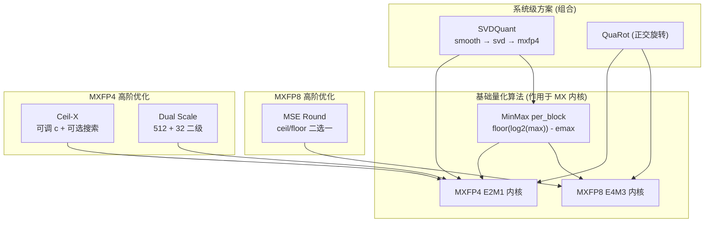

# msModelSlim MXFP8/MXFP4 量化算法深度理解分析

> 基于 `/home/caishengcheng/msmodelslim` 源码，结合 OCP Microscaling 规范与 msModelSlim 实现。
> 分析模式：**Deep** | 目标：面试可讲清 WHY + 公式 + 代码对应关系

---

## 理解验证状态

| 核心概念                     | 自我解释 | 理解"为什么" | 应用迁移 | 状态   |
| ---------------------------- | -------- | ------------ | -------- | ------ |
| Microscaling (MX) 块共享指数 | ✅       | ✅           | ✅       | 已掌握 |
| MXFP8 E4M3 量化内核          | ✅       | ✅           | ✅       | 已掌握 |
| MXFP4 E2M1 量化内核          | ✅       | ✅           | ✅       | 已掌握 |
| MinMax per_block 基础策略    | ✅       | ✅           | ✅       | 已掌握 |
| MSE Round (MXFP8 权重)       | ✅       | ✅           | ✅       | 已掌握 |
| Ceil-X (MXFP4 权重)          | ✅       | ✅           | ✅       | 已掌握 |
| Dual Scale 二级缩放          | ✅       | ✅           | ✅       | 已掌握 |
| SVDQuant 三阶段流水线        | ✅       | ✅           | ✅       | 已掌握 |

---

## 项目完整地图

### 量化模块分层架构

```
┌─────────────────────────────────────────────────────────────────┐
│  YAML Processor 层                                               │
│  linear_quant / iter_smooth / svd_res / convert(mxfp8)          │
└───────────────────────────┬─────────────────────────────────────┘
                            ▼
┌─────────────────────────────────────────────────────────────────┐
│  量化策略层 (core/quantizer/impl/)                               │
│  minmax | mse_round | ceil_x | dualscale                        │
└───────────────────────────┬─────────────────────────────────────┘
                            ▼
┌─────────────────────────────────────────────────────────────────┐
│  伪量化 IR 层 (ir/w*_mx_dynamic*.py)                             │
│  W8A8 / W4A4 / W4A8 / W4A4 DualScale FakeQuantLinear            │
└───────────────────────────┬─────────────────────────────────────┘
                            ▼
┌─────────────────────────────────────────────────────────────────┐
│  量化内核 (ir/api/impl/mx_quantization.py)                       │
│  calculate_qparam → quantize → dequantize                       │
└───────────────────────────┬─────────────────────────────────────┘
                            ▼
┌─────────────────────────────────────────────────────────────────┐
│  基础设施: block 切分 (ir/utils.py) + 块观测 (observer/minmax)   │
└─────────────────────────────────────────────────────────────────┘
```

### 关键文件清单

| 类别       | 文件                                                 | 行数    | 职责                           |
| ---------- | ---------------------------------------------------- | ------- | ------------------------------ |
| 量化内核   | `ir/api/impl/mx_quantization.py`                   | 185     | MXFP8/MXFP4 核心 quant/dequant |
| 格式定义   | `ir/qal/qbase.py`                                  | 181     | block_size=32, E4M3/E2M1 参数  |
| 基础策略   | `core/quantizer/impl/minmax.py`                    | 383     | per_block MinMax 权重/激活     |
| MXFP8 优化 | `core/quantizer/impl/mse_round.py`                 | 148     | 权重 MSE 选 scale              |
| MXFP4 优化 | `core/quantizer/impl/ceil_x.py`                    | 275     | 权重 Ceil-X + 搜索             |
| MXFP4 优化 | `core/quantizer/impl/dualscale.py`                 | 192     | 二级缩放                       |
| 伪量化 IR  | `ir/w8a8_mx_dynamic.py`                            | 110     | W8A8 动态 per_block            |
| 伪量化 IR  | `ir/w4a4_mx_dynamic_dualscale.py`                  | 186     | W4A4 Dual Scale                |
| SVDQuant   | `ir/svd_residual.py` + `processor/svd_residual/` | 143+245 | 低秩旁路                       |
| Block 工具 | `ir/utils.py`                                      | 86      | reshape_to_blocks              |

---

## 1. 快速概览

**语言/框架：** Python + PyTorch，源自 Microsoft [microxcaling](https://github.com/microsoft/microxcaling) 的 MX 算子，华为 msModelSlim 在此基础上扩展了多种高阶量化策略。

**核心格式：**

- **MXFP8**：OCP Microscaling FP8，元素格式 **E4M3**（4 位指数 + 3 位尾数），每 **32 元素**共享一个 **E8M0** 块 scale
- **MXFP4**：元素格式 **E2M1**（2 位指数 + 1 位尾数），同样 block_size=32，scale_bits=8

**典型部署场景：**

| 方案            | 权重                  | 激活                | 典型模型             |
| --------------- | --------------------- | ------------------- | -------------------- |
| W8A8 MXFP8      | mxfp8 + mse_round     | mxfp8 + minmax      | Wan2.2, HunyuanVideo |
| W4A4 MXFP4      | mxfp4 + minmax/ceil_x | mxfp4 + minmax      | Wan2.2 W4A4          |
| W4A4 Dual Scale | mxfp4 + dualscale     | mxfp4 + dualscale   | Qwen-Image-Edit      |
| W4A4 SVDQuant   | 残差 mxfp4            | mxfp4 + iter_smooth | Wan2.2 低比特        |

**面试一句话：** MX 格式不是 per-tensor/per-channel 一个 scale，而是 **32 元素一组共享指数**，在硬件友好性和局部动态范围之间取平衡；msModelSlim 在此之上用 MSE Round / Ceil-X / Dual Scale / SVDQuant 进一步压低量化误差。

---

## 2. 背景与动机（3 个 WHY）

### 问题本质

**要解决的问题：** 大模型（尤其扩散/多模态）权重和激活动态范围极大，传统 per-tensor 或 per-channel 量化在低比特下精度崩塌；同时 NPU 需要标准化、块对齐的低比特格式以高效 GEMM。

**WHY 需要解决：** W4A4 若直接用 INT4/FP4 单 scale，outlier 通道会"吃掉"整个量化动态范围，MSE 剧增；不解决则低比特模型不可用。

### 方案选择

**WHY 选择 Microscaling (MX)：**

- 比 per-channel 更细（32 元素一块），比 per-element 更省（scale 共享）
- OCP 标准格式，Ascend NPU 原生支持（AscendV1: `W8A8_MXFP8`, `W4A4_MXFP4`）
- 两级指数结构（shared exp + private exp）与 FP8/FP4 浮点量化天然契合

**替代方案对比：**

| 方案             | 简述             | WHY 不单独使用                     |
| ---------------- | ---------------- | ---------------------------------- |
| INT8 per-channel | 每通道一个 scale | 4bit 下精度不足；无 MX 硬件加速    |
| FP8 per-tensor   | 全局 E4M3        | outlier 压缩全 tensor 动态范围     |
| GPTQ/AWQ         | 权重量化后处理   | 需校准数据，与 MX 块格式正交可组合 |
| NF4/NormalFloat  | 非均匀码本       | 非 OCP 标准，NPU 支持有限          |

### 应用场景

**适用：** 扩散模型 Linear 层 W8A8/W4A4 部署；有 Ascend 350 等支持 MX 格式的硬件。

**不适用：** 无 MX 硬件加速的平台（需 fallback）；MoE expert 未激活时 block observer 会报错。

---

## 3. 核心概念网络

### 概念 1：Microscaling 块共享指数 (Shared Exponent)

- **是什么：** 每 32 个连续元素共享一个 E8M0 格式的指数 `shared_exp`，元素各自保留 private exponent + mantissa
- **WHY 需要：** 单 scale 无法覆盖块内 10x~100x 的局部动态范围差异；per-element scale 存储开销太大
- **WHY 这样实现：** 32 是硬件 tile 友好大小（`mx_finfo.block_size=32`）；E8M0 scale 用 `floor(log2(max)) - emax` 计算，保证块内最大值可表示
- **WHY 不用 per-channel：** channel 粒度对 outlier 仍太粗（一个 channel 内也有分布差异）

### 概念 2：MXFP8 E4M3

- **是什么：** 8 位浮点，ebits=4, mbits=5, emax=8, max_norm=448（1.75×2^8）
- **WHY 需要：** W8A8 是视频/扩散模型主流部署精度，比 INT8 对 outlier 更鲁棒
- **WHY E4M3 而非 E5M2：** E4M3 精度更高（更多尾数位），适合权重/激活；E5M2 动态范围更大适合梯度
- **WHY 不用普通 FP8 per-block：** MX 的 shared exp 进一步细化了块内缩放，与 OCP 标准一致

### 概念 3：MXFP4 E2M1

- **是什么：** 4 位浮点，ebits=2, mbits=3, emax=2, max_norm=6.0
- **WHY 需要：** W4A4 极致压缩，带宽/显存减半
- **WHY 动态范围仅 6.0：** 1 位尾数精度极低，必须配合 Dual Scale 或 SVDQuant 才能实用
- **WHY calculate_qparam 公式不同于 MXFP8：** MXFP4 用 `floor(log2(max / (1-0.5^(man_shift+2))))` 预留尾数舍入空间

### 概念 4：Data-Free 动态激活量化

- **是什么：** `MXActPerBlockMinmax.is_data_free() = True`，激活 scale 在推理 forward 时实时计算
- **WHY 需要：** 扩散模型每步激活分布变化大，静态 scale 不准
- **WHY 权重可离线量化：** 权重固定，setup 阶段一次性 block quantize
- **WHY 不用校准集：** 降低部署门槛，与 convert 路径一致

### 概念关系矩阵

| 关系 | 概念 A     | 概念 B     | WHY 关联                                          |
| ---- | ---------- | ---------- | ------------------------------------------------- |
| 依赖 | block 切分 | shared exp | 必须先 reshape 才能沿 block 维聚合 max            |
| 组合 | MXFP4      | Dual Scale | MXFP4 动态范围太小，需外层 scale 扩展             |
| 组合 | MXFP4      | SVDQuant   | 离群值进低秩旁路，残差更适合 4bit                 |
| 对比 | MinMax     | MSE Round  | 同算 shared_exp，MSE Round 在 ceil/floor 间择优   |
| 对比 | MinMax     | Ceil-X     | Ceil-X 用可调除数 c 收紧 scale，专用于 MXFP4 权重 |

---

## 4. 算法与理论分析

### 算法 A：MXFP8 MinMax per_block 量化

**完整流程：**

```
W [M×N] → reshape_to_blocks(axes=-1, block=32) → 每块 max
→ shared_exp = floor(log2(max)) - emax
→ x_scaled = x / 2^shared_exp
→ private_exp = floor(log2(|x_scaled|))
→ quantize mantissa (round-to-nearest)
→ dequant: x_q * 2^shared_exp
```

**时间复杂度：** O(MN)，线性扫描 + 块内聚合
**空间复杂度：** O(MN) 原 tensor + O(MN/32) scale tensor

**WHY 选择 floor(log2(max))：** 保证 shared scale 不会过大导致溢出；块内最大值刚好落在可表示范围内

**WHY 复杂度可接受：** 量化是一次性 offline 操作；推理时 NPU 硬件完成

**退化场景：** 块内同时存在极大值和大量小值 → 小值被量化到 0（可通过 MSE Round 缓解）

**参考：** [OCP Microscaling Specification](https://www.opencompute.org/documents/ocp-microscaling-formats-mx-v1-0-spec-final-pdf)

---

### 算法 B：MXFP4 量化

**scale 公式（源码）：**

```
shared_exp = floor(log2(max_val / (1 - 0.5^(man_shift_bit+2)) + ε)) - emax
其中 man_shift_bit = mbits - 2 = 1, emax = 2
```

**WHY 除以 (1 - 0.5^3) = 7/8：** 为尾数截断/舍入预留 headroom，防止量化后超出 max_norm=6.0

**量化步骤（与 MXFP8 不同，MXFP4 有独立实现）：**

1. `x_biased = |x| / 2^shared_exp`
2. `private_exp = clip(floor(log2(x_biased)), min_exp, emax)`
3. `mant = round(x_biased / 2^private_exp * 2^man_shift_bit) / 2^man_shift_bit`
4. `out = sign(x) * mant * 2^private_exp`

**退化场景：** shared_exp 过小（< -127）→ 输出强制置 0

---

### 算法 C：MSE Round（仅 MXFP8 权重）

**核心思想：** shared_exp 的 floor 和 ceil 两档都试量化，选 MSE 更小的

```
shared_exp_up   = ceil(log2(max)) - emax
shared_exp_down = floor(log2(max)) - emax
MSE_up   = mean((W - dequant(quant(W, up)))^2)
MSE_down = mean((W - dequant(quant(W, down)))^2)
shared_exp = argmin(MSE_up, MSE_down)
```

**WHY 仅 MXFP8：** MXFP4 动态范围太窄，ceil/floor 差异更敏感，改用 Ceil-X 的可调参数 c

**WHY 比 MinMax 好：** MinMax 固定 floor，可能对小值过度量化；MSE Round 在块级别做 1-bit scale 搜索，零额外存储

**复杂度：** 2× 量化开销（仅 offline 权重），可接受

---

### 算法 D：Ceil-X（仅 MXFP4 权重）

**公式：**

```
shared_exp = ceil(log2(max / c + ε)) - emax
c ∈ [6.0, 12.0], 默认 7.25
```

**WHY ceil 而非 floor：** 收紧 shared_exp → 更小步长 → 更高精度，c 控制收紧程度

**WHY c=7.25：** 接近 MXFP4 max_norm=6.0 的经验最优；c 越大 scale 越小精度越高但溢出风险增

**enable_search：** 在 [6.0, 12.0] 按 step=0.25 网格搜索最小 MSE 的 c

**WHY 不用 MSE Round：** MXFP4 只有 4bit，ceil/floor 二选一不够；Ceil-X 提供连续可调旋钮

---

### 算法 E：Dual Scale 二级缩放

**两级结构：**

```
外层 (dual_block, 如 512 元素): S_dual = max(|block|) / 6.0
内层 (inner_block, 32 元素):    标准 MXFP4 per_block quant
最终: x ≈ mxfp4_dequant(mxfp4_quant(x / S_dual)) * S_dual
```

**WHY 需要：** 激活存在 outlier channel，单级 MXFP4（max=6.0）无法同时表示 0.01 和 100.0

**WHY S_dual 除数是 6.0：** 即 `MXFP4_MAX_NORMAL`，保证除法后内层 MXFP4 能满量程利用

**WHY dual_block_size=512：** 比 32 更大粒度捕获 channel 级 outlier，512 是经验值（Qwen-Image-Edit 验证）

**存储开销：** 每 512 元素多一个 FP32 dual_scale（比 per-element 小 16×）

---

### 算法 F：SVDQuant 三阶段流水线

**不是单一量化算法，而是与 MXFP4 组合的系统方案：**

```
Stage 1: iter_smooth  — 激活 outlier 迁移到权重 (需校准)
Stage 2: svd_res      — W ≈ US·V^T + R, 权重替换为残差 R (data-free)
Stage 3: linear_quant — 残差 R 用 W4A4 MXFP4 量化
```

**推理计算：**

```
out = Q(x/s) · Q(R)^T + (x/s · V) · (US)^T
      └─ 4bit 主通路 ─┘   └── FP16 低秩旁路 ──┘
```

**WHY 三阶段协作：**

1. Smooth 让激活易量化，但权重变难
2. SVD 把权重中的 outlier 低秩结构抽到 FP16 旁路
3. 残差分布均匀，MXFP4 可胜任

**rank 选择：** 默认 32，越大近似越好但旁路开销增；与 alpha 协调

---

## 5. 设计模式分析

### 模式 1：策略模式 (Strategy Pattern)

**位置：** `AutoWeightQuantizer.from_config(QScheme, method)` → minmax/mse_round/ceil_x/dualscale

**WHY 使用：** 同一 MX 内核，不同 scale 计算策略可插拔；YAML 配置驱动

**WHY 不用 if-else 硬编码：** 10+ 量化方案组合，注册表可扩展

### 模式 2：注册表分派 (Registry)

**位置：** `@QFuncRegistry.register(dispatch_key=(QDType.MXFP8, ...))` 在 mx_quantization.py

**WHY 使用：** quantize/dequantize/calculate_qparam 按 (dtype, scope, symmetric) 自动路由

### 模式 3：惰性量化 (Lazy Quantization)

**位置：** `MXWeightPerBlockMinmax.forward()` 首次调用才 `_quantize()`

**WHY 使用：** DTS 多卡场景统一入口，避免 init_weight 与 forward 行为不一致

### 模式 4：组合模式 (Composite)

**位置：** `MXWeightDualScaleMinmax` 内部持有 `inner_quantizer = AutoWeightQuantizer.from_config(per_block minmax)`

**WHY 使用：** Dual Scale = 外层 scale + 标准 MXFP4，复用而非重写

### 模式 5：包装器 (Wrapper)

**位置：** `SVDResidualWrapper` 双通路 forward

**WHY 使用：** 不修改 Linear API，通过 wrapper 叠加低秩旁路

---

## 6. 关键代码深度解析

### 核心片段清单

| 编号 | 片段名称                          | 所在文件:行号                        | 优先级 | 识别理由                  |
| ---- | --------------------------------- | ------------------------------------ | ------ | ------------------------- |
| #1   | MXFP8 calculate_qparam + quantize | mx_quantization.py:33-86             | ★★★ | 整个 MX 体系的核心        |
| #2   | MXFP4 calculate_qparam + quantize | mx_quantization.py:125-184           | ★★★ | 与 MXFP8 不同的 4bit 路径 |
| #3   | MSE Round 双档择优                | mse_round.py:115-132                 | ★★★ | MXFP8 关键优化            |
| #4   | Dual Scale 权重初始化             | dualscale.py:99-119                  | ★★☆ | W4A4 精度提升关键         |
| #5   | Ceil-X qparam 计算                | ceil_x.py:85-102                     | ★★☆ | MXFP4 权重优化            |
| #6   | SVDResidual 双通路 forward        | svd_residual.py:63-84                | ★★☆ | SVDQuant 推理核心         |
| #7   | Dual Scale 伪量化 forward         | w4a4_mx_dynamic_dualscale.py:137-185 | ★★☆ | 完整二级 fake quant 流程  |

---

### 片段 #1：MXFP8 calculate_qparam + quantize

> 📍 **位置：** `msmodelslim/ir/api/impl/mx_quantization.py:33-86`
> 🎯 **优先级：** ★★★
> 💡 **一句话核心：** 从块内 max 算 shared exponent，再对每个元素做 private exp + mantissa 舍入

#### 1.1 代码整体作用

这是整个 msModelSlim MX 量化体系的**数学内核**，源自 Microsoft microxcaling。`calculate_mx_qparam` 负责从块级 max 值计算 E8M0 shared exponent；`mxfp_per_block_quantize` 负责逐元素量化到 E4M3 可表示值。

**它解决了什么问题？** 把 FP32/BF16 权重/激活映射到 OCP MXFP8 格式，且保证 dequant(quant(x)) ≈ x。

**系统层次定位：** IR 层最底层算子，被所有上层 quantizer 和 FakeQuantLinear 调用。

**角色与依赖：** 上游依赖 `MsMinMaxBlockObserver` 提供 min/max；下游被 `fake_quantize` / `quantize` / `dequantize` 封装。

#### 1.2 核心逻辑分析

**执行流程：**

```
max_val [per block]
  → shared_exp = floor(log2(max)) - emax(=8)
  → x' = x / 2^shared_exp
  → private_exp = floor(log2(|x'|))
  → mantissa = round(x' / 2^private_exp, mbits)
  → clamp to max_norm
  → output (still float storage, logical MXFP8)
```

**核心状态变量：**

| 变量        | 初值       | 变化时机               | 终态                   |
| ----------- | ---------- | ---------------------- | ---------------------- |
| shared_exp  | 未定义     | calculate_qparam       | 每块一个 E8M0 指数     |
| keep_mask   | None/ bool | flush_fp32_subnorms 时 | 标记是否保留 subnormal |
| private_exp | 逐元素     | quantize 内            | 元素级指数             |

**多执行路径：**

- **路径 A（正常块）：** max > 0 → floor(log2(max)) → 正常量化
- **路径 B（全零块）：** max == 0 → log2(FP32_MIN_NORMAL) 保护 → shared_exp 极小 → 输出全零

#### 1.3 逐行代码解释

> **贯穿示例：** 某 block 32 元素，max=448.0，emax=8

```python
# 步骤 1: 计算 shared exponent
shared_exp = torch.floor(torch.log2(max_val + FP32_MIN_NORMAL * (max_val == 0).to(max_val.dtype)))
# WHY: floor 确保 scale 不超过块内最大值；FP32_MIN_NORMAL 防止 log2(0)
# 此时: max=448 → log2(448)≈8.8 → floor=8 → shared_exp = 8-8 = 0

shared_exp = shared_exp - mx_finfo.emax  # emax=8 for E4M3
# WHY: 减去 emax 是 OCP MX 规范要求，使 scale 与元素格式对齐

# 步骤 2: 量化
inp = inp / (2**shared_exp)  # 块内归一化
# WHY: 先除 shared exp，把块内值缩到 private exp 可表示范围

private_exp = torch.floor(torch.log2(torch.abs(inp) + ...))
# WHY: 每个元素独立 private exp，在 shared 缩放后再细调

inp = _quant(inp, mx_finfo.mbits, private_exp, mx_finfo.ebits)
# WHY: mbits=5 → 3 位有效尾数 + 符号 + 隐式位，round-to-nearest

inp = _clamp_out(inp, inp_, mx_finfo.max_norm)  # max_norm=448
# WHY: 防止舍入溢出到 Inf
```

#### 1.4 关键设计点

| 设计维度             | 分析                                                     |
| -------------------- | -------------------------------------------------------- |
| **实现选择**   | 用 FP32 中间计算再转回 dtype，避免 BF16 下 log2 精度损失 |
| **性能优化**   | 块级 shared exp 向量化；推理时 NPU 融合 quant+GEMM       |
| **安全健壮性** | scale 超出 E8M0 范围 clip 到 ±127；NaN 传播保留         |
| **可扩展性**   | QFuncRegistry 注册，可添加 MXINT8 等格式                 |
| **潜在问题**   | flush_fp32_subnorms=False 时极小值可能 underflow         |

#### 1.5 完整示例（三组对比）

**示例 1 — 正常块：** max=100, shared_exp=floor(log2(100))-8=-2, 块内值 /4 后正常 E4M3 量化

**示例 2 — 大动态范围块：** max=448 (满量程), shared_exp=0, 块内最大元素刚好可表示

**示例 3 — 全零块：** max=0, shared_exp 极小, 输出全零, 不 NaN

#### 1.6 使用注意与改进建议

1. **axes 参数必须正确**：通常 Linear 权重 axes=-1（沿 input dim 分块）；错误 axes 会导致 scale 粒度错误
2. **padding 影响**：reshape_to_blocks 会 pad 到 32 倍数，尾部 padding 值参与 max 计算

---

### 片段 #2：MSE Round 双档择优

> 📍 **位置：** `msmodelslim/core/quantizer/impl/mse_round.py:115-132`
> 🎯 **优先级：** ★★★
> 💡 **一句话核心：** 对 MXFP8 权重每个 block 在 ceil/floor 两种 shared_exp 间选 MSE 更小者

#### 2.1 代码整体作用

MinMax 固定用 `floor(log2(max))` 算 scale，但 floor 和 ceil 只差 1 个指数位（2× 步长差异），对块内分布偏斜的数据，选错会导致 MSE 翻倍。MSE Round 在 **offline 权重量化** 时对每个 block 做 2 选 1。

**WHY 仅权重：** 激活是 data-free 动态量化，无法在 offline 搜索；权重固定可预计算最优 scale。

#### 2.2 核心逻辑分析

```
max_val → log2v = log2(max)
  ├─ shared_exp_up   = ceil(log2v) - emax
  └─ shared_exp_down = floor(log2v) - emax
       ↓ 各自 quantize + dequantize
  ├─ MSE_up   = mean((W - W_up_dq)^2)
  └─ MSE_down = mean((W - W_down_dq)^2)
       ↓
  select argmin(MSE_up, MSE_down)
```

**面试对比 MinMax：**

|            | MinMax           | MSE Round           |
| ---------- | ---------------- | ------------------- |
| scale 计算 | floor(log2(max)) | ceil/floor 择优     |
| 计算开销   | 1× quant        | 2× quant (offline) |
| 适用       | 通用             | MXFP8 权重          |
| 典型收益   | baseline         | Wan2.2 W8A8 权重    |

#### 2.3 关键代码

```python
log2v = torch.log2(log_arg)
shared_exp_up = torch.ceil(log2v) - mx_finfo.emax      # 更小的 scale，更精细
shared_exp_down = torch.floor(log2v) - mx_finfo.emax   # 更大的 scale，更安全

dequant_up = dequantize(quantize(float_storage, q_param_up), q_param_up)
dequant_down = dequantize(quantize(float_storage, q_param_down), q_param_down)

mse_up = (weight_value - dequant_up).pow(2).mean(dim=-1, keepdim=True)
mse_down = (weight_value - dequant_down).pow(2).mean(dim=-1, keepdim=True)
shared_exp = torch.where(mse_up < mse_down, shared_exp_up, shared_exp_down)
```

**WHY ceil 可能 MSE 更小：** ceil 使 shared_exp 更大 → 除法后值更小 → 小值不被量化到 0；但大值可能 overflow（被 clamp）

---

### 片段 #3：Dual Scale 二级缩放

> 📍 **位置：** `dualscale.py:99-119` + `w4a4_mx_dynamic_dualscale.py:146-172`
> 🎯 **优先级：** ★★☆
> 💡 **一句话核心：** 先用 512 元素大块 scale 压缩 outlier，再用 32 元素 MXFP4 精细量化

#### 3.1 代码整体作用

MXFP4 最大可表示值仅 6.0，对 outlier channel（值可达 100+）完全不够。Dual Scale 引入**外层 FP32 scale**（每 512 元素），先把值缩到 [-6, 6] 附近，再走标准 MXFP4。

#### 3.2 数学公式（面试必背）

```
S_dual = max(|X_block_512|) / 6.0
X' = X / S_dual
X_qdq = MXFP4_quant_dequant(X') * S_dual
```

**权重（静态）：** init_weight 时计算 S_dual 并固化；forward 时只做 dequant
**激活（动态）：** 每次 forward 实时算 S_dual

#### 3.3 关键代码

```python
# 权重 init_weight
dual_scale = dual_block_max_val / MXFP4_MAX_NORMAL  # MXFP4_MAX_NORMAL = 6.0
dual_scale_weight = weight / dual_scale
inner_quantizer.init_weight(dual_scale_weight)  # 内层标准 MXFP4 per_block

# 激活 forward (w4a4_mx_dynamic_dualscale.py)
dual_scale_x = dual_block_max_val / MXFP4_MAX_NORMAL
x_dualscaled = x / dual_scale_x
x_inner_qdq = fake_quantize(x_dualscaled, inner_qparam)  # 32-element MXFP4
x_q_dq = x_inner_qdq * dual_scale_x
```

**WHY 512：** 捕获 channel 级 outlier（一个 channel 可能跨多个 32-block）；32 太细无法感知 channel 间差异

---

### 片段 #4：Ceil-X

> 📍 **位置：** `ceil_x.py:85-102`
> 🎯 **优先级：** ★★☆
> 💡 **一句话核心：** 用可调常数 c 除 max 后再 ceil，控制 MXFP4 shared_exp 收紧程度

```python
shared_exp = torch.ceil(torch.log2((max_val / ceil_x_value).clamp(min=0) + 9.6e-7))
```

**c 的物理含义：**

- c 小 → max/c 大 → shared_exp 大 → scale 大 → 步长大 → 适合大值主导块
- c 大 → shared_exp 小 → 步长小 → 精度高 → 适合小值主导块
- 默认 7.25 ≈ MXFP4 max_norm 附近

**enable_search：** 遍历 c ∈ [6.0, 12.0]，选全局 MSE 最小（比 MSE Round 的 2 选 1 更灵活）

---

### 片段 #5：SVDQuant 双通路

> 📍 **位置：** `svd_residual.py:63-84`
> 🎯 **优先级：** ★★☆
> 💡 **一句话核心：** 输出 = 4bit 残差通路 + FP16 低秩旁路，数学等价于原始 Linear

```python
residual_out = self.wrapped_module(x)           # x @ R^T + b, R = W - USV^T
lowrank_hidden = F.linear(x, self.svd_lowrank_l1)  # x @ V,  V^T shape [rank, in]
lowrank_out = F.linear(lowrank_hidden, self.svd_lowrank_l2)  # (xV) @ (US)^T
return residual_out + lowrank_out              # ≈ x @ W^T + b
```

**面试要点：**

- SVDQuant 不是量化算法，是**结构变换 + MXFP4 量化**的组合
- rank=32 意味着旁路额外 32×(in+out) 参数，但主通路 4bit
- 必须先 iter_smooth 再 svd_res，否则残差仍含 outlier

---

## 7. 测试用例分析

| 测试文件                                                  | 覆盖模块   | 关键验证                  |
| --------------------------------------------------------- | ---------- | ------------------------- |
| `test/cases/ir/api/impl/test_mx_quantization.py`        | MXFP8 内核 | qparam/quant/dequant 数值 |
| `test/cases/ir/api/impl/test_mxfp4_quantization.py`     | MXFP4 内核 | 4bit 边界值               |
| `test/cases/core/quantizer/test_mse_round_quantizer.py` | MSE Round  | ceil/floor 择优           |
| `test/cases/core/quantizer/impl/test_dualscale.py`      | Dual Scale | 二级 scale 一致性         |
| `test/cases/core/quantizer/test_ceil_x.py`              | Ceil-X     | search 模式               |

**从测试发现的边界：**

- MoE expert 未激活 → observer 无 update → SpecError
- dual_scale 未初始化 → UnexpectedError
- ceil_x 仅支持 MXFP4 dtype

---

## 8. 应用迁移场景

### 场景 1：W8A8 视频模型 → W4A4 低比特部署

**不变原理：** MX block 量化 + data-free 动态激活

**需要修改：**

- dtype: mxfp8 → mxfp4
- 权重 method: mse_round → ceil_x 或 minmax
- 增加 iter_smooth + svd_res 流水线
- 可选 Dual Scale 替代 SVDQuant

### 场景 2：MX 量化 → 其他硬件平台

**不变原理：** 32-element block + shared exp + private exp 两级量化

**需要修改：**

- 替换 `mx_quantization.py` 为目标平台 kernel
- scale 存储格式（E8M0 → INT8/FP16 scale）
- block_size 可能变为 16/64（取决于硬件 tile）

---

## 9. 依赖关系与使用示例

### 典型 YAML 配置

**W8A8 MXFP8 + MSE Round（Wan2.2）：**

```yaml
weight: { scope: per_block, dtype: mxfp8, method: mse_round }
act:    { scope: per_block, dtype: mxfp8, method: minmax }
```

**W4A4 Dual Scale（Qwen-Image-Edit）：**

```yaml
weight: { scope: dual_scale, dtype: mxfp4, method: dualscale, ext: { dual_block_size: 512 } }
act:    { scope: dual_scale, dtype: mxfp4, method: dualscale, ext: { dual_block_size: 512 } }
```

**W4A4 SVDQuant 三阶段：**

```yaml
process:
  - type: iter_smooth
    alpha: 0.25
  - type: svd_res
    rank: 32
  - type: linear_quant
    qconfig:
      weight: { scope: per_block, dtype: mxfp4, method: minmax }
      act:    { scope: per_block, dtype: mxfp4, method: minmax }
```

---

## 10. 质量验证清单

### 理解深度

- [X] 每个核心概念 3 WHY
- [X] 能不看代码解释 MXFP8 vs MXFP4 差异
- [X] 能画量化算法层次图

### 技术准确性

- [X] 公式与源码一致
- [X] 算法适用边界明确（mse_round 仅 MXFP8 权重等）

### 最终"四能"测试

1. ✅ 理解设计思路（块共享指数 + 策略层优化 + 系统级 SVDQuant）
2. ✅ 独立实现类似 block quantize
3. ✅ 迁移到其他 bit-width / 硬件
4. ✅ 向他人清晰解释

---

## 附录 A：面试高频问答

### Q1: MX 格式和传统 per-channel 量化有什么区别？

**答：** 传统 per-channel 一个 channel 共享一个 scale；MX 每 **32 个元素**共享一个 **E8M0 指数**（shared exponent），每个元素还有自己的 private exponent 和尾数。粒度比 per-channel 细 32×（假设 channel=1024），比 per-element 省 32× scale 存储。这是 OCP 标准，Ascend NPU 原生支持。

### Q2: MXFP8 和 MXFP4 的核心差异？

**答：** 

|            | MXFP8 E4M3           | MXFP4 E2M1                 |
| ---------- | -------------------- | -------------------------- |
| 位宽       | 8 bit                | 4 bit                      |
| 指数/尾数  | 4/3 effective        | 2/1                        |
| max_norm   | 448                  | 6.0                        |
| scale 公式 | floor(log2(max)) - 8 | floor(log2(max/0.875)) - 2 |
| 典型优化   | MSE Round            | Ceil-X, Dual Scale         |

MXFP4 动态范围极小，必须配合 Dual Scale 或 SVDQuant 才能用于生产。

### Q3: MSE Round 原理？为什么不用在 MXFP4？

**答：** 对每个 32-block，比较 ceil 和 floor 两种 shared_exp 量化后的 MSE，选更小的。仅 2 选 1，零额外存储。MXFP4 只有 4bit，ceil/floor 1 bit 差异影响太大，改用 Ceil-X 的连续参数 c ∈ [6,12] 做更细粒度搜索。

### Q4: Dual Scale 解决了什么问题？

**答：** MXFP4 最大表示 6.0，但激活 outlier channel 可达 100+。Dual Scale 用 512 元素大块算外层 scale 先压缩到 [-6,6]，再用 32 元素 MXFP4 精细量化。两级 scale：外层 FP32（捕获 outlier），内层 E8M0（精细表示）。

### Q5: SVDQuant 三阶段分别做什么？为什么顺序不能乱？

**答：**

1. **iter_smooth**：把激活 outlier 迁移到权重（x/s · sW），让激活分布均匀
2. **svd_res**：权重中的 outlier 呈低秩结构，SVD 提取到 FP16 旁路，残差更均匀
3. **linear_quant**：残差用 W4A4 MXFP4 量化

顺序不能乱：先 smooth 再 SVD，否则 outlier 还在激活里，SVD 无法捕获；先 SVD 再 quant，否则 outlier 在残差里 4bit 量化失败。

### Q6: 权重和激活量化为什么策略不同？

**答：** 权重固定 → offline 量化，可用 MSE Round/Ceil-X 搜索最优 scale；激活动态 → data-free 运行时 per_block minmax，无法预搜索。这是 msModelSlim 中 `MXActPerBlockMinmax.is_data_free()=True` 的设计。

### Q7: 如何选择量化方案？

**决策树：**

```
目标 bit-width?
├─ 8bit → MXFP8
│   └─ 权重: mse_round (Wan2.2 验证)
│   └─ 激活: minmax (动态)
├─ 4bit → MXFP4
│   ├─ 有 outlier channel? 
│   │   ├─ 是 → Dual Scale (Qwen-Image-Edit)
│   │   └─ 否 → minmax + ceil_x (Wan2.2 深层)
│   └─ 扩散模型 + 低比特?
│       └─ SVDQuant 三阶段 (Wan2.2 W4A4)
└─ 混合 → W4A8 (权重 mxfp4 + 激活 mxfp8)
```

### Q8: reshape_to_blocks 做了什么？

**答：** 沿指定 axis 把 tensor 切分为 `[..., num_blocks, block_size]` 形状。不足 32 倍数会 zero-pad。这样 `MsMinMaxBlockObserver` 可以沿 block 内维度聚合 max，得到 per-block shared exponent。量化后 `undo_reshape_to_blocks` 还原原始形状。

---

## 附录 B：算法层次关系图



---

## 附录 C：源码速查表

| 面试关键词   | 源码位置                                          | 配置关键字                           |
| ------------ | ------------------------------------------------- | ------------------------------------ |
| MXFP8 内核   | `mx_quantization.py:33-86`                      | dtype: mxfp8                         |
| MXFP4 内核   | `mx_quantization.py:125-184`                    | dtype: mxfp4                         |
| MinMax       | `minmax.py:261-343`                             | method: minmax                       |
| MSE Round    | `mse_round.py:46-147`                           | method: mse_round                    |
| Ceil-X       | `ceil_x.py:160-274`                             | method: ceil_x                       |
| Dual Scale   | `dualscale.py:44-135`                           | scope: dual_scale, method: dualscale |
| SVDQuant     | `svd_residual.py` + `processor/svd_residual/` | type: svd_res                        |
| W8A8 IR      | `w8a8_mx_dynamic.py`                            | W8A8_MXFP8                           |
| W4A4 Dual IR | `w4a4_mx_dynamic_dualscale.py`                  | W4A4_MXFP4_DUALSCALE                 |

---

*文档生成时间：2026-07-06 | 基于 msModelSlim 源码 Deep 分析*
