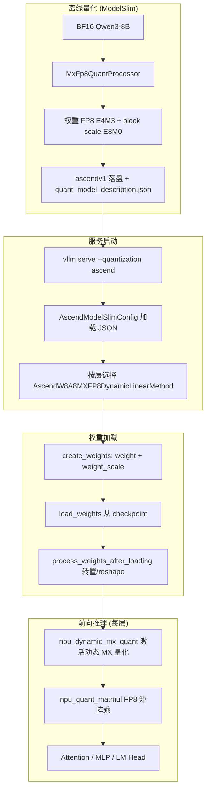
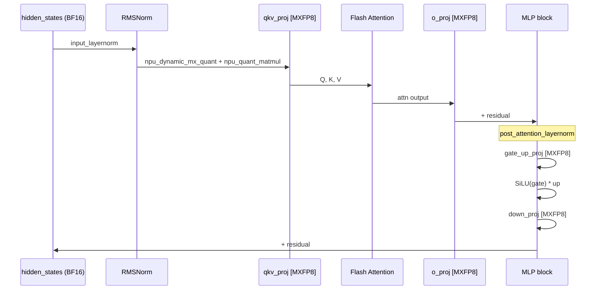

# Qwen3-8B MXFP8 量化权重推理流程（vllm-ascend）

> 基于 [vllm-ascend](https://github.com/vllm-project/vllm-ascend) 源码梳理。  
> 代码参考路径：`/home/caishengcheng/vllm-ascend`  
> 分析日期：2026-06-18

---

## 1. 背景与适用范围

**Qwen3-8B** 是 Dense 模型（`model_type=qwen3`），在 vllm-ascend 上走 **ModelSlim / ascend** 量化路径时，若 `quant_model_description.json` 中 Linear 层标注为 **`W8A8_MXFP8`**，则启用 MXFP8（Microscaling FP8）推理。

> **注意**：社区常见的 `vllm-ascend/Qwen3-8B-W8A8` 多为 **W8A8_DYNAMIC（INT8 权重）**，与 MXFP8 是不同量化方案。本文专述 **MXFP8** 路径。

| 维度 | W8A8_MXFP8 | W8A8_DYNAMIC（常见 W8A8 模型） |
|------|------------|--------------------------------|
| 权重 dtype | `float8_e4m3fn` | `int8` |
| 权重 scale | per-group E8M0（`uint8`） | per-channel FP32 |
| 激活量化 | `npu_dynamic_mx_quant`（MX FP8） | `npu_dynamic_quant`（INT8） |
| 矩阵乘 | `npu_quant_matmul` + `group_sizes` | `npu_quant_matmul`（per-channel） |
| JSON 标注 | `W8A8_MXFP8` | `W8A8_DYNAMIC` |

---

## 2. 整体流程概览



---

## 3. 离线量化：权重如何产生

ModelSlim 侧（`msmodelslim/processor/convert/mxfp8_quant.py`）完成 `FLOAT → W8A8_MXFP8` 转换：

| 项目 | 内容 |
|------|------|
| IR 转换 | `FLOAT → W8A8_MXFP8` |
| 权重量化 | per-block MXFP8，`float8_e4m3fn` |
| 激活量化 | **推理时动态** per-token MX 量化（checkpoint 不存激活 scale） |
| 落盘格式 | **ascendv1**（MXFP8 仅面向昇腾 NPU） |
| 描述文件 | `quant_model_description.json` |

### 3.1 Qwen3-8B 中被量化的 Linear 层

vLLM 已将部分算子 fuse，典型每层结构：

| 模块 | vLLM 层名 | 并行方式 | 说明 |
|------|-----------|----------|------|
| Attention | `qkv_proj` | ColumnParallel | Q/K/V 融合投影 |
| Attention | `o_proj` | RowParallel | 注意力输出投影 |
| MLP | `gate_up_proj` | ColumnParallel | gate + up 融合 |
| MLP | `down_proj` | RowParallel | MLP 输出投影 |

`embed_tokens`、`lm_head` 通常为 **FLOAT**（未量化），由 `is_layer_skipped_ascend()` 跳过。

---

## 4. 服务启动与量化方案绑定

### 4.1 启动命令

```bash
vllm serve <Qwen3-8B-MXFP8模型路径> --quantization ascend
```

### 4.2 配置加载链路

1. `NPUPlatform` 注册 `quantization=ascend`
2. `AscendModelSlimConfig.maybe_update_config()` 读取模型目录下的 `quant_model_description.json`
3. 对每个 `LinearBase`，`get_quant_method()` 查询 JSON 中 `{prefix}.weight` 的量化类型
4. 若为 `W8A8_MXFP8` → 实例化 `AscendW8A8MXFP8DynamicLinearMethod`，外包 `AscendLinearMethod`

关键源码：

- 配置类：`vllm_ascend/quantization/modelslim_config.py` → `AscendModelSlimConfig`
- 方案注册：`vllm_ascend/quantization/methods/w8a8_mxfp8.py` → `@register_scheme("W8A8_MXFP8", "linear")`
- 适配器：`vllm_ascend/quantization/method_adapters.py` → `AscendLinearMethod`

### 4.3 group_size

从 `quant_model_description.json` 读取，默认 **32**（MX 微缩放 block 大小）：

```python
# vllm_ascend/quantization/methods/w8a8_mxfp8.py
self.group_size = vllm_config.quant_config.quant_description.get("group_size", 32)
```

---

## 5. 权重内存布局与加载后变换

### 5.1 创建参数（create_weights）

`AscendLinearMethod.create_weights()` 调用 scheme 的 `get_weight()` 与 `get_pergroup_param()`：

| 参数 | 形状 | dtype |
|------|------|-------|
| `weight` | `[out_features, in_features]` | `float8_e4m3fn` |
| `weight_scale` | `[out_features, ceil(in_features / group_size)]` | `uint8`（E8M0） |

### 5.2 加载后变换（process_weights_after_loading）

Checkpoint 布局与 NPU kernel 要求不一致，加载后做转置与 reshape：

| 张量 | 加载时形状 | 推理时形状 |
|------|-----------|-----------|
| `weight` | `(N, K)` | `(K, N)` 转置 |
| `weight_scale` | `(N, K/group_size)` | `(K/2, N, 2)` reshape + 转置 |

核心逻辑（`w8a8_mxfp8.py`）：

```python
n_dim, k_dim = layer.weight_scale.data.shape
if layer.weight_scale.data.shape[-1] % 2 != 0:
    layer.weight_scale.data = F.pad(layer.weight_scale.data, (0, 1), mode="constant", value=0)
    layer.weight_scale.data = layer.weight_scale.data.reshape(n_dim, k_dim // 2 + 1, 2)
else:
    layer.weight_scale.data = layer.weight_scale.data.reshape(n_dim, k_dim // 2, 2)
layer.weight.data = layer.weight.data.transpose(0, 1)
layer.weight_scale.data = layer.weight_scale.data.transpose(0, 1)
layer._mxfp8_transformed = True
```

目的：适配 `npu_quant_matmul` 对 MXFP8 权重 + E8M0 scale 的硬件内存布局。

---

## 6. 单层 Linear 前向（核心推理算子）

`AscendW8A8MXFP8DynamicLinearMethod.apply()` 是两步 NPU 算子：

### 6.1 步骤一：激活动态 MX 量化

```python
quantized_x, pertoken_scale = torch_npu.npu_dynamic_mx_quant(
    x, dst_type=torch.float8_e4m3fn
)
```

- 输入：BF16/FP16 激活
- 输出：`quantized_x`（E4M3）+ `pertoken_scale`（E8M0，per-token）

### 6.2 步骤二：FP8 量化矩阵乘

```python
output = torch_npu.npu_quant_matmul(
    quantized_x,
    layer.weight,
    layer.weight_scale,
    scale_dtype=FLOAT8_E8M0FNU_DTYPE,
    pertoken_scale=pertoken_scale,
    pertoken_scale_dtype=FLOAT8_E8M0FNU_DTYPE,
    bias=bias,
    output_dtype=output_dtype,
    group_sizes=[1, 1, self.group_size],
)
```

| 参数 | 含义 |
|------|------|
| `group_sizes=[1, 1, group_size]` | 激活 per-token、权重 per-block（默认 32） |
| `scale_dtype` | 权重 block scale 为 E8M0 |
| `pertoken_scale` | 激活 per-token scale |
| `output_dtype` | 通常恢复为 BF16/FP16 |

**W8A8 MXFP8** = 权重 8bit + 激活 8bit，均为微缩放 FP8，与 INT8 动态量化路径不同。

---

## 7. Qwen3-8B Decoder 完整前向路径

以单个 `Qwen3DecoderLayer` 为例（8B 约 36 层，结构重复）：



### 7.1 Tensor Parallel 注意点

`AscendLinearMethod.apply()` 根据层类型设置 `tp_rank`：

| 层 | 并行类型 | tp_rank |
|----|----------|---------|
| `qkv_proj`、`gate_up_proj` | ColumnParallel | 0 |
| `o_proj`、`down_proj` | RowParallel | 当前 TP rank（含 FlashComm 等变体） |

RowParallel 层在 matmul 后需 all-reduce 聚合。

---

## 8. KV Cache 与其它量化（正交路径）

MXFP8 仅覆盖 **Linear 权重**，与以下配置正交：

| 配置项 | 作用 |
|--------|------|
| `fa_quant_type` | Flash Attention KV 量化 |
| `kv_cache_type=C8` | KV Cache INT8 量化 |
| `indexer_quant_type` | DSA/Indexer 量化 |

Qwen3-8B Dense 默认不走 MLA。`patch_gqa_c8.py` 为 `Qwen3ForCausalLM.load_weights` 增加了 C8 KV scale 加载补丁，与 MXFP8 Linear 独立。

---

## 9. 运行时依赖

`vllm_ascend/device/mxfp_compat.py` 在初始化时检查 `torch_npu` 是否提供：

- `float8_e8m0fnu`
- `npu_dynamic_mx_quant`
- `npu_quant_matmul`

缺失时 `ensure_mxfp8_linear_available()` 会报错，需升级 torch_npu 或关闭 MXFP8。

---

## 10. 关键源码索引

| 模块 | 路径 | 职责 |
|------|------|------|
| MXFP8 Linear | `vllm_ascend/quantization/methods/w8a8_mxfp8.py` | 权重布局、apply、后处理 |
| 量化配置 | `vllm_ascend/quantization/modelslim_config.py` | JSON 解析、按层选 scheme |
| Linear 适配 | `vllm_ascend/quantization/method_adapters.py` | create_weights / apply 委托 |
| dtype 兼容 | `vllm_ascend/device/mxfp_compat.py` | E8M0 dtype 与算子检查 |
| 类型映射 | `vllm_ascend/quantization/quant_parser.py` | MXFP8 act/scale dtype |
| Qwen3 权重加载 | `vllm_ascend/patch/worker/patch_gqa_c8.py` | C8 KV scale 拦截 |
| 离线量化 | `msmodelslim/processor/convert/mxfp8_quant.py` | FLOAT → W8A8_MXFP8 |

---

## 11. 一句话总结

**Qwen3-8B MXFP8 推理** = ModelSlim 离线产出 FP8 权重 + E8M0 block scale（ascendv1）→ vllm-ascend 启动时按 JSON 绑定 `W8A8_MXFP8` scheme → 加载后转置/reshape 权重 → 每个 Linear 前向先 `npu_dynamic_mx_quant` 动态量化激活，再 `npu_quant_matmul` 完成 FP8 GEMM，Attention/MLP 其余逻辑与 BF16 模型一致。

---

## 参考

- [vllm-ascend](https://github.com/vllm-project/vllm-ascend)
- [Qwen3-Dense 部署文档](https://github.com/vllm-project/vllm-ascend/blob/main/docs/source/tutorials/models/Qwen3-Dense.md)
- [ModelSlim / msmodelslim](https://gitee.com/ascend/msit/tree/master/msmodelslim)
